*Learn how you can download and use the Shapes app.*

##Overview

Learn how you can download and use the new Shapes app from the marketplace. 

##Introduction
Shapes lets you add and edit basic shapes (entities) in High Fidelity. You can use Shapes only in VR mode. 

###Get Shapes
* In Interface, pull up your tablet and go to **Market**. 
* Search for **Shapes** and get it. 
* You will be prompted about running the Shapes script. Click "Yes" and check your tablet to see if the Shapes app has been added. 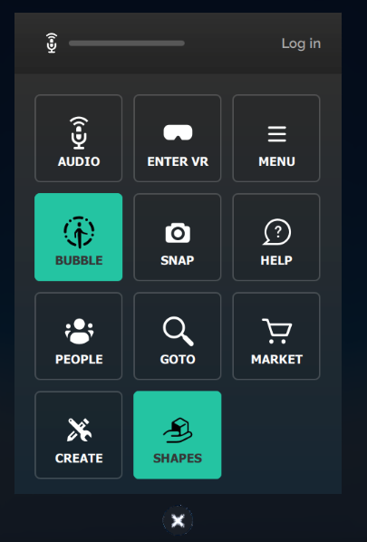

###Using Shapes
* Click on **Shapes** on your tablet. 
* A **Tools** menu and **Create** palette will be attached to your non-dominant hand. You can set your dominant hand by going to **Settings > Avatar > Dominant Hand**. 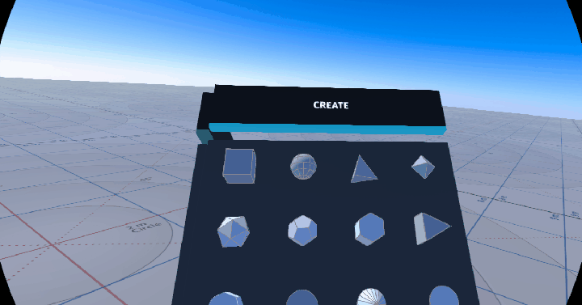

####Using the Create Palette
* Click on one of the shapes to create and add that entity. 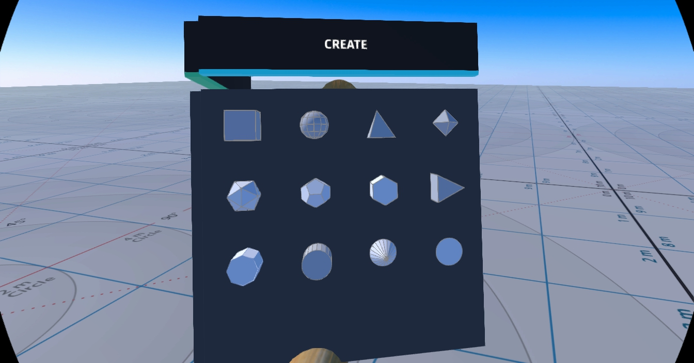
* The entity will be created at your hand. You can grab it by pressing the trigger on your controller. 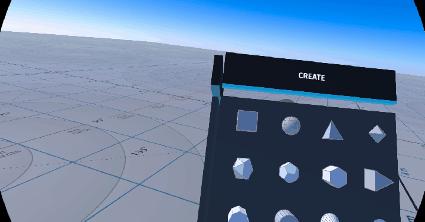

####Using the Tools Menu
Once you create an entity, you can edit its properties using the **Tools** menu. 
* You can see the tools available on the **Tools** menu in the image below. 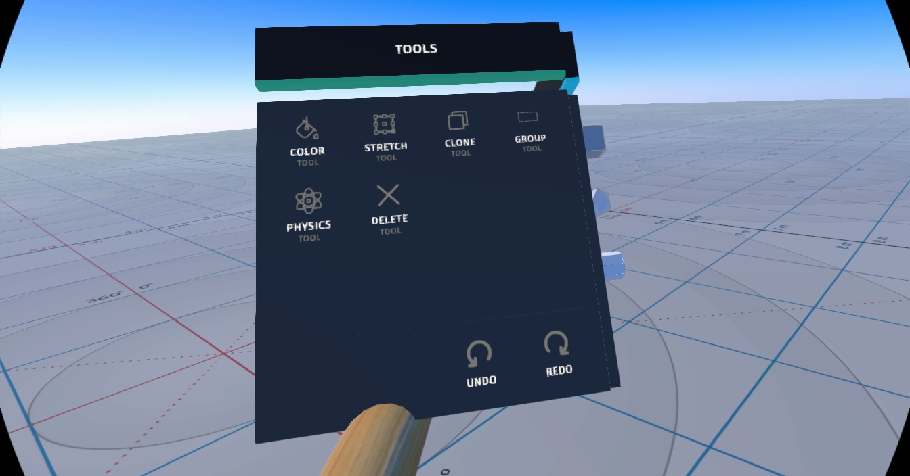
* Activate a tool by clicking its button. You'll see an icon representing the tool you selected on your dominant hand. 
* You can deactivate a tool by hovering over the title bar and clicking "Back".
* **Color**: You can choose a color for your entity by pointing your laser at "Color" in the **Tools** menu and dipping your finger or stylus in the color of your choice. You can even create color swatches for yourself. 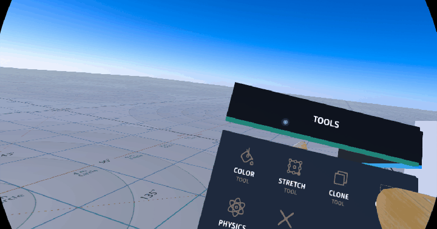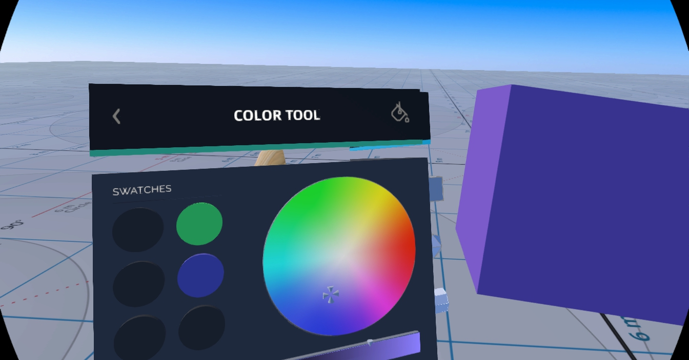
* **Stretch**: You can change the dimensions of your entity by stretching it. Select "Stretch" to see the handles on your entity that you can pull it using your controllers. 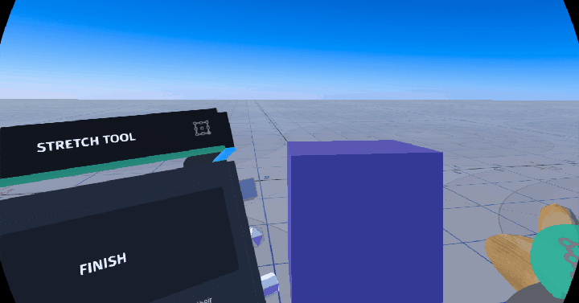
* **Clone**: You can clone your entity using the "Clone" tool. Select "Clone", point your laser at your entity and pull out its clone. 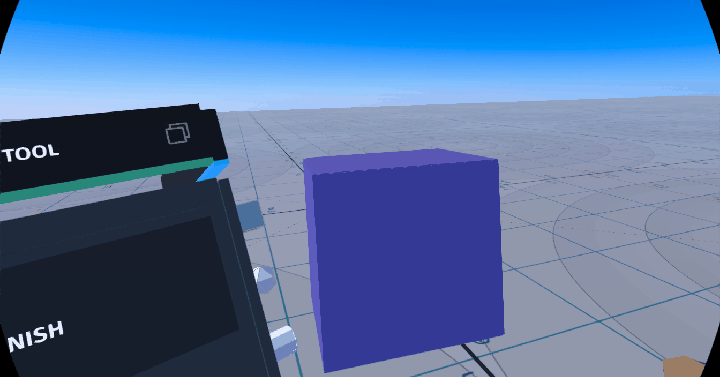
* **Group**: You can group two or more entities together for easier editing. Select "Group" and then select all the entities you want to group. 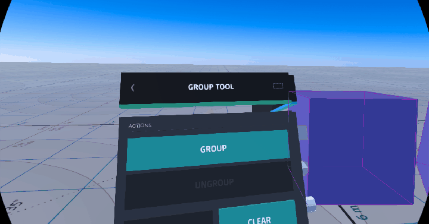
* **Physics**: You can modify the physics (behavior of your entity in space) using the "Physics" tool. Select "Physics" to see the variety of options available to you. 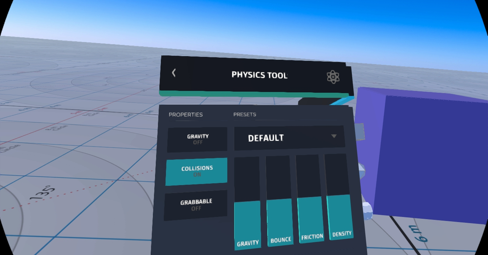 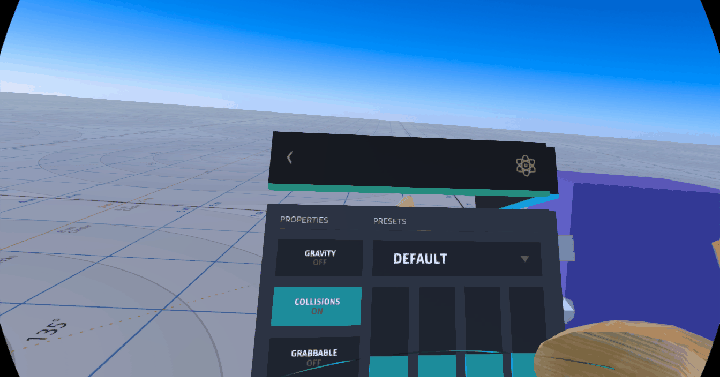 
* **Delete**: You can delete an entity by selecting "Delete" and then selecting the entity you want to delete. 

