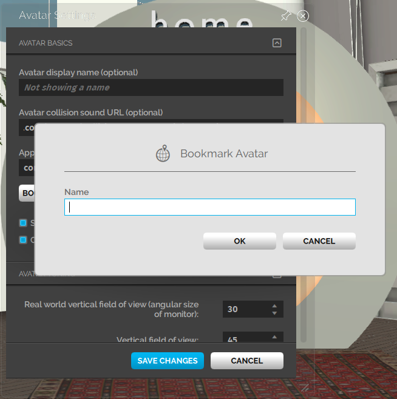

Do you have different avatars that you like switching between frequently? If you do, we've released a new feature to bookmark your avatars!

The new **Bookmark Avatar** feature lets you bookmark any avatar that you're wearing. When you want to switch to an avatar you've bookmarked, you can click on the saved bookmark to load it. Now, you don't have to go the Marketplace to load one of your favorite avatars or load the file of your choice.

>>>>> This is a local system setting. This means that if you uninstall High Fidelity, delete your Settings, or log in from another system, you will not be able to access your bookmarked avatars.

Here's how you can bookmark your avatar:

- Pull up your tablet.
- Go to **Avatar > Bookmark Avatar** to bookmark the avatar you are wearing.
- Click **Bookmark Avatar** and you'll be prompted to name it.
- You can also go to **Menu > Settings > Avatar **. A window named Avatar Settings will open.
- Below the tab for *Appearance*, you'll see a button named **Bookmark Avatar**.

- Click **Bookmark Avatar** and you'll be prompted to name it.

- Click OK and Save Changes.

Now that you've bookmarked your avatar, you can access it anytime from the Avatar menu. To do this:

- Pull up your tablet.
- Go to **Avatar**.

- You can access your bookmarked avatar by clicking on 'Avatar Bookmarks'.
- You can also delete your avatar bookmarks by clicking on 'Delete Avatar Bookmark'.

