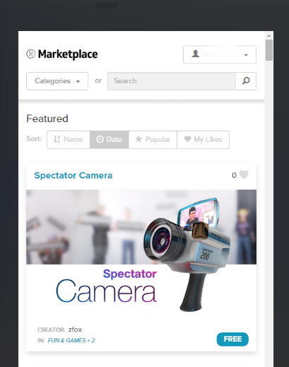
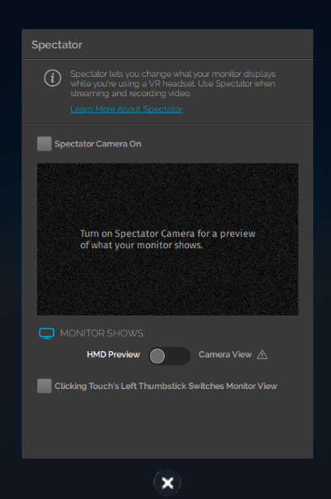
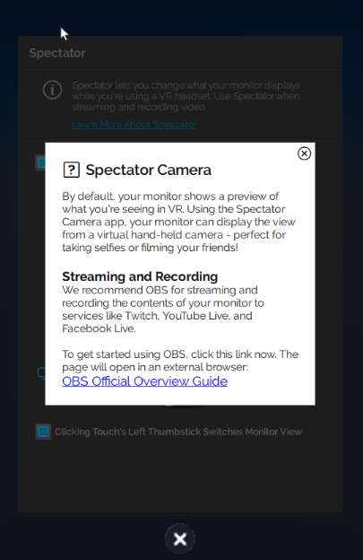

*Learn how you can download and use the new Spectator Camera!*

##Overview

Learn how you can download and use the new Spectator Camera from the marketplace. 

##Introduction
The Spectator Camera is a camera you can use, along with recording software such as [Open Broadcaster Software (OBS)](https://obsproject.com/), to record or livestream what you and your friends do in High Fidelity. 

>>>>> You can use the Spectator Camera only while using an HMD.

You can record or livestream what you see through your Spectator Camera using OBS. Check out their [official overview guide](https://obsproject.com/forum/threads/official-overview-guide.402/) for more details.

###Get the Spectator Camera
* In Interface, pull up your tablet and go to Market. 
* Search for the Spectator Camera and get it. 
* You will be prompted about running the camera script. Click Yes and check your tablet to see if the Spectator app has been added.  

>>> While using the Spectator Camera, Interface's framerate might be affected. This is because Interface is rendering not only what you see, but what the Spectator Camera sees as well. 

###Using the Spectator Camera
* Click on the Spectator app on your tablet. The new window that opens contains instructions for turning it on. 
* Turn on your Spectator Camera by clicking the "Spectator Cam On" checkbox. You'll see the camera appear in-world. The display on the app will show you what you see in VR through your HMD. This is to show you what you're recording without having to take off your HMD.
* You can also see what your camera is capturing on the display above the lens. If you switch to "Camera View" from "HMD Preview" on the tablet, the tablet preview also switch to the camera view.  
* You can switch between views using your controllers so that you don't have to pull up your tablet to do so every time. This allows you to switch views without viewers noticing. You can enable this on your tablet in the spectator cam app. 
  * Rift: If you're using Oculus Touch controllers, click the left thumbstick to switch views. 
  * Vive: If you're using HTC Vive controllers, press on the center of the thumb pad to switch views. 
* Learn more about the spectator cam by clicking the link on the top of the tablet window.  

## Advanced Topics

### How it works

**We will be updating this section with more details.**

The Spectator Camera works using High Fidelity's new secondary camera feature. The Spectator Camera is a camera model that has been parented to the secondary camera.  

