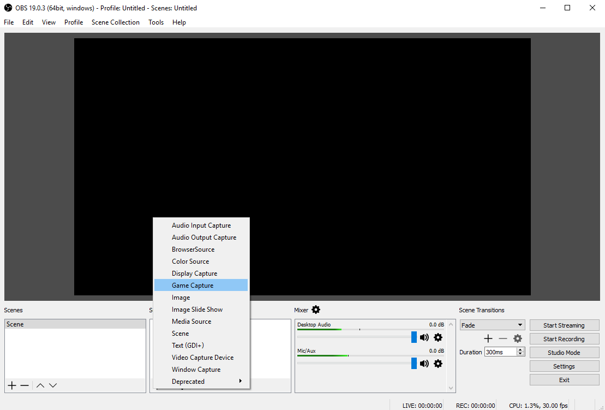
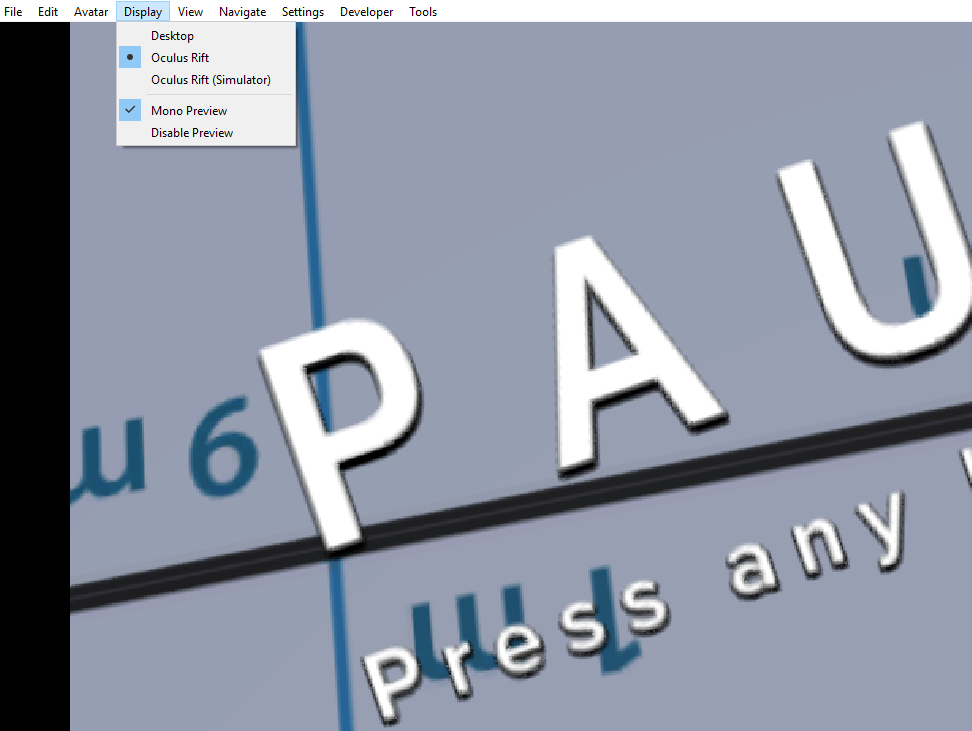
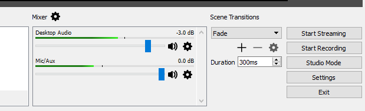
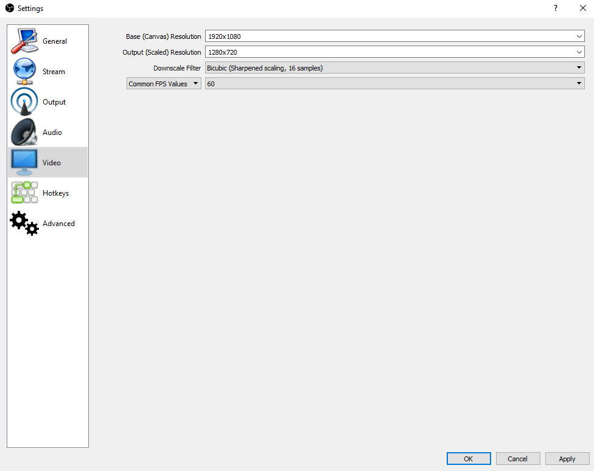
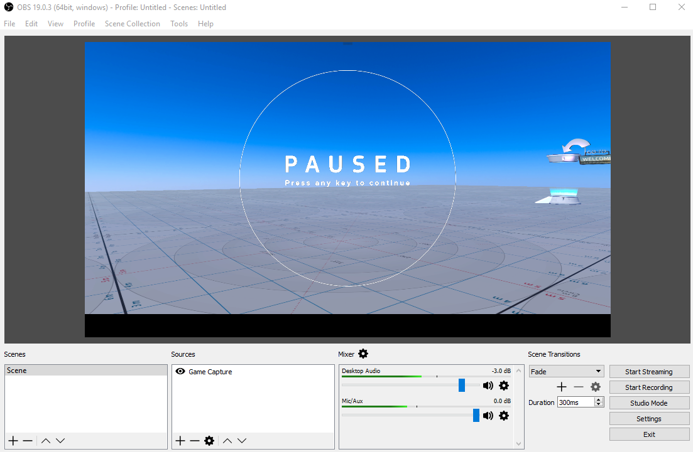

## Introduction

Open Broadcaster Software (OBS) Studio is a free and open source software for video recording and live streaming. Because of the ease of availability and valuable features, we recommend using OBS for all your streaming and recording needs. 

You can download and install OBS [here](https://obsproject.com/).

To understand how you can use OBS, 

* For Beginners: Check out their [official overview guide](https://obsproject.com/forum/threads/official-overview-guide.402/).
* For Advanced Users: Check out their [official quick start guide](https://obsproject.com/forum/threads/official-quick-start-guide.410/). 

### Set Up OBS for Streaming from High Fidelity

Once you've learnt the basics of OBS, you can start setting it up to stream your content in High Fidelity. 

Some settings you need to keep in mind are:

* Under Sources, select **Game Capture**. This is not necessary, but we recommend this setting for streaming and recording. 
* Ensure that your display is showing your Spectator Camera's view. 
* If you're using an HMD, uncheck disable preview in High Fidelity. This is important, as OBS captures what is being displayed in a window and will not capture anything apart from the preview disabled window if you don't uncheck it. 
*  Set your application's audio gain as -3dB so that its volume is lower than your audio. This allows you to be heard over any of the application's audio. 
* To see your avatar moving properly, without any jarring experiences, you have to set your fps (frames per second) to 60. You can do this in OBS by going to **File > Settings > Video**. In the window that opens, change the Common FPS Values to 60. 
* If you have to switch between Desktop and HMD during the show, check and change your audio inputs to allow your streaming to continue without any disruptions. 
* Once you've set up OBS with these High Fidelity specific settings, you can add your streaming specific settings. 
* You're ready! Click on Start Streaming. 