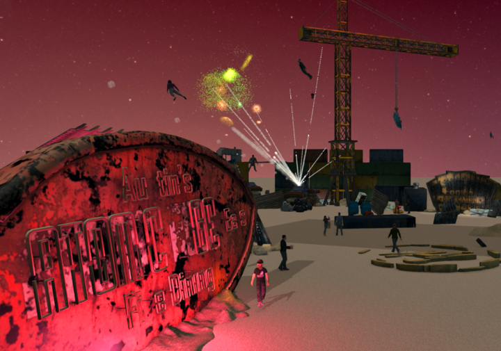

Welcome to the fireworks scripting tutorial! Here we will take you step by step through building a launch button which, when pressed, will launch a series of fireworks into the sky!




## All is quiet...

You find yourself on the edge of a vast desert. Through the screaming wind you hear laughter and music. You slowly make your way through the dust, tinged with purple light from the far off mysterious structure you can just barely glimpse. You've moved into a deep trancelike state when suddenly- BOOM! A huge explosion overhead vibrates you to the core, and crackling firework after firework almost blinds you. A shriek of joy rings out from the settling smoke, and your curiosity overpowers your fear as you fly at top speed towards the source.

A mysterious woman clad in flowing red robes is standing next to a large rusty button that reads "launch". You're new to this world, and approach her in awe and exclaim "You have to show me how you made that!"

The figure grows solemn and stares deeply into your eyes. "Are you sure you want to know?" she asks softly, "for this knowledge may lead you down a path from which there is no turning back. A magical path, brimming with creativity and profound, intense power. You're life may never be the same again, my friend."

You feel absolutely no hesitation. "I'm in," you reply.

She breaks into a wide smile. "I was hoping you'd say that! I have a special document prepared, available to all those who seek the deeper knowledge. You will find what you are looking for within..."

## Overview

The fireworks experience is composed of two scripts- one is the spawner script that creates the button from which fireworks will be launched from, and the other is the entity script you will attach to the launch button itself. Whenever I'm creating any experience that requires an entity script, I always find it immensely helpful to write a corresponding interface script that spawns the entity with the script attached. This will speed up your iteration time considerably as you develop your content. For a deeper look at the difference between entity and interface (or client) scripts, see [all about scripting](../../all-about-scripting).

I've organized this tutorial as a series of progressing chapters, and as you follow along with this you will be going through a similar process to the one I took as I wrote the actual fireworks experience. I've included the code for each chapter in the examples/tutorials/fireworks directory for your reference.

## Chapter 1: Writing the Spawner Script

It's generally a good idea to write your spawner script first, so you can quickly get your entity (or group of entities) set up and destroyed as you iterate. This will become more and important as you start building more intricate experiences that require multiple entities working together in concert, but even now will save you lots of time and frustration. Let's start by writing the interface script to get our launch button spawned and positioned in front of our avatar with a simple, boilerplate entity script attached to it: Call it fireworksLaunchButtonSpawner.js

```
// Chapter 1 : fireworksLaunchButtonSpawner.js
  var orientation = Camera.getOrientation();
  orientation = Quat.safeEulerAngles(orientation);
  orientation.x = 0;
  orientation = Quat.fromVec3Degrees(orientation);
  var center = Vec3.sum(MyAvatar.position, Vec3.multiply(3, Quat.getFront(orientation)));

  var SCRIPT_URL = Script.resolvePath("fireworksLaunchButtonEntityScript.js");
  var MODEL_URL = "https://s3-us-west-1.amazonaws.com/hifi-content/eric/models/Launch-Button.fbx";
  var launchButton = Entities.addEntity({
    type: "Model",
    name: "hifi-launch-button",
    modelURL: MODEL_URL,
    position: center,
    dimensions: {
      x: 0.98,
      y: 1.16,
      z: 0.98
    },
    script: SCRIPT_URL,
  })


  function cleanup() {
    Entities.deleteEntity(launchButton);
  }

  Script.scriptEnding.connect(cleanup);</source>

Now create a file in the same folder called fireworksLaunchButtonEntityScript.js. Paste or type the following code in:

<source lang="javascript">// Chapter 1: fireworksLaunchButtonEntityScript.js

  (function() {
    Script.include("../../libraries/utils.js");
    var _this;
    Fireworks = function() {
      _this = this;
    };

    Fireworks.prototype = {

      preload: function(entityID) {
        _this.entityID = entityID;

      }

    };

    // entity scripts always need to return a newly constructed object of our type
    return new Fireworks();
  });

```

Great! Now run the interface script and you should see a launch button appear in front of you.

The spawner script is quite simple- it spawns a model entity with an entity script attached in front of your avatar. If you haven't learned about the different kinds of entities our system supports, no worries! Hop on over to [this guide](https://docs.highfidelity.com/api-reference/namespaces/entities#.EntityProperties), which will walk you through all of the entities you can create and the properties common to them all and specific to each entity type.

The entity script doesn't do much right now, but we're ready to start building it out, and will be able to make rapid changes and see them take effect almost instantly, simply by reloading our spawner script, since we've set up the script to delete the launch button entity on shutdown. From here on out, most of our work will be spent building out our entity script to imbue our launch button with the power to launch fireworks into the sky!

## Chapter 2: Launching a Firework on Mouse Click or Hand Controller Trigger

Let's add some logic to our entity script that will launch a firework when someone clicks on the button with their mouse, or squeezes a hand controller trigger while their hand is in the launch button or pointing at the button from further away. For the latter two actions to work, you need to be running handControllerGrab.js, which is one of your default running scripts.

```
// Chapter 2: fireworksLaunchButtonEntityScript.js

  (function() {
    Script.include("../../libraries/utils.js");
    var _this;
    Fireworks = function() {
      _this = this;
      _this.launchSound = SoundCache.getSound("https://s3-us-west-1.amazonaws.com/hifi-content/eric/Sounds/missle+launch.wav");
    };

    Fireworks.prototype = {

      startNearTrigger: function() {
        _this.shootFirework(_this.position);
      },

      startFarTrigger: function() {
        _this.shootFirework(_this.position);
      },

      clickReleaseOnEntity: function() {
        _this.shootFirework(_this.position);
      },


      shootFirework: function(launchPosition) {
        Audio.playSound(_this.launchSound, {
          position: launchPosition,
          volume: 0.5
        });


        var smoke = Entities.addEntity({
          type: "ParticleEffect",
          position: _this.position,
          velocity: {x: 0, y: 3, z: 0},
          lifespan: 10,
          lifetime: 20,
          isEmitting: true,
          name: "Smoke Trail",
          maxParticles: 3000,
          emitRate: 80,
          emitSpeed: 0,
          speedSpread: 0,
          polarStart: 0,
          polarFinish: 0,
          azimuthStart: -3.14,
          azimuthFinish: 3.14,
          emitAcceleration: {
            x: 0,
            y: 0.01,
            z: 0
          },
          accelerationSpread: {
            x: 0.01,
            y: 0,
            z: 0.01
          },
          radiusSpread: 0.03,
          particleRadius: 0.3,
          radiusStart: 0.06,
          radiusFinish: 0.9,
          alpha: 0.1,
          alphaSpread: 0,
          alphaStart: 0.7,
          alphaFinish: 0,
          textures: "https://hifi-public.s3.amazonaws.com/alan/Particles/Particle-Sprite-Smoke-1.png",
          emitterShouldTrail: true,
        });

      },

      preload: function(entityID) {
        _this.entityID = entityID;
        _this.position = Entities.getEntityProperties(_this.entityID, "position").position;

      }

    };

    // entity scripts always need to return a newly constructed object of our type
    return new Fireworks();
  });

```

Now, reload your spawner script, and you should see the launch button flicker briefly out of and back into existence. What happened here is we just deleted our old launch button entity, and respawned a new one. This new launch button now has our more fleshed-out entity script attached. When you click on it with your mouse, or near or far-trigger it with your hand controller of choice, you should see a trail of smoke go flying into the air! We currently support Razer Hydra and HTC Vive hand controllers, so if you have either one of those systems and you're running handControllerGrab.js, you should be able to near or far-trigger the launch button and to launch the firework in the same manner as you would by mouse clicking on it. If you're unsure of what "far trigger" or "near trigger" means, check out [this walkthrough](https://dash.readme.io/project/hifijavascriptref/v1.0/docs/hand-controller-api) on our hand controller API, which will take you through the different ways entity scripts can hook into our controller system and respond to various kinds ways you can interact with entities with your hands.

The smoke you see is a Particle Effect entity which is a powerful and flexible entity that allows you to create all kinds of awesome effects- from a comet trail, to fire, rain, magic spells, and so much more. To learn more about particle effects, the [entity properties guide](https://docs.highfidelity.com/api-reference/namespaces/entities#.EntityProperties-ParticleEffect) goes into the details of all the properties you can play with to make your own effects. When you're done reading through that, you can spawn your own particle system right from the edit menu (make sure you're running edit.js for this menu to be available) and adjust the properties from the particle explorer tab that appears alongside the other entity menu tabs.

The other element of note here is the sound we play on the firework's launch. High Fidelity has an awesome 3D spatial sound system, and it's super easy to play all kinds of sounds at an in-world location of your choice that anyone nearby can hear. Line's 8 and 27-30 demonstrate how to load and play the missile launch sound effect you hear. For more detailed information, check out the [SoundCache](https://docs.highfidelity.com/api-reference/namespaces/soundcache) and [Audio](https://docs.highfidelity.com/api-reference/namespaces/audio) references.

So to sum up what we've accomplished so far: We've wired up an entity script to our launch button that, when clicked or triggered by a hand controller, launches our firework into the sky! Right now, our firework is just a trail of smoke- we need to make it explode! We'll cover that in the next chapter

## Chapter 3: Exploding the Firework

To create a cool firework explosion effect, we'll want to wait for the launched firework to rocket upwards for a few seconds, and then detonate the explosion, which, like the smoke, is a particle entity. If you've ever done any web development, you'll be familiar with the setTimeout function, which in browsers is implemented as part of the Window object, but in High Fidelity is exposed on the global Script object. Check out our [Script Object reference](https://docs.highfidelity.com/api-reference/namespaces/script) for more! Here's the implementation:

```
// Chapter 3: fireworksLaunchButtonEntityScript.js

  (function() {
    Script.include("../../libraries/utils.js");
    var _this;
    Fireworks = function() {
      _this = this;
      _this.launchSound = SoundCache.getSound("https://s3-us-west-1.amazonaws.com/hifi-content/eric/Sounds/missle+launch.wav");
      _this.explosionSound = SoundCache.getSound("https://s3-us-west-1.amazonaws.com/hifi-content/eric/Sounds/fireworksExplosion.wav");
      _this.TIME_TO_EXPLODE = 3000;
    };

    Fireworks.prototype = {

      startNearTrigger: function() {
        _this.shootFirework(_this.position);
      },

      startFarTrigger: function() {
        _this.shootFirework(_this.position);
      },

      clickReleaseOnEntity: function() {
        _this.shootFirework(_this.position);
      },

      shootFirework: function(launchPosition) {
        Audio.playSound(_this.launchSound, {
          position: launchPosition,
          volume: 0.5
        });


        var smoke = Entities.addEntity({
          type: "ParticleEffect",
          position: _this.position,
          velocity: {x: 0, y: 3, z: 0},
          linearDamping: 0,
          lifespan: 10,
          lifetime: 20,
          isEmitting: true,
          name: "Smoke Trail",
          maxParticles: 3000,
          emitRate: 80,
          emitSpeed: 0,
          speedSpread: 0,
          polarStart: 0,
          polarFinish: 0,
          azimuthStart: -3.14,
          azimuthFinish: 3.14,
          emitAcceleration: {
            x: 0,
            y: 0.01,
            z: 0
          },
          accelerationSpread: {
            x: 0.01,
            y: 0,
            z: 0.01
          },
          radiusSpread: 0.03,
          particleRadius: 0.3,
          radiusStart: 0.06,
          radiusFinish: 0.9,
          alpha: 0.1,
          alphaSpread: 0,
          alphaStart: 0.7,
          alphaFinish: 0,
          textures: "https://hifi-public.s3.amazonaws.com/alan/Particles/Particle-Sprite-Smoke-1.png",
          emitterShouldTrail: true,
        });

        Script.setTimeout(function() {
          var explodePosition = Entities.getEntityProperties(smoke, "position").position;
          _this.explodeFirework(explodePosition);
        }, _this.TIME_TO_EXPLODE);

      },

    explodeFirework: function(explodePosition) {
        Audio.playSound(_this.explosionSound, {
          position: explodePosition
        });
        var firework = Entities.addEntity({
          name: "fireworks emitter",
          position: explodePosition,
          type: "ParticleEffect",
          colorStart: hslToRgb({
            h: Math.random(),
            s: 0.5,
            l: 0.7
          }),
          color: hslToRgb({
            h: Math.random(),
            s: 0.5,
            l: 0.5
          }),
          colorFinish: hslToRgb({
            h: Math.random(),
            s: 0.5,
            l: 0.7
          }),
          maxParticles: 10000,
          lifetime: 20,
          lifespan: randFloat(1.5, 3),
          emitRate: randInt(500, 5000),
          emitSpeed: randFloat(0.5, 2),
          speedSpread: 0.2,
          emitOrientation: Quat.fromPitchYawRollDegrees(randInt(0, 360), randInt(0, 360), randInt(0, 360)),
          polarStart: 1,
          polarFinish: randFloat(1.2, 3),
          azimuthStart: -Math.PI,
          azimuthFinish: Math.PI,
          emitAcceleration: {
            x: 0,
            y: randFloat(-1, -0.2),
            z: 0
          },
          accelerationSpread: {
            x: Math.random(),
            y: 0,
            z: Math.random()
          },
          particleRadius: randFloat(0.001, 0.1),
          radiusSpread: Math.random() * 0.1,
          radiusStart: randFloat(0.001, 0.1),
          radiusFinish: randFloat(0.001, 0.1),
          alpha: randFloat(0.8, 1.0),
          alphaSpread: randFloat(0.1, 0.2),
          alphaStart: randFloat(0.7, 1.0),
          alphaFinish: randFloat(0.7, 1.0),
          textures: "http://ericrius1.github.io/PlatosCave/assets/star.png",
        });


        Script.setTimeout(function() {
          Entities.editEntity(firework, {
            isEmitting: false
          });
        }, 1000);

      },

      preload: function(entityID) {
        _this.entityID = entityID;
        _this.position = Entities.getEntityProperties(_this.entityID, "position").position;

      }

    };

    // entity scripts always need to return a newly constructed object of our type
    return new Fireworks();
  });

```

You'll notice that we use the Script.setTimeout function twice- one starting on line 73, where we wait 3 seconds from the time of launch until we explode the firework, and the other starting on line 136, where we stop emitting the particles from the emitter after 1 second. If you read through the entity properties guide I referenced above you may be asking yourself, "why do I need to set a timeout on the fireworks emitter and disable the emitter, when I could just give that entity a lifetime of 1 second?" That's a great question- and the answer is that, even after we turn off the emitter, we still want the particles that have already been emitted to stay alive and be visible. With particle effect entities, if you delete the entity, all of its associated particles will all blink out of existence simultaneously! That might be fine for some things you'll want to design, but a firework doesn't work like that at all- once the combustible material within the firework is burnt through, all the remaining sparks keep doing their thing and slowly fade away- ideally before they land on anything flammable on the ground.

Another interesting aspect of this script is that many of the properties of the particle entity are assigned random values within a certain range. This is an easy and fun way to get a ton of subtle and not-so-subtle kinds of firework explosions every time one explodes! By using randomness in such a way, no two fireworks will ever be the same. Though powerful, the path of randomness is not to be taken lightly- too much or the wrong kind of randomness may turn your beautiful creation into utter chaos.

Hopefully you got a lot out of this tutorial. You are highly encouraged to take this script and try modifying it to understand it at a deeper level. Some fun things you can try are launching multiple fireworks for each button click, and/or exploding multiple fireworks from one launched firecracker!
