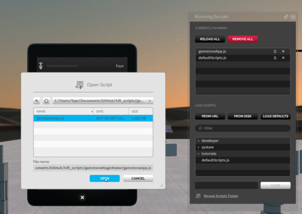
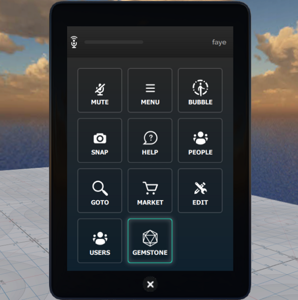
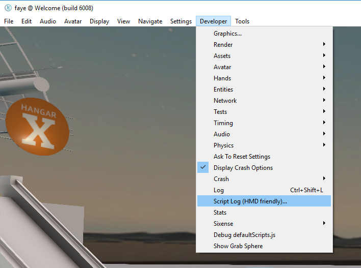

*Learn how you can create your own tablet app.*

## Overview
This tutorial takes you through the process of creating your own tablet app.

## Introduction

Once you've created a script to see a particular behavior, you can create a tablet app for it. In this page, you will learn how to create an app called “Gemstone Magic Maker”. This app lets you spawn colorful little gemstones in VR that you can share with your friends. This is just an example script. You can follow the same steps to create an app with your own script!

### What is a Tablet App?

Tablet apps are customizable programs running on the latest Tablet UI framework in High Fidelity. While the tablet comes out-of-the-box for everyone with a couple of system apps such as Snapshot, People and Create, the Tablet UI framework is designed to accomodate custom apps as well. With the Tablet, you can create your own apps and UI elements. 

Let's get started with the “Gemstone Magic Maker”. The app gives you quick access to a collection of colorful gemstones made in High Fidelity. The goal of the app is to spawn gemstones with a quick tap on the tablet app.

### What You'll Need

- High Fidelity installed.
- Basic web development experience (HTML/CSS/JavaScript).
- Familiarity with scripting in High Fidelity is nice to have, but not required. 
- About 30 minutes to an hour. 

### Instructions

#### Step 1: Create a JavaScript program for installing/uninstalling your app

Create a new JavaScript file with your text editor. You can name it gemstoneApp.js. The following example contains all the functions you need to create an app that installs and uninstalls from the tablet. 

```javascript
(function() { 
// Every great app starts with a great name (keep it short so that it can fit in the tablet button)
var APP_NAME = "GEMSTONE";   
// Get a reference to the tablet 
var tablet = Tablet.getTablet("com.highfidelity.interface.tablet.system");
// "Install" your cool new app to the tablet
// The following lines create a button on the tablet's menu screen
var button = tablet.addButton({ 
text: APP_NAME  
});
// Provide a way to "uninstall" the app
// Here, we write a function called "cleanup" which gets executed when
// this script stops running. It'll remove the app button from the tablet.
function cleanup() { 
tablet.removeButton(button);
}
Script.scriptEnding.connect(cleanup); 
}());

```

>>> [View gemstoneApp.js.](https://gist.github.com/fayeli/e0f74efaf615558e57758dc507155361#file-gemstoneapp-js)

---
>>>>> gemstoneApp.js will be a [client script](https://wiki.highfidelity.com/wiki/Script_Types_Overview) running on your High Fidelity Interface.


#### Step 2: Start designing your app’s UI in HTML/CSS

You can design UI elements in the Tablet UI framework, like how you do when designing a web application. You can write this in HTML, CSS or JavaScript.

You want to keep in mind that the tablet screen dimensions are **480 x 720**, and this factors in for buttons sizes for small screens, text readability etc.

To help you get started, we’ve put together a [quick start template](https://hifi-content.s3.amazonaws.com/faye/tablet-sample-app/quick_start_template.html) that you can reuse. It contains the same layout, styling and font as the main menu screen. It also has a “sticky” header bar for your app title. You can also choose to make your own UI.

* **Modify the quick start template**: Here, we only changed the title and made a list of buttons for our gemstone collection.  
* It only takes a few modifications in HTML going from the template to our Gemstone Magic Maker app
* **Host your HTML file on the web**: We’re using Amazon S3 for the tutorial [https://hifi-content.s3.amazonaws.com/faye/gemstoneMagicMaker/gemstoneMagicMaker.html](https://hifi-content.s3.amazonaws.com/faye/gemstoneMagicMaker/gemstoneMagicMaker.html))

Development Tips: You can test your UI using the Chrome Inspector tool, which allows you to live preview your app while making changes. 

#### Step 3: Load your web app on the High Fidelity tablet

In gemstoneApp.js, copy and paste a link to your web app.

```javascript
// Link to your app's HTML file
var APP_URL = "https://hifi-content.s3.amazonaws.com/faye/gemstoneMagicMaker/gemstoneMagicMaker.html";

```

Type in the following function to load the app when the button is clicked.

```javascript
// Link to your app's HTML file
// When a user clicks the app button, we'll display our app on the tablet screen
function onClicked() {
  tablet.gotoWebScreen(APP_URL);
}
button.clicked.connect(onClicked);

```

Let’s see our progress so far!

```javascript
(function() {
	// Every great app starts with a great name (keep it short so that it can fit in the tablet button)
	var APP_NAME = "GEMSTONE";
	// Link to your app's HTML file
	var APP_URL = "https://hifi-content.s3.amazonaws.com/faye/gemstoneMagicMaker/gemstoneMagicMaker.html";

	// Get a reference to the tablet 
	var tablet = Tablet.getTablet("com.highfidelity.interface.tablet.system");

	// "Install" your cool new app to the tablet
	// The following lines create a button on the tablet's menu screen
	var button = tablet.addButton({
        	text: APP_NAME
    	});

	// When user click the app button, we'll display our app on the tablet screen
	function onClicked() {
		tablet.gotoWebScreen(APP_URL);
	}
    	button.clicked.connect(onClicked);

	// Provide a way to "uninstall" the app
	// Here, we write a function called "cleanup" which gets executed when
	// this script stops running. It'll remove the app button from the tablet.
	function cleanup() {
        tablet.removeButton(button);
	}
    Script.scriptEnding.connect(cleanup);
}()); 
```
  

Lastly, go to **Running Scripts (Ctlr + J) -> From Disk -> Open gemstoneApp.js**. Then, you can click on the Gemstone button on the tablet and load the app.

#### Step 4: Add an icon for your app

As you may have noticed, we never specified an icon for our app and the tablet defaults it to the “pencil & wrench” icon that was also used for **Create**. Let’s make something more appropriate for our Gemstone Magic Maker.

The recommended specs for tablet icon art are **50 by 50 (or square), white on a transparent background in the SVG file format**. You can create your own icon using graphic design software or any other online resources. For this, we used [The Noun Project](https://thenounproject.com/), a site where designers create icons and share them for free use under [Creative Commons](https://creativecommons.org/). We picked the [gemstone icon by Cengiz SARI from the Noun Project](https://thenounproject.com/search/?q=gemstone&i=9978). The icon was then modified so that the vector paths are in white and in the correct dimension.

Then, in gemstoneApp.js, we copy and paste the path to the icon. Both, the local path or the URL should work.

```javascript
// Path to the icon art for your app
var APP_ICON = "https://hifi-content.s3.amazonaws.com/faye/gemstoneMagicMaker/gemstoneAppIcon.svg";

```

Reference the icon when you create the tablet button.

```javascript
var button = tablet.addButton({
   icon: APP_ICON,
   text: APP_NAME
});

```

  *Before and after we added an icon. Looking a lot better, isn’t it?*

### Step 5: Handle the button click events via the EventBridge

Now, let’s make the gemstone buttons interact with High Fidelity. The Tablet UI framework provides a communication channel called **EventBridge**. It allows you to send and receive events between the client script (gemstoneApp.js) and JavaScript in your web app (gemstoneMagicMaker.html). Follow the example code below to see the EventBridge in action. We’re using it to handle the button clicks:

```html
 <body>
        <div class="top-bar">
            <h4>Gemstone Magic Maker</h4>
        </div>
        <div class="content">
            <p>Pick a gemstone from our curated collection:<p>
            <p><input type="button" class="gemstone-button white" value="Emerald"></p>
            <p><input type="button" class="gemstone-button red" value="Ruby"></p>
            <p><input type="button" class="gemstone-button blue" value="Sapphire"></p>
            <p><input type="button" class="gemstone-button white" value="Quartz"></p>
        </div>

        <script src="https://ajax.googleapis.com/ajax/libs/jquery/3.1.1/jquery.min.js"></script>
        <script>
            function main() {
                // Send an event to gemstoneApp.js when the page loads and is ready to get things rolling
                console.log("document ready");
                var readyEvent = {
                    "type": "ready",
                };
                // The event bridge handles events represented as a string the best. So we first create a Javascript object, then convert to stirng
                EventBridge.emitWebEvent(JSON.stringify(readyEvent));
                // Send an event when user click on each of the gemstone buttons
                $(".gemstone-button").click(function(){
                    console.log(this.value + " button click");
                    var clickEvent = {
                        "type": "click",
                        "data": this.value
                    };
                    EventBridge.emitWebEvent(JSON.stringify(clickEvent));
                });
            }
            $(document).ready(main);
        </script>
    </body>
```

>>>[View snippetGemstoneMagicMaker.html](https://gist.github.com/fayeli/e5a95ca01bd3179ed7f86ec07bab14fa#file-snippetfromgemstonemagicmaker-html)

And in gemstoneApp.js, we can write the following lines to listen for the events.

```javascript
// Handle the events we're receiving from the web UI
function onWebEventReceived(event) {
   print("gemstoneApp.js received a web event: " + event);
}
tablet.webEventReceived.connect(onWebEventReceived);

```

Debugging Pro Tip: Use the method print(“your debug message”) to take a peek into your program’s behavior.



Open the script log (Developer > Script Log) to see the debug messages.

### Step 6: Let's create gemstones!

Finally, to the most fun part of this tutorial, we’ll create the gemstones with the High Fidelity JS API. The gemstones will be created as Entities, whose [Properties](https://docs.highfidelity.com/api-reference/namespaces/entities#.EntityProperties) we can manipulate in gemstoneApp.js.

- Let's calculate the position where we want to create the entity.

```
// Helper function that gives us a position right in front of the user 
function getPositionToCreateEntity() {
  var direction = Quat.getFront(MyAvatar.orientation);
  var distance = 0.3;
  var position = Vec3.sum(MyAvatar.position, Vec3.multiply(direction, distance));
  position.y += 0.5;
  return position;
}

```

- **Provide more properties (color, name, shape, etc.) for each kind of gemstone**. The Entity will be created when gemstoneApp.js receives click events from each of the buttons.

```javascript
// Handle the events we're recieving from the web UI
function onWebEventReceived(event) {
    print("gemstoneApp.js received a web event:" + event);

    // Converts the event to a JavasScript Object
    if (typeof event === "string") {
        event = JSON.parse(event);
    }

    if (event.type === "click") {
        // Define the entity properties of for each of the gemstone, then add it to the scene
        var properties = {
            "type": "Shape",
            "position": getPositionToCreateEntity(),
            "userData": "{\"grabbableKey\":{\"grabbable\":true}}"
        };
        if (event.data  === "Emerald") {
            properties.name = "Emerald";
            properties.shape = "Dodecahedron";
            properties.color = {
                "blue": 122,
                "green": 179,
                "red": 16
            };
            properties.dimensions = {
                "x": 0.20000000298023224,
                "y": 0.26258927583694458,
                "z": 0.20000000298023224
            };
            Entities.addEntity(properties);
        } else if (event.data  === "Ruby") {
            properties.name = "Ruby";
            properties.shape = "Octagon";
            properties.color = {
                "blue": 160,
                "green": 52,
                "red": 237
            };
            properties.dimensions = {
                "x": 0.20000000298023224,
                "y": 0.24431547522544861,
                "z": 0.12547987699508667
            };
            Entities.addEntity(properties);
        } else if (event.data  === "Sapphire") {
            properties.name = "Sapphire";
            properties.shape = "Icosahedron";
            properties.color = {
                "blue": 255,
                "green": 115,
                "red": 102
            };
            properties.dimensions = {
                "x": 0.160745769739151,
                "y": 0.20000000298023224,
                "z": 0.23340839147567749
            };
            Entities.addEntity(properties);
        } else if (event.data  === "Quartz") {
            properties.name = "Quartz";
            properties.shape = "Octahedron";
            properties.color = {
                "blue": 245,
                "green": 142,
                "red": 216
            };
            properties.dimensions = {
                "x": 0.20000000298023224,
                "y": 0.339866042137146,
                "z": 0.20000000298023224
            };
            Entities.addEntity(properties);
        }
    }
}
```


* Showcase gemstones created: 
* Share with friends!: 

#### We're Done!

We’ve covered all the basics of creating a tablet app for High Fidelity. For your reference, the full example project is available below:

- [**gemstoneApp.js**](https://github.com/fayeli/hifi_scripts/blob/master/gemstoneMagicMaker/gemstoneApp.js)
- [**gemstoneMagicMaker.html**](https://github.com/fayeli/hifi_scripts/blob/master/gemstoneMagicMaker/gemstoneMagicMaker.html)


