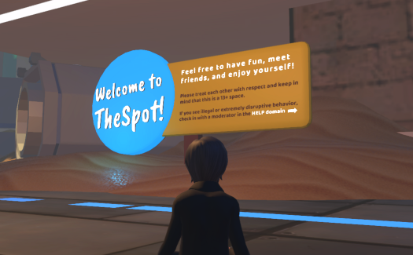

High Fidelity is a metaverse where you can connect and create with others. We invite you to explore VR worlds created in High Fidelity and interact with other users. You can visit your friend's VR world, meet people, attend events and even go for a class on avatar creation. It's an immersive and interactive experience with realistic visuals and audio.

If its your first time using High Fidelity, you'll start your journey in our welcome area where you can choose an avatar, discover how to use your controls, and talk with one of our greeters. If you've visited High Fidelity before, you will return to the location where you last visited. 

Throughout this chapter, learn how to make the most of your exploration:

* [**Get Started with High Fidelity**](./get-started)
* [**Personalize Your Experience**](./personalize-experience)
* [**Change Your Avatar**](./personalize-experience/change-avatar)
* [**Socialize with Others**](./socialize)
* [**Travel Between Worlds**](./travel)
* [**Interact with Your Environment**](./interact-objects)
* [**Bank and Shop**](./bank-and-shop)
* [**Give and Receive Gifts**](./gifts)
