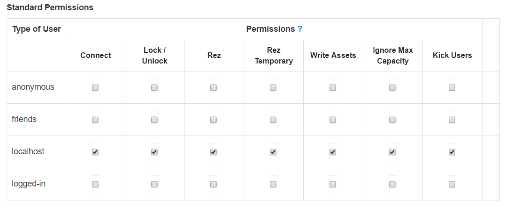
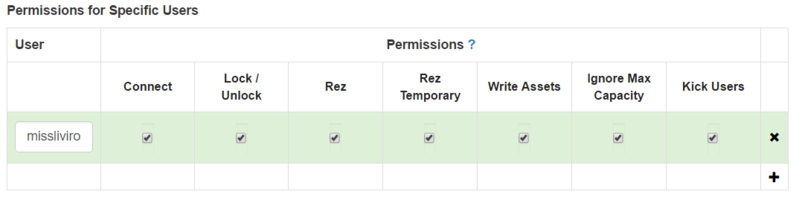

*This tutorial covers setting up your home domain to build in High Fidelity.*

## Contents

* [Overview](#overview)
* [Introduction](#introduction)
* [Steps](#steps)
* [Results](#results)
* [Conclusion](#conclusion)
* [Additional Information](#additional-information)
* [References](#references)

## Overview

High Fidelity is an open-source software with which you can create and share virtual reality (VR) experiences. If you’re ready to start building in High Fidelity, you’ve come to the right place! In this tutorial, we’ll walk you through:

* Installing High Fidelity’s Sandbox.
* Setting up a personal High Fidelity server (for your Sandbox) to be hosted on your machine.
* Connecting to your Sandbox server with the browser.
* Configuring user permissions for your domain.

## Introduction

To start building in High Fidelity, we need to talk about domains first. [Domains](../../get-started/what-is-high-fidelity/how-it-works) in High Fidelity are hosted on your system or the system running Sandbox.

As a user, you can set-up multiple domains. These domains can be accessed by typing in the domain place name when you use the Interface. High Fidelity automatically generates [place names](../../create-and-explore/start-working-in-your-sandbox/place-names) for domains, though these are not personalized. Through your High Fidelity account, you can also purchase a place name for your domain. With your own place name, you can make your domain easier to find and share with other users.

Users can access and share your VR experiences by looking for your domain through the Interface. The Interface runs on a client device, and allows users to interact with the domains hosted through the [Sandbox](../../get-started/what-is-high-fidelity/how-it-works). And it is in Sandbox (hosted on your local system) that you can build whatever you’d like.

Let’s set-up your domain!

### Steps

1. [**Install High Fidelity**](../../get-started/installation)
   If you don’t have High Fidelity on your system, download and install the software using these instructions.
2. Check if your server is running your domain.
3. **Launch Sandbox**
   If Sandbox is running, you should see High Fidelity’s icon in the system tray (Windows) or menu bar (Mac). If you don’t see it running, Launch Sandbox from the Start Menu by going to High Fidelity > Sandbox.
4. **Configure Server Properties**
   When you start using your Sandbox, we recommend you secure your server so that other users cannot enter and modify objects within your domain. You can do this by updating user permissions in your server settings. To do this,
   * Open your desktop browser and connect to Sandbox by typing in [http://localhost:40100/](http://localhost:40100/).
   * You’ll see the page in the image below. Click on Settings. 
   * In the Settings page, click Security.
   * Uncheck the Connect column for anonymous, friends, and logged-in users in the Standard Permissions table as shown below.
   * The rest of the settings on the page will come into play when you have a place name and are ready to share your content.
   * Scroll down further and add your username in the Permissions for Specific Users table. Check all the boxes as shown. If you want your friends or particular users to access and edit your domain, you can add their usernames here. 
   * Click Save & Restart to save and run the domain server with the new settings. Now only you can access your home domain.
5. **Your server is set-up!**
   You can visit your Sandbox to start building. If your server isn’t running, right-click High Fidelity’s icon in the System tray (Windows) or Menu bar (OS X), and select ‘Start Server’. Once the server starts, click ‘Go Home’ to enter your home domain!

### Results

You’ve successfully setup your domain to start building. Before you do, get familiar with your home domain and try to pop into some of the other domains (like Welcome) using Interface to get comfortable with High Fidelity.

## Conclusion

Now, you’re ready to start building your own world. We recommend Get Started with Scripting in High Fidelity as your next step!

## Additional Information

Curious about how everything runs under the hood? You can check out the compiler documentation and build the source code for High Fidelity yourself!

Download and Install High Fidelity Interface and Sandbox  and sign up for a High Fidelity account at [http://highfidelity.com/](http://highfidelity.com/).

## References

* Server Settings
* Sandbox documentation
* Explore
