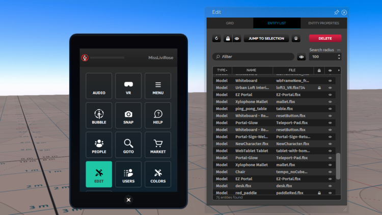

## Introduction to Scripting

Before we get started with building more complex projects, we’re going to start by taking a look at the tools provided within the High Fidelity Interface client to edit our domain. These tools will allow us to add and modify different entities in our domain.

In this tutorial, you’ll learn how to:

- Switch in and out of desktop and VR modes
- Turn on the editing and developer menus
- Add a cube to your domain
- View running scripts and start new ones

## Domain Editing

If you have permissions to create and edit in a given domain (either your sandbox domain, or another domain) you will be able to modify the world around you in real time. On your tablet or HUD, you can click ‘Create’ to open up a secondary menu that enables you to add entities to your domain and to change properties for the objects in the environment.

*Entity* - an object with a set of properties within a domain in High Fidelity



When the Edit window is open, you can set up and use an editing grid, search for entities in your scene, and select objects to view the properties that have been set for different entities. You can select objects within the scene using the mouse [(desktop mode)](https://wiki.highfidelity.com/wiki/Explore) and grab triggers [(VR mode with hand controllers)](https://wiki.highfidelity.com/wiki/Hand_controllers) and move, rotate, and scale them in your environment. A selected entity will have a red line around the model.

For an extensive look at the editing tools, read over the [Interface edit mode documentation here](https://wiki.highfidelity.com/wiki/Edit_Mode).

## Entity Properties

Each entity within your High Fidelity domain will contain a number of different properties that define the behavior and appearance of your object. You can view properties for a given entity in Edit mode by selecting an object and clicking the ‘Entity Properties’ tab in the Edit window.

1. With Edit mode on, select the Cube button to add a cube to your scene. The cube will appear directly in front of you, and will be selected when you add it.
2. In the Edit window, select the Entity Properties tab to view the cube properties. You can change the shape, give your cube a name, modify the position, rotation, dimensions, and scale, customize physics properties, change the colors, attach scripts, and set specific behaviors.
3. Spend some time getting familiar with the properties that are presented to you by changing the shape and color of the cube you just created.
4. Take a look at the different physics properties you can set with this video: [Setting Grab Properties](https://wiki.highfidelity.com/wiki/Setting_Grab_Properties) and make your cube throwable.

When we start writing our scripts, we’ll also be able to access and modify the properties of entities within our scene using the [Entity Properties APIs](https://wiki.highfidelity.com/wiki/Entity_Properties_API), which we’ll cover in depth in future modules.

## Write and Execute Your Own Scripts

You can write your scripts in an external editor of your choice. 

With your script editor open, you can now view and modify scripts in your domain or attached to various entities. To start, we’ll do a basic ‘Hello, World’:

1. Type print("Hello, World"); into your script editor's window.
2. Save your script as testScript.js on your computer. 
3. On your tablet, go to Menu > Settings and check both Advanced Menu and Developer Menu. 
4. On your tablet, go to Menu > Edit > Open and Run Script. 
5. Your tablet will now display your local system's directory. You can find your script file and click on **Open**.
6. You will see your text printed in the console window. Your script will continue running until you stop it.

We’ll now replicate our steps from earlier to create our cube through a script instead of adding it manually. Replace your `print(“Hello, World”)` code with the following example:

```
var position = Vec3.sum(MyAvatar.position, Quat.getFront(MyAvatar.orientation));
var properties = {
type: "Box",
name: "ScriptBox",
position: position,
color: { red: 0, green: 0, blue: 155 }};
Ent = Entities.addEntity(properties);
print("Entity added");

```

A few things are happening in this script to get us warmed up with scripting in High Fidelity. First, we’re accessing some data from our avatar `(MyAvatar.position, MyAvatar.orientation)` to figure out where to place our newly generated box. Next, we create an entity based on our properties specification (we do type, name, position, and color, but you could also set additional properties for your entity depending on the complexity of your components). Finally, we save a reference to the Entity and place it in our world, then print our debug line to confirm everything is running smoothly.

Click on run to see your cube appear!

