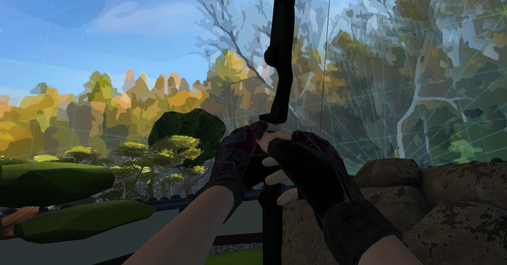
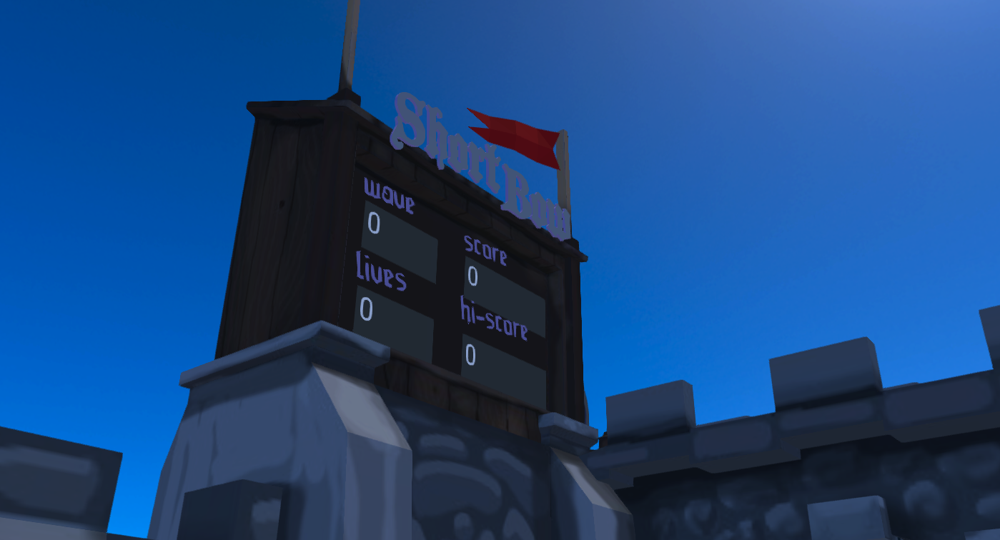

In this four-part tutorial, we’re going to go through the process of creating a Shortbow VR wave game that we can add to our domain in High Fidelity. Before diving into this section, we recommend that you familiarize yourself with the various types of scripts that run in High Fidelity and go through the following tutorials for setting up your domain and getting ready to build a game:

- [Setup Your Domain to Build in High Fidelity](https://docs.highfidelity.com/learn-with-us/setup-your-domain-to-build)
- [Get Started with Scripting in High Fidelity](https://docs.highfidelity.com/learn-with-us/get-started-with-scripting)

If you want to check out what we'll be building, you can [get Shortbow on Marketplace](https://highfidelity.com/marketplace/items/76711111-ef6d-457b-aef0-63e9206d2964)! After you run spawnShortbow.js in your domain, you should see a castle appear. Using the trigger on your controllers, select the 'Start' button on the target to start the game!

## Chapter 1: Set Up & Build our Bow and Arrow

In this module, we’re going to:

- Set up a project directory for our Shortbow game
- Download assets
- Explain the game structure
- Build a bow and arrow that we can use in our domain

### Creating a Project Structure

While our Shortbow game isn’t too large of an application, we’ll want to set up our project files so that we can clearly see which components go with different parts of the application. In particular, we’ll be creating a number of different elements (to start with, a bow) that will require audio files, images, and mesh components. These will all come together to create entities that we’ll be able to use in our Shortbow scripts.

High Fidelity comes with a built-in script editor, but you can set up your development environment with the tools of your choosing and do your script editing outside of the High Fidelity script editor. As we build out various components of the Shortbow application, we’ll be using the built-in editor to load and test scripts at different times.

For now, navigate to a folder on your desktop and create a new folder to house the project. Name it ‘Shortbow’, then double click to open it. We’ll be adding in a number of different scripts and various file types to make our game come together.

Inside of the Shortbow folder, make three more folders. Name one folder ‘models’, one folder ‘sounds’, and one folder ‘bow’ - we’ll be placing any components for our bow into its respective folder, and the other sounds or resources into their respective folders.

With two exceptions, the scripts for our Shortbow game will go into the root folder.

### Getting the Project Assets

In addition to the scripts that we’ll be writing, our Shortbow game requires several types of components to make it interactive and fun. You can download the full set of project assets [here](https://github.com/highfidelity/hifi/tree/master/unpublishedScripts/marketplace/shortbow), or create your own 3D assets in a tool like Clara.io, Blender, 3DS Max, or Maya. If you do plan to build your own models, make sure that your collision, grab, equip, and properties are set properly. For this tutorial, we recommend downloading the existing assets to start. Including models, you should have the following assets:

| **Name**            | **Path** 		| **File Type** |
| ------------------- | -------- 		| ------------- |
| escape              | /sounds/ 		| WAV           |
| explosion           | /sounds/ 		| WAV           |
| fight               | /sounds/ 		| WAV           |
| gameOn              | /sounds/ 		| WAV           |
| gameOver            | /sounds/ 		| WAV           |
| letTheGamesBegin    | /sounds/ 		| WAV           |
| spawn               | /sounds/ 		| WAV           |
| targetHit           | /sounds/ 		| WAV           |
| tenSecondsRemaining | /sounds/ 		| WAV           |
| waveComplete        | /sounds/ 		| WAV           |
| Amber               | /models/ 		| FBX           |
| shortbow-platform   | /models/ 		| FBX           |
| shortbow-button     | /models/ 		| FBX           |
| shortbow-scoreboard | /models/ 		| FBX           |
| Arrow_impact.1.L    | /bow/    		| WAV           |
| Bow_draw1.L         | /bow/    		| WAV           |
| String_release2.L   | /bow/    		| WAV           |
| arrow-sparkle       | /bow/    		| PNG           |
| arrow               | /bow/models/    | FBX           |
| bow-deadly          | /bow/models/    | FBX           |
| bow                 | /bow/    		| SVO.JSON      |
| bow                 | /bow/    		| JSON          |
| bow_collision_hull  | /bow/models/    | OBJ           |
| notch               | /bow/    		| WAV           |

[Asset Download Link](https://github.com/highfidelity/hifi/tree/master/unpublishedScripts/marketplace/shortbow)

### Script Files

As we mentioned in the introduction, we’ll be covering a number of different script types to put together our Shortbow game. At a high level, scripts that we build in Shortbow will fall into one of two categories:

- Scripts that perform a specific behavior on a given object
  - Example: A script on the bow to shoot arrows
  - Example: A script on an enemy entity to manage movement and collisions


- Scripts that control overarching elements of the game play
  - Example: A script that loads in all of the necessary entities
  - Example: A script that handles when the game begins and ends

For many of our scripts, there will be both a client side entity script and a server side entity script. You can find a full description of the four types of scripts in the Script Types Overview documentation on the High Fidelity Wiki [here](https://wiki.highfidelity.com/wiki/Script_Types_Overview).

We will have one script that loads in all of our other entities and handles the overall game play, which we’ll write in Chapter 4. This script will handle the setup of our models, load in all of the other required scripts for the experience, and start our game loop. This structure for our Shortbow game enables us to load and unload everything for our game with spawnShortbow.js, but before we get into those scripts, we’re going to create our bow!

### Scripting a Bow & Arrow

*Before getting started with the scripts, make sure that you’ve got all of the non-scripting assets in their correct folders, as shown in the table above!*

The first thing we'll write is a script for our bow behaviors, which will contain a number of different functions that will help us give our bow the ability to shoot arrows.

1. Create a new file named ‘bow.js’ in your bow directory.
2. [Click this link](https://github.com/highfidelity/hifi/blob/master/unpublishedScripts/marketplace/shortbow/bow/bow.js) and copy the contents into your bow.js file.
3. Save bow.js

Let’s pause for a second and take a look at the internals of bow.js, since this is the bulk of what makes up our projectile launcher. To start, you’ll see that there are a number of different functions that help with entity management, translating objects in 3D space, and colors.

Once we set up our helper functions, we establish the relative location of the hand controllers we have and translate the position into world coordinates, which we’ll use to understand the position of our hands and detect when we grab our bow. The function getControllerLocation() will use that logic to establish where our hands are in the world.

The main function in bow.js is in an unnamed function that starts at line 95. Lines 101 - 187 set up constants for our bow and arrow, and do the following, in order:

- Set up a null UUID, which will later be used to assign an Entity ID
- Load in four .wav files for our sound effects, as well as the model URL for our arrow
- Save dimensions, distances, speed, offsets, gravity, lifetime, and draw for our arrow behavior
- Place our trigger controls in an array that contains both the left and right trigger buttons on our hand controllers
- Define an interval function
- Create a variable to hold a reference to the bow object
- Set up names for the bowstring and arrow
- Define states for when the bow is idle (0), or if an arrow has been grabbed (1)

After all of the constant values are defined, we set up a prototype for our bow object, which is a way of specifying a series of components for an entity that we will reuse during our game experience. The rest of bow.js consists of setting up the properties and functions that every bow will have.

*Bow Properties* include:

- String data
- Bow state (aiming, notching, idle, etc.)
- Sound files for different bow events

*Bow Functions* provide support for:

- Being equipped and unequipped when grabbed by a player
- Spawning and shooting arrows
- Updating the visuals of pulling on the string

Additionally, the bow prototype also contains a prototype for our arrow objects, which are generated when the bowstring is pulled. Arrows are entities with properties that include a model and particle effect, are parented to the bow, and have specific physics settings that make them collide, fly, and make noise when they hit other objects.

The second script that we’ll write for our bow is the spawnBow.js script, which will create an instance of a bow as defined in bow.js, and add it to our domain so that users in the virtual world can interact with it. In your bow directory, create a new script named spawnBow.js, then open spawnBow.js in the High Fidelity script editor or the IDE of your choosing.

The spawnBow script has two main parts: the first part of the script calculates the hand position and rotation for the left and right hands, in order to figure out where the bow will be “worn” by the user, and creates a userData variable to assign the “wearable” property of the bow accordingly. Copy and paste the following code into your spawnBow.js file:

  ```
  var leftHandPosition = {
      "x": 0,//-0.0881,
      "y": 0.0559,
      "z": 0.0159
  };
  var leftHandRotation = Quat.fromPitchYawRollDegrees(90, -90, 0);
  var rightHandPosition = Vec3.multiplyVbyV(leftHandPosition, { x: -1, y: 0, z: 0 });
  var rightHandRotation = Quat.fromPitchYawRollDegrees(90, 90, 0);

  var userData = {
      "grabbableKey": {
          "grabbable": true
      },
      "wearable": {
          "joints": {
              "LeftHand": [
                  leftHandPosition,
                  leftHandRotation
              ],
              "RightHand": [
                  rightHandPosition,
                  rightHandRotation
              ]
          }
      }
  }

  ```

User data is a JSON-formatted set of entity properties that you can use to specify additional parameters outside of what is provided by default. In this case, we’re giving it the ability to be equipped as a wearable object, so that we don’t need to continue to hold the trigger down to keep the object in our hands when we pick it up.

The second part of spawnBow.js creates an instance of our bow using our prototype function in bow.js, and adds the entity to our scene with the specified user data. Copy the following code and paste it under the existing code:

```
var id = Entities.addEntity({
    position: MyAvatar.position,
    "collisionsWillMove": 1,
    "compoundShapeURL": Script.resolvePath("bow_collision_hull.obj"),
    "created": "2016-09-01T23:57:55Z",
    "dimensions": {
        "x": 0.039999999105930328,
        "y": 1.2999999523162842,
        "z": 0.20000000298023224
    },
    "dynamic": 1,
    "gravity": {
        "x": 0,
        "y": -9.8,
        "z": 0
    },
    "modelURL": Script.resolvePath("bow-deadly.fbx"),
    "name": "Hifi-Bow",
    "rotation": {
        "w": 0.9718012809753418,
        "x": 0.15440607070922852,
        "y": -0.10469216108322144,
        "z": -0.14418250322341919
    },
    "script": Script.resolvePath("bow.js") + "?" + Date.now(),
    "shapeType": "compound",
    "type": "Model",
    //"userData": JSON.stringify(userData),
    "userData": "{\"grabbableKey\":{\"grabbable\":true},\"wearable\":{\"joints\":{\"RightHand\":[{\"x\":0.0813,\"y\":0.0452,\"z\":0.0095},{\"x\":-0.3946,\"y\":-0.6604,\"z\":0.4748,\"w\":-0.4275}],\"LeftHand\":[{\"x\":-0.0881,\"y\":0.0259,\"z\":0.0159},{\"x\":0.4427,\"y\":-0.6519,\"z\":0.4592,\"w\":0.4099}]}}}",
    "lifetime": 600
});
print("Created bow:", id);

```

Save spawnBow.js - it’s time to test it out!

### Loading User Scripts in High Fidelity

If it isn’t already running, launch Sandbox and go to your home domain. Make sure that developer and advanced menus are enabled, then go to Edit > Open and Run Script File and navigate to your spawnBow.js file.

When it loads, you should see a bow appear in front of your avatar. Grab it and start practicing! If you don’t see it running, press CTRL+J to open the script menu and click the reload button to the right of spawnBow.js in the running script list.



### Recap

In this tutorial, we set up our project assets and made a usable bow and arrow for our domain. In Chapter 2, we’ll continue our Shortbow game by creating enemy entities to fight off.

## Chapter 2: Creating Enemy Entities

In Chapter 1, we created the main weapon for our tower defense game and brought it into our domain. We also set up our asset directory. In this module, we’re going to add:

- A utility script with helper functions
- An enemy client entity script
- An enemy server entity script

### Utility file: utils.js

In our first chapter, we introduced the idea of utility functions for our bow. We’ll build on that in this chapter by adding a utility script with helpful functionality that will be reused across different components in our script directory. We’re going to start out building our enemy entities by creating a utils.js file, which will live in our project’s root directory.

1. In the project’s root directory, create a utils.js file alongside your assets and bow folders.
2. Copy and paste the following code block into utils.js
3. Save your utils.js file

```
if (!Function.prototype.bind) {
Function.prototype.bind = function(oThis) {
    if (typeof this !== 'function') {
    // closest thing possible to the ECMAScript 5
    // internal IsCallable function
    throw new TypeError('Function.prototype.bind - what is trying to be bound is not callable');
    }

    var aArgs   = Array.prototype.slice.call(arguments, 1),
        fToBind = this,
        fNOP    = function() {},
        fBound  = function() {
        return fToBind.apply(this instanceof fNOP
                ? this
                : oThis,
                aArgs.concat(Array.prototype.slice.call(arguments)));
        };

    if (this.prototype) {
    // Function.prototype doesn't have a prototype property
    fNOP.prototype = this.prototype;
    }
    fBound.prototype = new fNOP();

    return fBound;
};
}

utils = {
    parseJSON: function(json) {
        try {
            return JSON.parse(json);
        } catch(e) {
            return undefined;
        }
    },
    findSurfaceBelowPosition: function(pos) {
        var result = Entities.findRayIntersection({
            origin: pos,
            direction: { x: 0, y: -1, z: 0 }
        });
        if (result.intersects) {
            return result.intersection;
        }
        return pos;
    }
};

```

Where the utility functions for our bow focused on entity management and position / appearance functions for entities, this utils.js function contains functionality for calculating the bottom of surfaces, formatting numbers, and parsing JSON files, all of which will be useful for placing enemies, the playing field, and scoring our Shortbow game.

### Creating an Enemy Entity Server Script

With the helper script finished, we get to move into the fun part - making our enemies do things! A cube that stays in one place as an enemy isn’t particularly engaging, so we’ll be making a couple of additional scripts for our enemy entities to make them more interactive and respond to being shot by arrows. Create a file in your root directory called ‘enemyServerEntity.js’ and open it

Our server entity script for our enemies will set up a prototype that sends a heartbeat to the game channel we’ll be implementing in the next module. The first thing that we’ll do in our function is include our utility script. We’ll also define an empty function for our enemy, with the prototype defined shortly after. Add the following in between the brackets of the first function:

```
(function(){
    Script.include('utils.js');
    Enemy = function() {
    };

```

The prototype for our enemies will handle different states during the gameplay. The first function defined in our enemy prototype is our preload function, which handles setup.

In our preload function, we’re going to make sure that our enemy gets an entity ID and set up an array that will contain the different objects that the enemy has collided with. We also want to make sure that we’ve set a game for the enemy to be a part of. Under our Enemy function declaration, add the following:

```
Enemy.prototype = {
        preload: function(entityID) {
            this.entityID = entityID;
            var userData = Entities.getEntityProperties(this.entityID, 'userData').userData;
            var data = utils.parseJSON(userData);
            if (data !== undefined && data.gameChannel !== undefined) {
                this.gameChannel = data.gameChannel;
            } else {
                print("enemyServerEntity.js | ERROR: userData does not contain a game channel and/or team number");
            }
            var self = this;
            this.heartbeatTimerID = Script.setInterval(function() {
                print("Sending heartbeat", self.gameChannel);
                Messages.sendMessage(self.gameChannel, JSON.stringify({
                    type: "enemy-heartbeat",
                    entityID: self.entityID,
                    position: Entities.getEntityProperties(self.entityID, 'position').position
                }));
            }, 1000);
        },

```

The second function in our prototype is the unload function, which cleans up when the script is no longer needed. Directly following the preload function, add the following code and end out the closing brackets:

```
unload: function() {
            Script.clearInterval(this.heartbeatTimerID);
        },
    };
return new Enemy();
});

```

### Creating an Enemy Client Entity Script

The other part of our enemy behavior is defined in a client-side enemy script, a similarly named enemyClientEntity.js. Create this file in your project directory and open it. Like our server entity script, it will begin similarly:

```
(function() {
    Script.include('utils.js');

    Enemy = function() {
    };

```

We’ll add in the prototype under our Enemy function, and include some setup code in our preload function:

```
Enemy.prototype = {
        preload: function(entityID) {
            this.entityID = entityID;

            // To avoid sending extraneous messages and checking entities that we've already
            // seen, we keep track of which entities we've collided with previously.
            this.entityIDsThatHaveCollidedWithMe = [];

            Script.addEventHandler(entityID, "collisionWithEntity", this.onCollide.bind(this));

            var userData = Entities.getEntityProperties(this.entityID, 'userData').userData;
            var data = utils.parseJSON(userData);
            if (data !== undefined && data.gameChannel !== undefined) {
                this.gameChannel = data.gameChannel;
            } else {
                print("enemyEntity.js | ERROR: userData does not contain a game channel and/or team number");
            }
        },

```

Following the preload function in our prototype, we’ll add in a new function, **onCollide**. This function takes two entities and a collision event as a parameter, and checks if the two objects have collided previously. If they have, the collision is ignored, but if it is the first time that the two objects in question have hit one another, the colliding entity is added to the enemy’s collision history array. The collision function then checks if the entity was an arrow (killing the enemy) or the exit (thus escaping and a life being lost) and sends a corresponding message to the responding entity in each case.

Directly following the preload function, add the following code for onCollide and close out the prototype function:

```
onCollide: function(entityA, entityB, collision) {
            if (this.entityIDsThatHaveCollidedWithMe.indexOf(entityB) > -1) {
                return;
            }
            this.entityIDsThatHaveCollidedWithMe.push(entityB);

            var colliderName = Entities.getEntityProperties(entityB, 'name').name;

            if (colliderName.indexOf("projectile") > -1) {
                Messages.sendMessage(this.gameChannel, JSON.stringify({
                    type: "enemy-killed",
                    entityID: this.entityID,
                    position: Entities.getEntityProperties(this.entityID, 'position').position
                }));
                Entities.deleteEntity(this.entityID);
            } else if (colliderName.indexOf("GateCollider") > -1) {
                Messages.sendMessage(this.gameChannel, JSON.stringify({
                    type: "enemy-escaped",
                    entityID: this.entityID,
                    position: Entities.getEntityProperties(this.entityID, 'position').position
                }));
                Entities.deleteEntity(this.entityID);
            }
        }
    };
    return new Enemy();
});

```

For the time being, we won’t be able to see our enemies, because we’ll be giving them additional properties in our main game loop file, but with the prototype in place, we’re getting close to having our fully functional Shortbow game! Make sure that you’ve saved your enemyClientEntity.js script, and test that everything is formatted properly in your scripts by running them in the Script Editor. While we won’t have anything to display yet, check that there aren’t any errors in the console when you click ‘Run’.

### Next Steps

In Chapter 3, we’ll be finishing off the game play components in our Shortbow game by loading in a castle and playing field for our game, and set up everything in our main game loop file.

## Chapter 3: Creating the Arena

We’ve made a playable bow and arrow entity and an as-of-yet-unseen enemy, but we still have a few more steps to implement before we can begin playing. In this chapter, we’re going to walk through the process of:

- Loading in our game environment
- Setting up our start button

### Importing Pre-built Entities with Interface

One of the cool features that Interface supports is exporting properties of different entities in a domain in the JSON format, which means that you can set up models, lights, and other entities in the world and easily transport them to other domains or package them up to share with other people.

To export objects from Interface:

1. Select the objects (hold Shift to select multiple entities)
2. Go to Edit > Export Entities and choose a file location
3. Give your exported objects a name and click Save
4. To import objects into Interface:
5. Go to Edit > Import Entities and choose your JSON file
6. Click Open - your objects will appear in-world based on the properties in the file

In our Shortbow game, we’ll want to import our entities at run time through our main script, rather than loading them in manually. For the purposes of this tutorial, we’ve gone ahead and provided a file that contains several models for our playing field, including a castle wall, ramp, play space, and enemy cave. We’re also going to take a shortcut for our JSON file - by making it a JS file instead of JSON, we’ll be able to use it directly in our main game loop script without any conversions.

1. In the root of your project directory, create a new file called shortbow.js
2. [Copy the contents of this file into your shortbow.js file](https://github.com/highfidelity/hifi/blob/master/unpublishedScripts/marketplace/shortbow/shortbow.js)
3. Save shortbow.js

Taking a look at the content of shortbow.js, you’ll notice that there are a few different types of entities, including five enemy spawners (SB.EnemySpawn), a few display text elements for wave, lives, and scores, seven bow spawners, and objects that make up a castle to stand on and defend. The colliders, models, and properties are all included in the file, so we’ll be able to get right to our next scripts!

### Adding a Game Start Button

Before we get into the main game loop, we’ll go ahead and start on the smaller of our two remaining tasks: making a game start button. These scripts will be part of a target on top of our castle, and when we shoot an arrow at it, will start our game. In the root of your project directory, create a new file called startGameButtonServerEntity.js

Like our enemy script, we’ll be putting the code for our start button into a function and include our utility script. We’ll also add a Button function and a prototype, and assign behaviors to our functions within that prototype.

```
(function() {
    Script.include('utils.js');

    Button = function() {
    };

```

Below our Button function, we’ll again add to our prototype with a preload and unload function. This time, we’ll also add a function called onReceivedMessage, which is called when the button is sent a message that it should become visible.

```
Button.prototype = {
        preload: function(entityID) {
            print("Loaded enemy entity");
            this.entityID = entityID;

            var props = Entities.getEntityProperties(this.entityID, 'parentID');
            this.gameChannel = 'button-' + props.parentID;

            Messages.subscribe(this.gameChannel);
            Messages.messageReceived.connect(this, this.onReceivedMessage);
        },
        unload: function() {
            Messages.unsubscribe(this.gameChannel);
            Messages.messageReceived.disconnect(this, this.onReceivedMessage);
        },
        onReceivedMessage: function(channel, message, senderID) {
            if (channel === this.gameChannel) {
                Entities.editEntity(this.entityID, {
                    visible: message === 'show'
                });
            }
        },
    };

    return new Button();
});

```

Save your startGameButtonServerEntity.js file, and create a second script, startGameButtonClientEntity.js. You’ll notice we continue with the pattern of setting up our function with our utility file, function, and prototype:

```
(function() {
    Script.include('utils.js');

    StartButton = function() {
    };
    StartButton.prototype = {
        preload: function(entityID) {
            this.entityID = entityID;
            this.commChannel = "shortbow-" + Entities.getEntityProperties(entityID, 'parentID').parentID;
            Script.addEventHandler(entityID, "collisionWithEntity", this.onCollide.bind(this));
        },
signalAC: function() {
            Messages.sendMessage(this.commChannel, JSON.stringify({
                type: 'start-game'
            }));
        },
        onCollide: function(entityA, entityB, collision) {
            var colliderName = Entities.getEntityProperties(entityB, 'name').name;

            if (colliderName.indexOf("projectile") > -1) {
                this.signalAC();
            }
        }
    };

```

Finally, we’ll specify three triggers that will call the signalAC function on our prototype: when the button is triggered from a nearby interaction, a distant interaction, or on a mouse click. Following that, we’ll close out startGameButtonClientEntity.js with a return statement and our closing parenthesis.

Directly below the prototype code, add the following lines to startGameButtonClientEntity.js:

```
    StartButton.prototype.startNearTrigger = StartButton.prototype.signalAC;
    StartButton.prototype.startFarTrigger = StartButton.prototype.signalAC;
    StartButton.prototype.clickDownOnEntity = StartButton.prototype.signalAC;

    return new StartButton();
});

```

### Displaying our Score

In order to track how far along in our game we’ve progressed, we’ll be setting up a scoreboard that displays several stats about our game. To do this, we’ll be creating a server script called displayServerEntity.js, which will subscribe to messages from our game manager whenever the score or game wave is updated.



1. In your project’s root folder, create a new script called displayServerEntity.js
2. Copy and paste the following code into your script and save:

```
(function() {
    Script.include('utils.js');

    Display = function() {
    };
    Display.prototype = {
        preload: function(entityID) {
            this.entityID = entityID;

            var props = Entities.getEntityProperties(this.entityID, ['userData', 'parentID']);
            var data = utils.parseJSON(props.userData);
            if (data !== undefined && data.displayType !== undefined) {
                this.commChannel = data.displayType + "-" + props.parentID;
            } else {
                print("scoreboardEntity.js | ERROR: userData does not contain a game channel and/or team number");
            }

            Messages.subscribe(this.commChannel);
            Messages.messageReceived.connect(this, this.onReceivedMessage);
        },
        unload: function() {
            Messages.unsubscribe(this.commChannel);
            Messages.messageReceived.disconnect(this, this.onReceivedMessage);
        },
        onReceivedMessage: function(channel, message, senderID) {
            if (channel === this.commChannel) {
                Entities.editEntity(this.entityID, {
                    text: message
                });
            }
        },
    };

    return new Display();
});

```

### Next Steps

In this chapter, we set up our scoreboard and start buttons to lay the groundwork for how we’ll start and follow along with our game. In our final chapter, we’ll finish up our game with our game manager and launch script to add our game to our domain!

## Chapter 4: Finishing our Shortbow Game

In the previous tutorial, we set up our scripts for our scoreboard and start button, and in earlier modules, we created a playable bow and arrow, and scripted the prototype for our enemies. In this module, we’ll be:

- Building a central game manager to handle the game loop
- Adding a server entity for our game
- Writing our main script to launch our game within our domain
- Playing our game!

### Implementing a Game Manager

Our game manager will be the largest of our scripts, since it will be handling the bulk of our Shortbow game’s interactivity. We’ll start by loading in our assets and creating a few helper functions to spawn and access entities that we make. Following that, we’ll add in functionality to define and manage our game states, assign properties to enemy bases, and update scores. Then, we’ll create a prototype for our game manager that contains our functions for setting up and playing the game, create a function to set up our Shortbow game in our domain, and handle messages between different entities to facilitate our game play!

1. In your project’s root folder, create a new script called shortbowGameManager.js
2. [Copy and paste this code into your script](https://github.com/highfidelity/hifi/blob/master/unpublishedScripts/marketplace/shortbow/shortbowGameManager.js)

Our four game states are defined at line 25, where we create a few variable names to specify which state our game is in at any particular time. We then load in our audio assets from our asset folder so that we can play different sound effects when events occur in our game, and create a couple of helper functions for encoding URL parameters and updating scoring.

At line 104, we begin defining our enemy properties, which sets our enemy entity scripts for the server and for the client. Our enemy properties also specify physics behaviors, models, and our communication channel, so we know that the entity is linked back to our game.

The code in lines 184-241 sets up our game manager’s initial state, including variables to specify the number of lives our player will start with and empty arrays to store references back to the bows and enemies.

Starting at line 242, we set up our game manager prototype, which contains a number of different functions that are called at various points throughout the game loop.

Like our other entities, our game has a server entity component to it.

1. Create a new file in the root directory of your project folder and name it shortbowServerEntity.js
2. Copy and paste the below code into your shortbowServerEntity.js file:

```
(function() {
    Script.include('utils.js');
    Script.include('shortbow.js');
    Script.include('shortbowGameManager.js');

    TEMPLATES = SHORTBOW_ENTITIES.Entities;

    this.entityID = null;
    var gameManager = null;
    this.preload = function(entityID) {
        this.entityID = entityID;

        var bowPositions = [];
        var spawnPositions = [];
        for (var i = 0; i < TEMPLATES.length; ++i) {
            var template = TEMPLATES[i];
            if (template.name === "SB.BowSpawn") {
                bowPositions.push(template.localPosition);
            } else if (template.name === "SB.EnemySpawn") {
                spawnPositions.push(template.localPosition);
            }
        }

        gameManager = new ShortbowGameManager(this.entityID, bowPositions, spawnPositions);
    };
    this.unload = function() {
        if (gameManager) {
            gameManager.cleanup();
            gameManager = null;
        }
    };
});

```

The shortbowServerEntity.js script manages the setup and teardown of the shortbow game manager. In the preload function, the properties of the play space are set up, and the bows and enemy spawn positions are set. When the game ends, the server entity cleans up the elements that have been created - all that’s left now is to add the final script that pulls everything together!

### Spawning our Shortbow Game

We want to create one final script that will be our single script to run in our domain to create our shortbow game. This file, named spawnShortbow.js, will let us load in all of the other assets and scripts in one go.

1. In your project root directory, create a new file named spawnShortbow.js
2. [Copy and paste this code into your spawn script](https://github.com/highfidelity/hifi/blob/master/unpublishedScripts/marketplace/shortbow/spawnShortbow.js)

The spawnShortbow.js script processes our prototypes and creates a local Shortbow game on the domain where we’re running the server script. The script spawns our platform, scoreboard, and goals, then runs the initial setup for setting the text on our scoreboard. Finally, it sets up the bow and spawning points for our enemies - with that, it’s time to play!

### Play Shortbow!

With our scripts complete, it’s time for the fun - adding our game into our domain! In your Sandbox, go to Edit > Open and Run Script File, then navigate to your project folder. Select spawnShortbow.js and hit open - you should see a ramp with a scoreboard and a play area marked off. Climb up the ramp and select the start target to spawn the rest of the playing field. Selecting it a second time will spawn your bows and the enemies will come - do your best to fight them off, or invite a few friends to help you!

*Code samples Copyright 2017 High Fidelity, distributed under the Apache 2.0 License*

### Project Extensions

These opportunities for project extensions are designed to give you an idea of ways to continue to use the Shortbow game as a base tool for learning more about the High Fidelity platform.

[Large] Modify the game play to support competitive play against other people by spawning different enemy types and seeing who can take out the most enemies while avoiding their own.

[Medium] Create additional enemy types that add complexity to the game play, such as mini-bosses

[Small] Modify a weapon from the marketplace to use as an additional option for killing enemies

[Medium] Create custom environments that work with the structure of the game by changing the models and assets used in Shortbow.JSON / Shortbow.js

[Small - Medium] Modify the play space to create a larger area for enemies to spawn and move through

[Medium] Create a version of the game that connects to an online database of high scores across all players

[Medium] Make additional arrow types that correspond to different enemy types

[Small] Add a particle effect to your arrows when they are shot