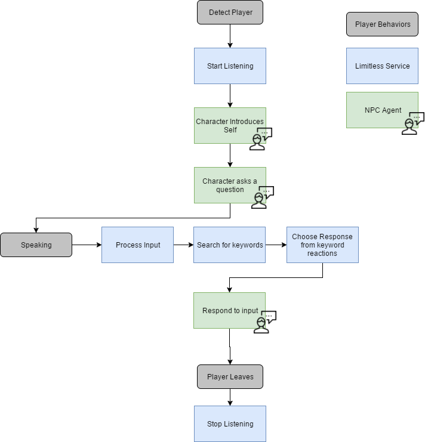

*Learn how to create NPCs (Non-Player Characters) using Limitless.*

## Overview

Limitless is a speech to text service that is integrated into High Fidelity for powering conversational non-player characters (NPCs). In this tutorial, we’ll walk through the process of creating an NPC using the Limitless system. You can visit hifi://limitless to experience a Limitless NPC yourself!

## Prerequisites

You will need your own Sandbox environment (home domain) to create in, or permission to do so in someone else’s domain.

## Background

The Limitless NPC system comprises several components. To set up a Limitless NPC system for yourself, you have to:

- Set up a trigger to listen to.
- Listen to audio and complete a voice-to-text conversion.
- Receive the parsed text.
- Send the resulting text as a JSON file to the Limitless services for branching NPC responses.

In this tutorial, we’ll start with the first stage of creating an NPC that responds to voice input. Specifically, we’ll cover how you can:

1. Create a text entity to display our speech.
2. Make a trigger to turn speech capabilities on and off.
3. Listen to the speech and processing it into a string through Limitless.
4. Display the processed text visibly on our text entity.

> > > > > The majority of the underlying code supporting the Limitless service can be found in LimitlessConnection.cpp and LimitlessVoiceRecognitionScriptingInterface.cpp.


### Voice Recognition

One of the key building blocks for language processing is voice recognition and the ability to translate spoken audio into machine-processed text. The Limitless service, integrated into High Fidelity, gives you the ability to choose when to process input from a user’s microphone.

The Limitless Speech Recognition API has several functions that we’ll use to start listening and processing audio from our microphone. You can choose when to trigger these functions depending on how you want to use the service - we’ll be using enterEntity and leaveEntity to trigger our start and stop listening processes.

When planning out an NPC, your requirements will contribute to how you define your overall solution, but to begin with, we’ll be creating a text entity to test our voice recognition setup. This entity will display anything that the Limitless voice recognition service hears from our microphone.

- Create a text entity by opening the edit menu and selecting ‘Text Entity'.

We’ll be updating the text with some JavaScript code, so you can leave the default text for now.

The next thing that we’ll do to set up our entities is create an invisible box that will be used to trigger when we start and stop processing voice data with the Limitless service.

- Create a box by opening the edit menu and selecting ‘Cube’.
- Drag your cube to the floor level and expand it so that your avatar’s waist intersects the box when walking into it.
- Place your cube in front of your text entity.
- Make your cube invisible by clicking the ‘eye’ icon on the edit menu.


### Using the LimitlessRecognition API

We’ll be adding an entity client script to our cube that will detect when an avatar enters or exits the cube and begins speaking. For this exercise, we’ll simply be transcribing the spoken audio onto the text entity in front of us, but in future tutorials, we’ll cover the process of using this data to create interactive non-player characters that run as agents in our domain.

- Launch your code editor of choice and create a new JavaScript file.

As with all entity scripts, we’ll start our Limitless speech recognition script with an anonymous function so that the entity server can process the script contents.

We’ll start out our function by setting a reference to the text entity that we’ve created (you can find this by opening the edit menu and selecting the Entity Properties tab after selecting the text entity) so that we can modify the text when we detect audio.

```
(function(){

    var textID = "{269401cb-9f13-4d84-b3c9-4cca295a0e64}";

 })

```

Next, we’ll detect when an avatar enters our entity by using the Entity Functions API to detect enterEntity and exitEntity.

- Add the following two functions to your script:

```
 this.enterEntity = function(entityID){
        print("Begin listening to voice");
        LimitlessSpeechRecognition.setListeningToVoice(true);
    };

    this.leaveEntity = function(entityID){
        LimitlessSpeechRecognition.setListeningToVoice(false);
        print("Stop listening to voice");
    };


```

The first of these functions tells the Limitless speech service to begin listening to audio from the user’s microphone. The second stops the service from listening when the user exits the range of the cube entity.

When the Limitless speech recognition service is listening to microphone input, there are two functions that we’ll create that are triggered when the service receives a transcription and when it detects that the user has finished speaking:

`LimitlessSpeechRecognition.onReceivedTranscription LimitlessSpeechRecognition.onFinishedSpeaking`

These functions are automatically called when the service receives transcriptions from the Limitless servers or detects that the speech has ended. We’ll be connecting `onReceivedTranscription` to a function that displays the transcribed text on our text entity. We will also include an alert to print in the script log when the service detects that we are done speaking.

- Under the existing functions, add in the following two functions for `onReceivedTranscription` and `onFinishedSpeaking`.

```
   LimitlessSpeechRecognition.onReceivedTranscription.connect(function(speech){
        print("Received transcription:" + JSON.stringify(speech));
        var newText = { "text" : JSON.stringify(speech)};
        Entities.editEntity(textID, newText);
    });
    LimitlessSpeechRecognition.onFinishedSpeaking.connect(function(speech){
        print("Finished Speaking");
});

```

When the Limitless service receives a transcription of spoken text, we stringify the text (passed in with the ‘speech’ variable) and edit our text entity to display the new string. We’ll use this information in future tutorials to detect specific keywords and pass in various states for our interactions to create more engaging scenarios for using the speech to text service.

### Finishing Up

With that short script, the basics of using the speech to text service provided by Limitless in High Fidelity is done.

- Save your script and upload it to a publicly facing file service, such as S3 on AWS, GitHub gists, or another service. You can also test in your Sandbox using your ATP server.
- Attach your script to the Script URL property of your invisible box by adding the URL.

You can test out your script by walking into your invisible cube and speaking into your microphone. You should see the text on your entity update as you speak with the processed information from the Limitless service.

The following sections provide an overview of ways that natural language processing can be used within High Fidelity to create additional features and solutions.

## Conversational Characters

### Creating Conversational Characters

When creating conversational non-player characters, there are different considerations with planning around conversation, messaging, and animations. Another component of the Limitless service is the development of story-driven conversations, which is how we can specify behaviors for our NPCs and have them react to specific keywords in a conversation. For an example of how this works in High Fidelity, visit hifi://limitless and try solving the sphinx’s riddles.

In addition to the character behaviors, another thing to consider when handling spoken input is the idea of characterizing and understanding the flow of a conversation - namely, when different trigger events should happen. When planning your NPC, you should consider:

- The types of triggers should call out specific events.
- The specific playback action happens when keywords are spoken.
- Various states for your NPC.

The first step to creating your NPC is deciding what actions will cause different behaviors. You may find it helpful to create a basic state diagram that shows the conversational flow and different reactions to specific words.

The state diagram below describes the basic process of establishing a conversational baseline for an NPC, starting with the player triggering the Limitless service to begin listening, followed by a conversation with the NPC agent, and ending with the player leaving the service area. In complex interactions, you will likely have more branching dialogue, or perhaps an intermediate step between processing and keyword detection.



### Defining Keywords

Consider the different keywords that you want your NPC to respond to, and what types of content will be necessary for your playback. Many NPCs will have specific animations or audio clips that are triggered by specific keywords, and you may want to have multiple options for each keyword trigger to increase response variety.

### Audio Clips and Animations

More likely than not, you will want to give your NPC audio clips to play back when specific keywords are said, and you may want custom animations for different scenarios. You can define simplistic states for your NPC (“starting dialogue”, “talking”, “ending dialogue”) or you may have a more complex NPC that has various friendly / aggressive states and a number of triggers to transition between them. For each of the states and behaviors, define a set of animations and audio resources that you’ll need.

Example states could look something like:

- State: Introduction, Animation: talking.fbx, Audio: 2 options for greeting
- State: Quizzing, Animation: talking.fbx, Audio: one of the three riddles
- State: Waiting, Animation: idle.fbx, Audio: none

Note that you will likely reuse animations across states (for example, playing the same animation for speaking regardless of what the NPC is saying) in order to reduce the complexity of the NPC. You can, of course, create custom animations for each response - the beauty of the system is that it’s entirely up to you.

With the Limitless storytelling service, you’ll be able to craft a JSON file that specifies different NPC states and animation files to play.

### Agent Playback with Assignment Client Scripts

For our NPC, we want to have access to a specific set of functionality that is available to avatars, so we’ll be using an assignment client script to define our agent and play it back as an avatar in our domain.

Related Documentation: Script Type Overview

There are two parts to our NPC, a client side script that will determine when audio should begin, and a server side script that will act as our NPC agent as if it were another avatar in our domain. We will send messages about the various states of our NPC and when the user is speaking between the two parts of the agent interactivity.

## Example: Sending Translated Text to Cloud Services

Developers can also make use of offerings from countless other services that process text data to facilitate near-real time functionality through the use of HTTP requests called after the Limitless service has finished processing information.

The example below shows how the received transcription from Limitless can be used to translate what a user is saying into another language using Microsoft’s Cognitive Services API, but you could create a similar example with any desired cloud service for text analysis or translation.

> > > > > You will need to have a developer account for your cloud service provider (likely Microsoft Azure, Google Cloud, Amazon Web Services, or IBM BlueMix) to use their associated services.


```
 (function () {
    var textID = "YOUR_TEXT_ENTITY_ID"; // Reference to the "Text" on our bot
    var token = ""; // Reference to our access token from Cognitive Services

    print("Loading Limitless Test");
    var xhr = new XMLHttpRequest();
    xhr.open("POST", "https://api.cognitive.microsoft.com/sts/v1.0/issueToken", true); 
    xhr.onreadystatechange = function () {
        if (xhr.readyState == 4) {
            if (xhr.status == 200) {
                print("200!");
                print("Token acquired");
                token = "Bearer " + xhr.responseText;
            } else {
                print("HTTP Code: " + xhr.status + ": " + xhr.responseText);
            }
        }
    };
    xhr.setRequestHeader("Content-Type", "application/json");
    xhr.setRequestHeader("Accept", "application/jwt");
    xhr.setRequestHeader("Ocp-Apim-Subscription-Key", “YOUR_API_KEY”);
    print("Sending...");
    xhr.send("");

    this.enterEntity = function (entityID) {
        print("Begin listening to voice");
        LimitlessSpeechRecognition.setAuthKey("testKey");
        LimitlessSpeechRecognition.setListeningToVoice(true);
    };

    this.leaveEntity = function (entityID) {
        LimitlessSpeechRecognition.setListeningToVoice(false);
        print("Stop listening to voice");
    };

    LimitlessSpeechRecognition.onReceivedTranscription.connect(function (speech) {
        print("Received transcription:" + JSON.stringify(speech));      
    });

    LimitlessSpeechRecognition.onFinishedSpeaking.connect(function (speech) {
        print("Finished Speaking");
        if(speech.length > 3)
        {
            testTranslationWithString(speech);
        }

    });
    var testTranslationWithString = function (toTest) {
        var _toTest = "?text=" + toTest.replace(/ /g, '%20') + "&to=fr";
        var req = new XMLHttpRequest();
        req.open("GET", "https://api.microsofttranslator.com/V2/Http.svc/Translate" + _toTest);
        req.onreadystatechange = function () {
            if (req.readyState == 4) {
                if (req.status == 200) {
                    print("200!");
                    var newText = { "text": formatResponse(req.responseText) };
                    print(JSON.stringify(newText));
                    Entities.editEntity(textID, newText);
                } else {
                    print("HTTP Code: " + req.status + ": " + req.responseText);
                }
            }
        };
        req.setRequestHeader("Accept", "application/xml");
        req.setRequestHeader("Authorization", token);
        req.send("");
    }
    var formatResponse = function(responseString)
    {
        var start = 68; // Only for this type of response
        var end = responseString.indexOf("<", responseString.indexOf("<") + 1);
        return responseString.substring(start, end);
    }
})

```