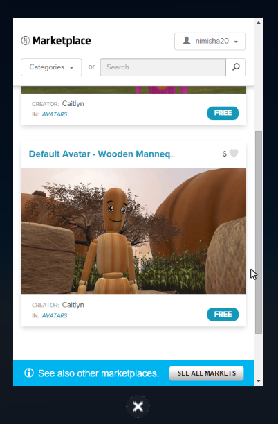
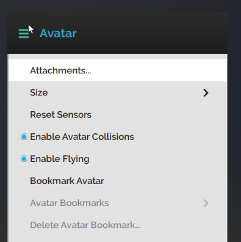
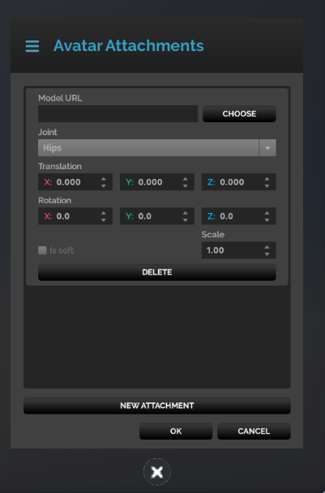
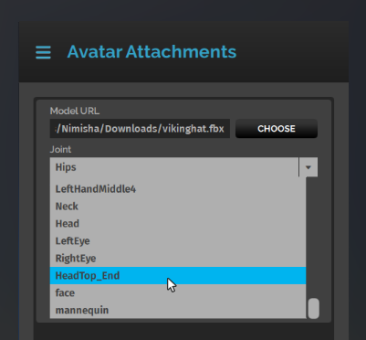
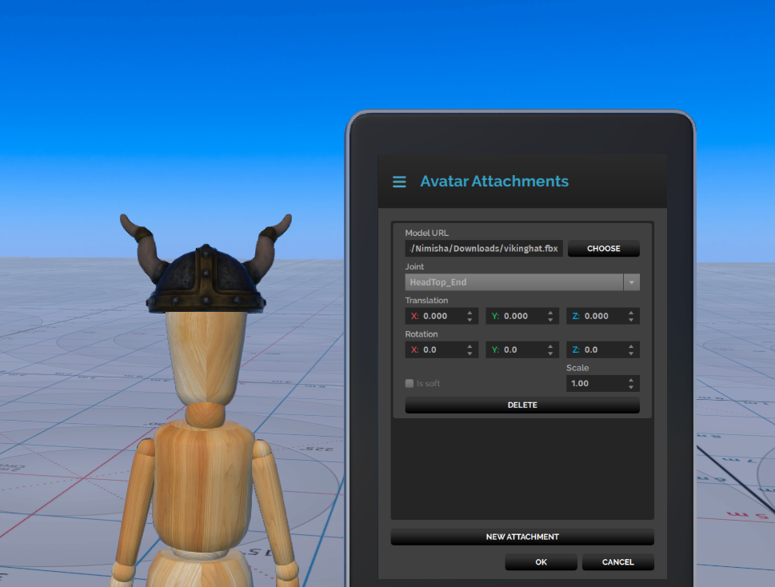

*Learn how to make your own avatar attachments and fix them to your avatar. *

## Overview

Do you want your avatar to wear a pirate's hat? Or a pair of trousers you designed? Well, you’ve come to the right place! Customize your avatar’s appearance using the Avatar Attachments Manager in Interface. The Manager lets you upload models that can be fixed to different joints on your avatar. 


## Prerequisites

* You’ll need to download and install High Fidelity’s Interface and Sandbox. 
* Download and install a 3D Modelling software such as Blender or Maya. 
* Get the Default Mannequin avatar from Marketplace. Currently, avatar attachments can only be fixed to the default wooden mannequin avatar. 


## Introduction

Avatar attachments are models that can be fixed to your avatar. They are not entities, and cannot be scripted. While you can get plenty of avatar attachments from the Marketplace, you can also make your own to use and upload in the Marketplace. 

Let’s create a Viking helmet attachment for your avatar. 


##Steps

1. ### Get the default Mannequin avatar
   Currently, we’re designing attachments that can only be fixed to the mannequin avatar. To get this avatar, pull up your tablet in Interface and go to **Market**. Search for mannequin and get the default wooden avatar. 

   

   

   >>>>> This default avatar has a custom face joint that allows you to add facial hair attachments. If you want to build your model using the avatar to see if it's a good fit, you can find the avatar's fbx file [here](https://www.google.com/url?q=http://mpassets.highfidelity.com/7fe80a1e-f445-4800-9e89-40e677b03bee-v1/mannequin/mannequin.fbx&sa=D&ust=1499379503378000&usg=AFQjCNEDRtPZlnqAs6h5pThcE3BEEezPjg). 

2. ### Create your attachment model
   Create the 3D model of the attachment you wish to see on your avatar. In this case, we created a [3D model of a viking helmet](http://mpassets.highfidelity.com/f2793a6a-8345-410a-b3bd-ebd67437ad53-v1/vikinghat.fbx). You can use the fbx file in the link as your model. 

3. ### Identify values for Attachment Manager
   After creating the model, you can upload it into Interface through the Avatar Attachment Manager. Before you do this, you should have identified a few important values: 
   * **Joint**: This is the joint on your avatar where you want your attachment to be fixed. We will want to place the Viking helmet on top of the head of your avatar. So, the joint of our choosing will be: HeadTop_End. You can learn more about avatar joint information [here](../../create-and-explore/avatars/avatar-standards) to create attachments that can fixed to other parts of the avatar. 
   * **Translation (X,Y,Z)**: TTranslation's X, Y and Z values help you determine where you’d like the helmet to be positioned. You can adjust the X value to move it sideways, the Y value to move the helmet up and down and the Z value to move it forward or backwards. This can be useful if you create a hair attachment and want only some of it on your head. For our helmet, we’re going to keep all the values as zero. 
   * **Rotation (X,Y,Z)**: This controls the orientation of the helmet. The X value moves it up and down, the Y value moves the helmet around the head and the Z value orients it sideways. You can use these values if you want to wear a lopsided baseball cap! For our helmet, we're going to leave these values as zero. 
   * **Scale**: Unless you want the helmet to be bigger than what is available, you can leave the scale as 1.0. 
   * **Is soft**: The “Is soft” checkbox is used for soft attachments. Soft attachments are those that move with the avatar’s body as detected by the sensors. These are rigged to the standard skeleton for this purpose. For instance, a bright shirt is a soft attachment whose sleeves move as you move your avatar’s arms and appear like how regular clothing does when you move your arms. Soft attachments comprises clothing that needs to move and form the same way as your avatar’s body. 

4. ### Upload your model to the Attachment Manager
   * In Interface, go to **Menu > Avatar > Attachments.** 

      

   * Click New Attachment.                                   

   * In the window that opens, paste your Model URL in the space provided. 

   * Add the Joint (HeadTop_End), Translation (0,0,0), Rotation (0,0,0), and Scale (1.0) values.    

     ​                                                                         

   * Click OK. Your attachment is now fixed to the head of  your avatar. 

5. ### Create attachment for uploading to Marketplace
   The steps above will take you through creating and adding an attachment to your own avatar. Now, if you want to create a pumpkin attachment for Halloween or a wizard’s hat for the Harry Potter fan, you can create these and upload them to the Marketplace. But, you will have to upload two files to the marketplace for an attachment: the model fbx and the attachment script. 
   * The attachment script defines the attachment, and where and how it will sit on an avatar. In other words, the values you added for joint, translation etc when you added your attachment manually through the manager, are handled by the script when downloaded through the marketplace. 

   * This type of attacher script must be designated as the root asset when you submit to the Marketplace. When a user gets your attachment, they will have to run the script as well. This means that they won’t only be importing a model, but also be running a script to wear it as an attachment. 

   * You can view the [Marketplace submission guidelines](../../create-and-explore/marketplace/submission-guidelines) to upload your own attachment and attacher script. 

     ​

     For the helmet, the script you can provide for the Marketplace is: 

   ```javascript
   (function () {
   'use strict';
   var main = function () {
   	var attachment = {
   	modelURL: "http://mpassets.highfidelity.com/f2793a6a-8345-410a-b3bd-ebd67437ad53-v1/vikinghat.fbx",
   	jointName: "HeadTop_End",
   	translation: {"x": 0, "y": 0, "z": 0},
   	rotation: {"x": 0, "y": 0, "z": 0, "w": 0},
   	scale: 1,
   	isSoft: false
   	};

   	Window.alert("Wearing item as an attachment.\nTo remove or make adjustments, please use Avatar > Attachment.");
   		
   	MyAvatar.attach(attachment.modelURL,
   				 attachment.jointName,
   				 attachment.translation,
   				 attachment.rotation,
   				 attachment.scale,
   				 attachment.isSoft);
   };
   main();
   Script.stop();
   })();
   ```


## Conclusion

Congratulations! You’ve learnt how to add a viking helmet avatar attachment and upload it to Interface using an fbx file! Now you can create your own models and follow these steps to upload your custom avatar attachments. You can even create attachments based on a theme and upload them with their attacher scripts to Marketplace for other users to enjoy. 


## Related Pages

* [3D Models](../../create-and-explore/3d-modelling)
* [Marketplace Submission Guidelines](../../create-and-explore/marketplace/submission-guidelines)
* [All About Scripting](../../create-and-explore/all-about-scripting)
* [Avatar Standards](../../create-and-explore/avatars/avatar-standards)