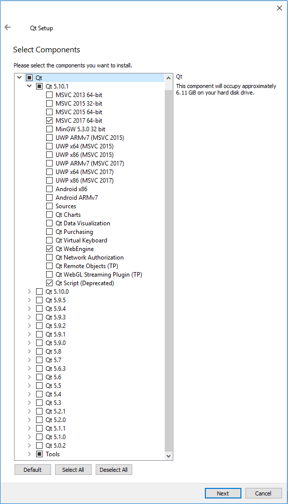

Use this guide to create your first High Fidelity build for Windows 64-bit.

##Overview
This guide will help you create your first High Fidelity build if you’re using a system with Windows 64 bit.

--------------

##Requirements

####Hardware Requirements
To successfully build High Fidelity, check out the [system requirements](https://docs.highfidelity.com/get-started/requirements).

####Software Requirements

>>>>> We are now using Visual Studio 2017 and Qt 5.10.1. If you are upgrading from Visual Studio 2013 and Qt 5.6.2, do a clean uninstall of those versions before going through this guide.

---

>>>>> The prerequisites will require about 10 GB of space on your drive.

To create your High Fidelity build you’ll need to download and install:

**1. Visual Studio 2017**

If you don’t have Community or Professional edition of Visual Studio 2017, download [Visual Studio Community 2017](https://www.visualstudio.com/downloads/).

When selecting components, check "Desktop development with C++." Also check "Windows 8.1 SDK and UCRT SDK" and "VC++ 2015.3 v140 toolset (x86,x64)" on the Summary toolbar on the right. In the end, your screen should look like this:

**2. CMake**

Download and install the latest version of CMake 3.9. Download the file named  win64-x64 Installer from the [CMake Website](https://cmake.org/download/). Make sure to check "Add CMake to system PATH for all users" when prompted during installation.

**3. Qt**

Download and install the [Qt Online Installer](https://www.qt.io/download-open-source/?hsCtaTracking=f977210e-de67-475f-a32b-65cec207fd03%7Cd62710cd-e1db-46aa-8d4d-2f1c1ffdacea). While installing, deselect components so that your window looks like this:

Note: Installing the Sources is optional but recommended if you have room for them (~2GB).

The next thing you need to do is set the Qt environment variables. Go to "Control Panel > System > Advanced System Settings > Environment Variables > New..." (or search “Environment Variables” in Start Search). Then, setup your Qt variables.
* Set "Variable name": QT_CMAKE_PREFIX_PATH
* Set "Variable value":  `C:\Qt\5.10.1\msvc2017_64\lib\cmake`

**4. vcpkg**

Download and unzip the [VCPKG repository](https://github.com/Microsoft/vcpkg) into `C:/src/`.

Follow the instructions in the [readme](https://github.com/Microsoft/vcpkg/blob/master/README.md) to bootstrap vcpkg using a Developer Command Prompt.

Set an environment variable VCPKG_ROOT to the location of the cloned repository. Go to "Control Panel > System > Advanced System Settings > Environment Variables > New..." (or search “Environment Variables” in Start Search). Then, setup your vcpkg variables:
* Set "Variable name": VCPKG_ROOT
* Set "Variable value":  `C:\src\vcpkg`

Close and re-open any command prompts after setting the environment variable so that they will pick up the change.

**5. OpenSSL**

Using a Developer Command Prompt, run the following command in your %VCPKG_ROOT% directory: `vcpkg install openssl:x64-windows`

**6. nodeJS/npm**

Download and execute [nodeJS](https://nodejs.org/en/). 
---------------------------

####Steps

#####1. Run CMake to Generate Build Files
Run Command Prompt from Start and run the following commands:

		cd "%HIFI_DIR%"
		mkdir build
		cd build
		cmake .. -G "Visual Studio 15 Win64"

`%HIFI_DIR%` is the directory for the highfidelity repository.

#####2. Make a Build
Follow these steps to make your build:
* Open  `%HIFI_DIR%\build\hifi.sln`  using Visual Studio.
* Change the Solution Configuration (next to the green play button) to Release.
* Lastly, go to the menu item Build > Build Solution.

#####3. Test the Interface
Create another environment variable (just like how you created the Qt-variable).

* Set Variable name: _NO_DEBUG_HEAP
* Set Variable value: 1

In Visual Studio, go to the Apps folder in the Solution Explorer. Right-click interface and select Set as Startup Project. Make sure that your Solution Configuration is set to RelWithDebInfo (not Debug). Then navigate to the menu item Debug > Start Debugging.

Now, you should have a full build of High Fidelity and be able to run the Interface using Visual Studio. Please check our documentation for more information regarding the programming workflow.

>>>>> You can also run Interface by launching it from command line or File Explorer from `%HIFI_DIR%\build\interface\Release\interface.exe`

---------------------------------------------------------------

####Troubleshooting
If you face any problems once you start trying to generate build files using CMake, there are couple of things you could try to solve any issues.
* Delete your locally cloned copy of the highfidelity repository.
* Restart your computer.
* Download the repository again.
* Try to generate build files using Cmake. If this is successful, continue with the rest of the steps.
* Uninstalling previous versions of Qt may not be enough: you may have to delete old versions from C:/Qt/

#####Common Errors and their Solutions
* If CMake gives you the same error message repeatedly after the build fails, try to remove CMakeCache.txt found in the %HIFI_DIR%\build' directory.
* If Qt is throwing an error, make sure you have the correct version (5.10.1) installed and the 'QT_CMAKE_PREFIX_PATH' environment variable is set correctly.
* If the application builds but does not start up, make sure that the root Qt directory is NOT in your PATH environment variable.

##References
* [System Requirements](https://docs.highfidelity.com/get-started/requirements)
