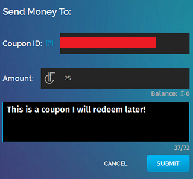

Once you have logged into High Fidelity and [received your HFC](https://docs.highfidelity.com/high-fidelity-commerce/basics/hfc/get-hfc), you can gift it to a connection or anyone nearby.

To send money: 

1. In Interface, pull up your tablet or HUD and go to Inventory.
2. In the Inventory app, click "Send Money". 
3. You have the option to send money to one of your connections, someone nearby in the same domain, or even yourself to use later as a coupon! 
  * If you want to send to one of your connections, click "Connections" and choose the recepient from the list. 
  * If you want to send to someone nearby, click "Someone Nearby" and choose your recepient by triggering or clicking on someone nearby to select them. 
  * If you want to send someone money at a later time, even when you are not in High Fidelity, you can create a coupon. Keep in mind, you can use a coupon you create only through a script. For example, you can have a slot machine game in your domain and [use a coupon to pay any user that wins]((../../../commerce-apis/slot-machine-example)). Or you can hold a raffle, and [pre-authorize a payout to the winner]((../../../commerce-apis#money-and-item-transfer-pre-authorization-and-redemption)) using a coupon. To create a coupon:
    1. Click on Create Coupon. 

    2. In the Tablet, next to Amount, enter the amount you want to payout later. For example, if you want a user playing on a slot machine to receive 25 HFC coins when they win, you will enter "25". 

    3. Enter an optional message so that you know why you created this particular coupon.

    4. The tablet will now display a window with the "Authorization ID" and "Coupon ID". Copy both these values on your computer. Click Close.

    5. Include both copied values in the script for the slot machine. This means you are pre-authorizing a payout of 25 HFC to any user that wins. 

    6. Whenever a user wins, they will get 25 HFC from the coupon you created. 
