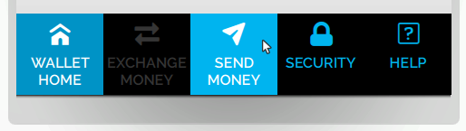
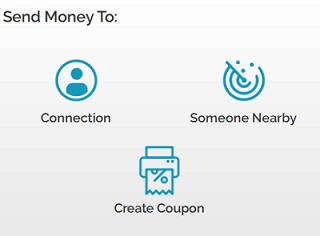
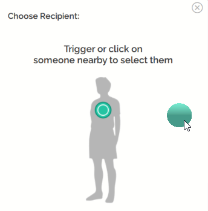

Once you have logged into High Fidelity and [received your HFC](https://docs.highfidelity.com/high-fidelity-commerce/basics/hfc/get-hfc), you can gift it to a connection or anyone nearby.

To send money: 

1. In Interface, pull up your tablet or HUD and go to Inventory.
2. In the Inventory app, click "Send Money". 
3. You have the option to send money to one of your connections or even someone nearby in the same domain! 
	* If you want to send to one of your connections, click "Connections" and choose the recepient from the list. 
	* If you want to send to someone nearby, click "Someone Nearby" and choose your recepient by triggering or clicking on someone nearby to select them. 
