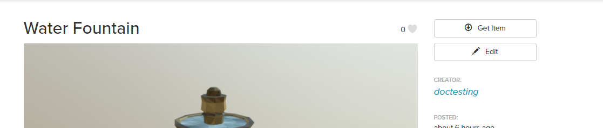
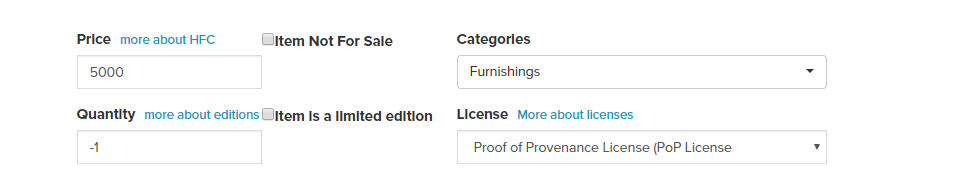

*Learn how you can change over to our new PoP License.*

## Introduction

All entity content in the Marketplace must accept the PoP License to be posted for sale. Anyone wishing to sell the items they have already uploaded on the Marketplace can follow the instructions below to switch their items to the PoP License. 

If you don't wish to sell your items and keep them available for free, you do not need to go through these steps.

### Migrate to the PoP License

* If you are not yet part of the closed beta, your HFC balance will be 0. You can get your initial grant by emailing us at info@highfidelity.com with your username and email address to request participation in the current HFC distribution program. 
* Once you have received the initial HFC grant, go to the [Marketplace](https://highfidelity.com/marketplace). Log in with your High Fidelity username and password. 
>>>>> Currently, we only support .JSON entities. 
* Under your profile, click "My Items". 
* Open a submitted item you wish to put up for sale. Click on "Edit".
* Select the PoP License from the license dropdown. 
* To sell your item, you must set a price. Otherwise, your item will be considered free. You also need to ensure that your item complies with the other terms of the license, such as attributions, compliance with non-commercial terms and more. 
* Ensure that your item description and name are what you want it to be. This information is a part of the certificate signing process and cannot be changed without invalidating your certificate. You can change it later, if you wish, but you will have to pay additional fees for your new submission. 
* Agree to the Terms of Service and fees applicable and click "Submit for Review". In the future, we will be including a fee for posting on the Marketplace. This fee will be automatically debited from your Wallet (not currently).  
* The Digital Asset Registry Office review team will review the new submission to make sure everything’s correct.  Once it is, we'll inform you by email of the status of your item. 
