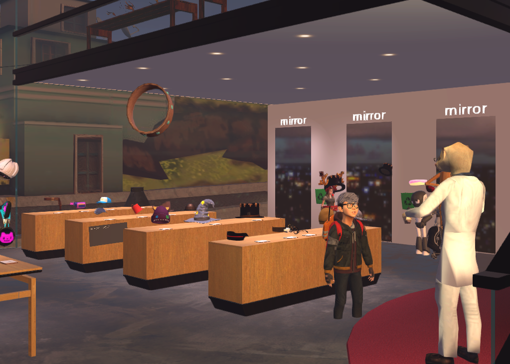
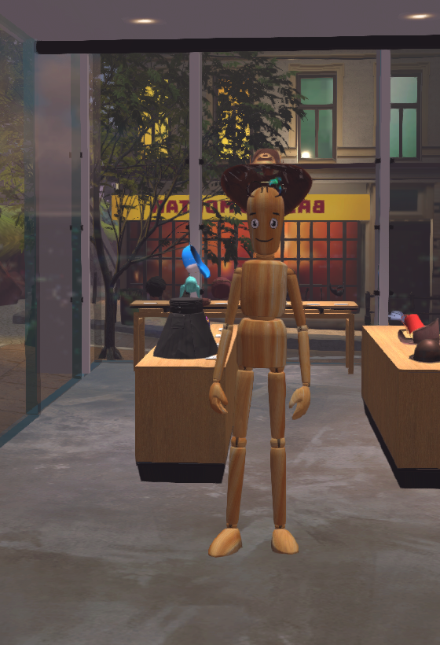
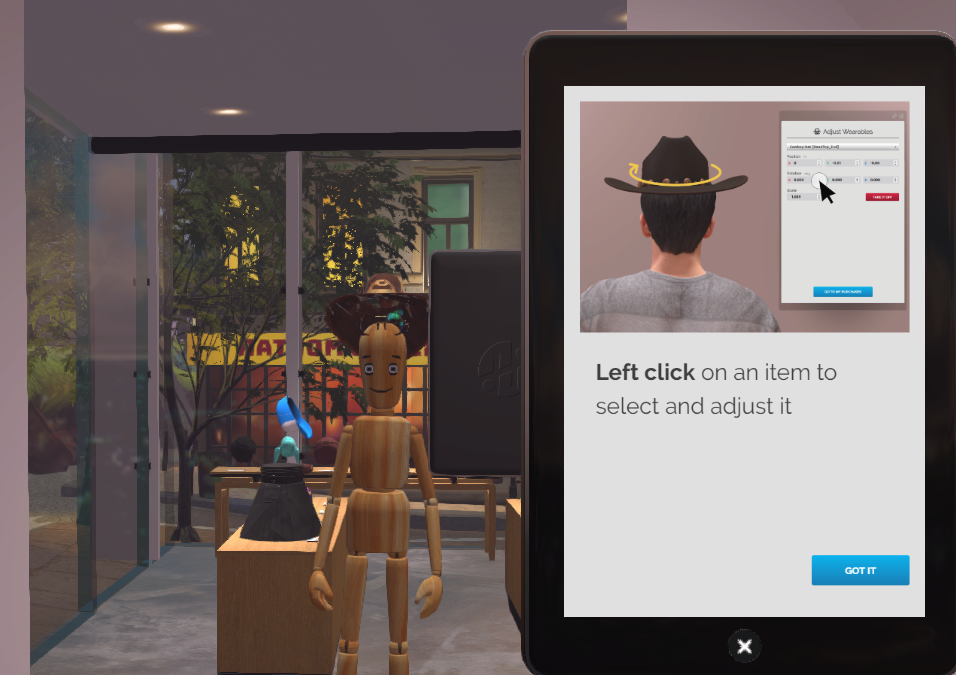
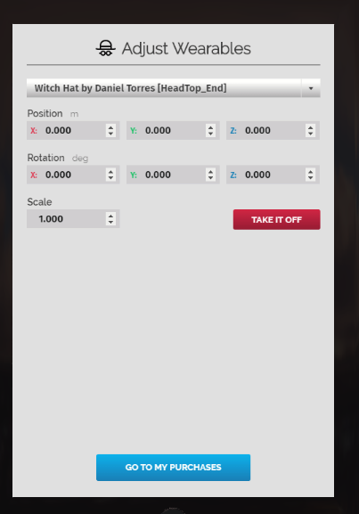
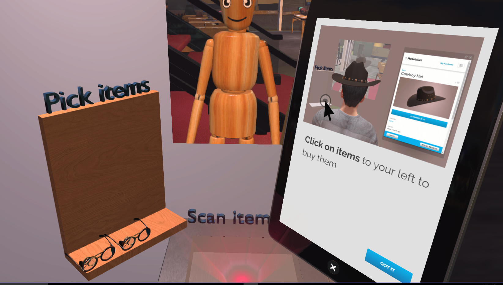

*Learn how you can buy wearables for your avatar.*

## Overview

This page details the process of purchasing avatar wearables. 

## Introduction

Are you interested in adding accessories to your avatar? Well, you're in the right place. Whether it's a hat, skirt or a pair of cool cat headphones, the Avatar Island has over 300 items for your needs. 

Avatar Island is a High Fidelity domain where you can purchase wearables created by digital artists all around the world. Learn more about wearables and our [Proof of Provenance](https://docs.highfidelity.com/high-fidelity-commerce/basics/pop) services.

### Buy a Wearable

- In High Fidelity, pull up your tablet. In the **Go to** app, enter "Avatar Island".

- Avatar Island is a domain containing many stores which carry all kinds of wearables. You can create wearables to sell at the Avatar Island too! 

- We're going to walk you through purchasing a pair of glasses for your avatar. 

- Let's first try on the glasses. If you're using an HMD with controllers, you can just pick up the glasses you want and place them on your face. You'll hear a small sound notification indicating that the wearable has been placed on the joint. If you're in Desktop mode, just click on the glasses of your choice. It will be placed around your avatar's head. You can adjust your wearables in VR mode by using moving it with your controllers. In Desktop mode, you can pull up your tablet, and go to the **Wear** app to adjust any wearable. You can use the mirrors in the store to see how you look. In the **Wear** app, you can adjust the position, rotation and scale to move your wearable to right size and position. 

  > > > > > If you don't want to purchase any of the wearables, you can simply walk out of the store without checking out. All wearables you are wearing will disappear when you leave. You can also take them off in VR mode or delete them using the **Wear** app in Desktop mode. If you want to see how your avatar looks with various wearables on, you can look at yourself in one of the many mirrors in the store. 

- Once you are done selecting the wearables you want to buy, head over to one of the checkout kiosks. When you are close to a kiosk, you will see the items you picked in the shelf marked "Pick Items". Your tablet will also open your wallet. 

- You can choose the items you want to purchase and pick them up and place them on the scanner marked "Scan Items". 

- Purchase the item. 

Congratulations, you've bought your first few wearables! Check out the other stores in Avatar Island or learn more about how you can [create a wearable for sale](https://docs.highfidelity.com/high-fidelity-commerce/avatar-wearables/create). 

>>>>>You can also buy wearables directly from the Marketplace. [Learn how](../../../marketplace/buy).