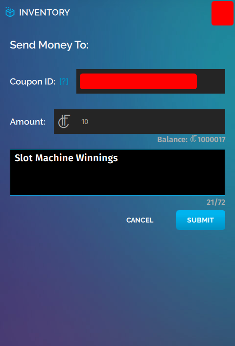

*Learn how you can create a slot machine game in your domain.*

This tutorial details how to create a slot machine game that pays out HFC in High Fidelity.

Here is how your slot machine game might play when you complete this tutorial:

>>>>> Experimental API Notice: The High Fidelity Commerce APIs introduced in this document are **Experimental APIs** and thus are subject to the following: A) Commerce APIs on the High Fidelity Metaverse may be modified or removed at any time *until Beta Release 81*; B) JavaScript Commerce APIs referenced in this document and related examples are subject to change or removal without notice *until Beta Release 81*; and C) Upon release of Beta 81, changes to the High Fidelity Commerce APIs will be subject to the standard API deprecation process.

### Requirements and Glossary
To create this content, you'll need:
* Access to a High Fidelity domain that you own and where you have full permissions. Examples of such a domain include:
    * Your private [Sandbox](../../../create-and-explore/start-working-in-your-sandbox/set-up-your-sandbox)
    * [Your DigitalOcean domain](../../../create-and-explore/start-working-in-your-sandbox/digital-ocean)
* A [Google](https://google.com) account for access to Google Sheets

Consider familiarizing yourself with the following concepts:
* The definition of an [Entity](../../../create-and-explore/entities) in High Fidelity
* The basics of [Scripting](../../../create-and-explore/all-about-scripting) in High Fidelity
    * In this example, we're going to use [Entity Scripts](../../../learn-with-us/all-about-entity-scripts) and AC Scripts. AC scripts, or Assignment Client scripts, are scripts that run on your domain even if you are not present in the domain.
* The basics of [High Fidelity's ATP](../../../create-and-explore/start-working-in-your-sandbox/assignment-clients)

Start by opening Interface in Desktop mode and connecting to your domain!

### Place an Unscripted "Slot Machine" Entity in Your Domain
First, create a Slot Machine entity in your domain. You can use a Slot Machine entity that already exists:
    1. Download the following JSON: [basicSlotMachine_noScripts.json](https://s3.amazonaws.com/hifi-docs-scripts/basicSlotMachine_noScripts.json)
    2. Import the JSON file into your domain:
        1. In Interface, go to **Edit > Import Entities**, then browse to and select `basicSlotMachine_noScripts.json`.

You should now see a slot machine entity in your domain. This example entity consists of:
* Three "reels" (red, green, and blue cubes).
* A "spin arm" that players will use to start the game.
* A "play text" text entity that will display the game status to players.
* A "pay-in text" text entity that will instruct users to add credits to the slot machine.

### Pre-authorize Game Winning Payout Funds
In our slot machine example, players will pay you (the domain owner) 1 HFC to start playing. The slot machine will pay out 25 HFC if the payer wins.

You will now learn how to pre-authorize the first payout of 25 HFC.

1. In your HUD or tablet, open the 'INVENTORY' app.
2. Click the "Authorized Script" button.
3. Next to "Amount", enter "25".
4. Under "Optional Public Message", enter "Slot Machine Winnings".
    
5. Click "SUBMIT".
6. On the "Payment Authorized" screen, copy the "Authorization ID" text string and save it on your computer. You'll use this string later.
7. On the "Payment Authorized" screen, copy the "Coupon ID" text string and save it on your computer. You'll use this string later.
8. Click "CLOSE", then "I'M ALL SET".

### Add the Pre-authorized Credentials to a Payout Database
You'll need to put the "Authorization ID" and "Coupon ID" secrets into some sort of database. Here's why:

You're going to write an Assignment Client script (AC script) for the Slot Machine game logic, including payout logic. When the Slot Machine pays out, it needs to know the Authorization IDs and Coupon IDs associated with your pre-authorized payout funds.

There are many ways that the AC script can know these secrets. In this example, we will use a Google Sheet to store the data, and a Google Script to access the data in the Sheet.

#### First, Create the Google Sheet:

1. Log into [Google Sheets](https://docs.google.com/spreadsheets/u/0/), and create a new spreadsheet. Give it a filename you want, such as "Slot Machine Payouts".
2. Name the current sheet "Authorizations" using the arrow on the tab at the bottom left of the screen.
3. Give the header row (the first row) the following labels in this order:
    * Used
    * HFC
    * Authorization ID
    * Coupon ID
4. In the second row, under the HFC column, put `25`.
5. In the second row, under the "Authorization ID" column, paste your saved Authorization ID.
6. In the second row, under the "Coupon ID" column, paste your saved Coupon ID.

#### Second, Create the Google Script

1. At the top of the Google Sheets window, click **Tools > Script editor**.
2. Name your currently untitled project "Slot Machine Authorization Handler".
3. Copy and paste the contents of [this example GS script](https://s3.amazonaws.com/hifi-docs-scripts/slotMachineAuthHandler.gs.txt) into the Script Editor.
4. Change `var SPREADSHEET_ID` to match the Spreadsheet ID of your spreadsheet above.
    * The Spreadsheet ID is embedded in the URL of the Google Sheets page and is visible in the following screenshot (part of the URL is blocked out for privacy purposes).
        
5. Save the script, using whatever filename you wish.
6. Click "Publish", then "Deploy as Web App..."
7. Follow Google's instructions to deploy your script as a web app. Ensure you set "Who has access to the app" to "Anyone, even anonymous". When finished, copy the URL you're given at the end of the process and save it somewhere you'll remember for later.
    * The web app URL will look something like `https://script.google.com/macros/s/ABCDEFGHIJKLMNOP_QRSTUVWXYZ1984373/exec`

Make sure you keep the web app URL and the Google Sheet URL **private**, or your authorization data will be visible to anyone with access to the sheet!

### Allow Users to "Add Credits" to the Slot Machine
You'll need to provide your users with a way to add slot machine play credits. Do this by adding an [Entity Script](https://docs.highfidelity.com/learn-with-us/all-about-entity-scripts) to the Slot Machine entity.

First, we need to write the entity script. This script will do the following:
* When a user clicks the text OR the border around the text, a message saying "1 Slot Machine Play Credit" pops up. They can pay a specified username (you) 1 HFC to play.

[Click here](https://s3.amazonaws.com/hifi-docs-scripts/addCreditsButton.js) to download a pre-made "Add Credits" entity script. Follow along with the comments in the code to understand what it's doing!

>>>>> All users who load the Add Credits entities will be individually running this script as if it were an Interface script.

Next, add the entity script to the Slot Machine. If you're using the example Slot Machine entity provided, add the script to two parts of the entity to make it easier for players to add credits:
1. Change the `DESTINATION_USERNAME` to your username in `addCreditsButton.js`.
2. Upload the `addCreditsButton.js` script to your domain's ATP server. In Interface, go to **Edit > Asset Browser > Choose File**. Right-click the script file, then click "Copy URL".
3. In Interface, use the 'CREATE' app to select the "Click Here to Add Credits" text entity on the Slot Machine entity.
4. In the entity's Properties tab, scroll down to "Script" and paste the URL you copied in step 2 into the text box. Press Enter.
5. Lock the entity so nobody can change its attributes.
6. In Interface, use the 'CREATE' app to select the border entity around the "Click Here to Add Credits" button on the Slot Machine entity.
7. In the entity's Properties tab, scroll down to "Script" and paste the URL you copied in step 2  into the text box. Press Enter.
8. Lock the entity so nobody can change its attributes.

### Allow Users to Start the Slot Machine's Reels
You'll need to provide your users with a way to start the slot machine's reels.

First, write an entity script to put on the slot machine's Spin Lever. This script will send a message to an Assignment Client (AC) script that we'll write in a later step. This message will kick off the rest of the game logic.

[Click here](https://s3.amazonaws.com/hifi-docs-scripts/slotMachineSpinLever.js) to download a pre-made "Spin Lever" entity script. Follow along with the comments in the code to understand what it's doing!

>>>>> All users who load the Spin Lever entity will be individually running this script as if it were an Interface script.

Next, add the entity script from above to the "Spin Lever" entity.
1. Upload the `slotMachineSpinLever.js` script to your domain's ATP server. In Interface, go to **Edit > Asset Browser > Choose File**. Right-click the script file, then click "Copy URL".
2. In Interface, use the 'CREATE' app to select the red Spin Lever sphere entity on the Slot Machine entity.
3. In the entity's Properties tab, scroll down to "Script" and paste the URL from step 1 into the text box. Press Enter.
4. Lock the entity so nobody can change its attributes.

### Obtain Auth Token
You'll have to get a High Fidelity authentication token that has the `commerce_ro` scope. You'll use this token when writing an Assignment Client (AC) script. This AC script checks your Recent Economic Activity for recent transactions of 1 HFC made in your domain with a specific memo ("1 Slot Machine Play Credit").

To get this auth token:
1. Go to https://highfidelity.com/user/tokens/new.
2. Name the token something memorable.
3. Select the `commerce_ro` scope.
4. Click "Create Token".
5. Copy and save the token.

### Write an Authenticated Assignment Client Script
Next, you'll have to write an AC Script that will handle the slot machine game logic, including:
* Knowing when to start a new spin.
* Knowing whether a user who attempted to spin has paid.
* Changing the slot machine reel colors during a spin.
* Checking the end state of the reels to determine win/loss.
* Paying out pre-authorized funds.

[Click here](https://s3.amazonaws.com/hifi-docs-scripts/slotMachineACScript.js) to download a pre-made "Slot Machine" entity server script. This script is quite long and is arguably the most important element of this project! Follow along with the comments in the code to understand what it's doing.

### Run the Assignment Client Script on Your Domain

#### Running an AC Script from ATP
To run the AC script on your domain from ATP:
1. Change your `slotMachineACScript.js` as follows:
    1. Set `HIFI_COMMERCE_TOKEN` to your HiFi `commerce_ro` token.
    2. Set `SLOT_MACHINE_REEL_1_ID` to the Entity ID of the leftmost slot machine reel.
    3. Set `SLOT_MACHINE_REEL_2_ID` to the Entity ID of the middle slot machine reel.
    4. Set `SLOT_MACHINE_REEL_3_ID` to the Entity ID of the rightmost slot machine reel.
    5. Set `SLOT_MACHINE_PLAY_TEXT_ID` to the Entity ID of the "Play Text" text entity right below the slot machine reels.
    6. Set `GOOGLE_SHEET_AUTH_SCRIPT` to the URL of the Google Script Web App created earlier.
    7. Set `SLOT_MACHINE_AREA` to the coordinates around which the slot machine entity will be placed.
        *See the comments in the code for more details about why this is necessary.*
2. Upload your `slotMachineACScript.js` script to your domain's ATP server. In Interface, go to **Edit > Asset Browser > Choose File**. Right-click the script file, then click "Copy URL".
3. Navigate to the Domain Settings page of your domain (for a local sandbox, this is http://localhost:40100/).
4. Click "Content" at the top of the page, then scroll to the "Scripts" section.
5. Under "Persistent Scripts", click the `+` button on the right column
6. Under "Script URL", paste the ATP URL from step 2.
7. Click "Save and restart" at the top right of the page

### Conclusion and Future Work
**You're done!** You should now have a basic but fully working slot machine in your domain, that you and anyone else in your domain can play.

Here are a few ideas for extending the basic functionality of this slot machine:
* Lights and sounds corresponding to game state.
* Spinning reels.
* More secure game logic that prevents tampering.
>>>> In this example, a user could change the colors of the unlocked reels to match just before the game ends, and thus force a payout. This example does not cover anti-cheat or anti-tampering methods for securing your slot machine or funds!
* Moving spin handle.
* "Credits" display using Overlays to show credits available to player.
* More secure access to your pre-authorized transaction secrets (for example, using a local HTTP server).
* Payout different amounts based on variable pay-in amounts.
* Payout with certified Marketplace items instead of HFC.
* You could use a database of credits instead of relying solely on Recent Economic Activity. If you use only Recent Economic Activity, if the AC script restarts, users may gain credits they shouldn't.
* Better user messaging: The simple status messages coded in the example that are visible to slot machine players are nice, but not great or descriptive. It might be nice to have a way of contacting an admin if there's a problem.
* Multiple slot machines in one domain.
