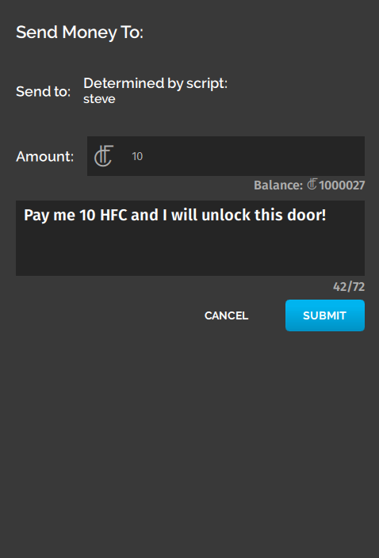
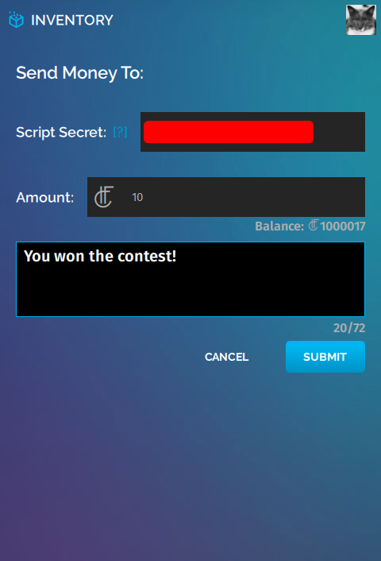
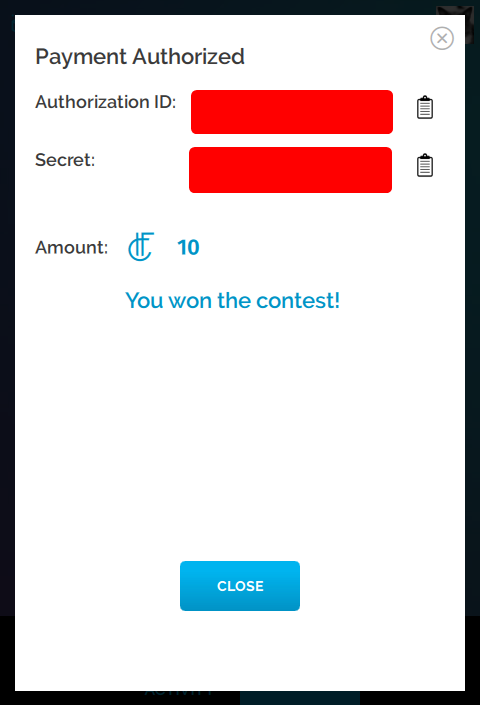

*Learn how to enhance your commerce experience with scripts that use the Commerce API.*

This page details how you can use the new Commerce APIs to transfer money and assets between users who aren't in-world, create a script to check a user's inventory, and more.  

*  [Commerce APIs](#api)
    *  [Scriptable, Secure Money Transfer](#moneyTransfer)
    *  [Scriptable, Secure Item Transfer](#itemTransfer)
    *  [Scriptable, Secure Item Purchases](#itemPurchases)
    *  [Scriptable Inventory Verification](#transferVerification)
    *  [Money and Item Transfer Pre-Authorization and Redemption](#preAuth)
*  [Mini Tutorials](#examples)
    *  [Tip Jar](#tipJar)
    *  [VIP Access Zone](#vipZone)
    *  [Slot Machine Game](#slotMachine)

## Introduction

Using High Fidelity's Commerce APIs, you can create unique domains, apps, and games that can reward users with High Fidelity Coins (HFC), Certified Marketplace Items, and/or premium content.

Some of the content you can create using these APIs are:
* VIP Domain Access
* Tip Jars
* Crane Games
* Banking Apps
* Poker Games
* Resale Shops
* Money Trees
* Vending Machines
* Trading Apps

>>>> Experimental API Notice: The High Fidelity Commerce APIs introduced in this document are **Experimental APIs** and thus are subject to the following: A) Commerce APIs on the High Fidelity Metaverse may be modified or removed at any time *until Beta Release 81*; B) JavaScript Commerce APIs referenced in this document and related examples are subject to change or removal without notice *until Beta Release 81*; and C) Upon release of Beta 81, changes to the High Fidelity Commerce APIs will be subject to the standard API deprecation process.


### Commerce APIs <a name="api"></a>
The High Fidelity Commerce APIs now have functionalities that can help you enhance a user's experience in your domain. You can write scripts using these APIs or use some of the example scripts provided.

#### Scriptable, Secure Money Transfer <a name="moneyTransfer"></a>
An entity script or client script can open an end-user's tablet to a "Send Money" screen.

The script must specify a recipient and an amount of HFC. It can specify a message to the user if desired.

**Example**

A user running this script will be **prompted to send 10 HFC to the username "steve".** When prompted to send this money, they will see a message: "Pay me 10 HFC and I will unlock this door!"

```
var tablet = Tablet.getTablet("com.highfidelity.interface.tablet.system");
tablet.loadQMLSource("hifi/commerce/common/sendAsset/SendAsset.qml");
tablet.sendToQml({method: 'updateSendAssetQML',
	assetCertID: "",
    amount: "10",
    username: "steve",
    message: "Pay me 10 HFC and I will unlock this door!"
});
```




#### Scriptable, Secure Certified Item Transfer <a name="itemTransfer"></a>
An entity script or client script can open an end-user's tablet to a "Send Item" screen.

The script must specify a recipient and an item Certificate ID. It can specify a message to the user if desired.
Note that the user running the script must own the specified item Certificate ID.

**Example**

A user running this script will be **prompted to send an item to a username "steve".** When prompted to send this money, they will see a message: "Send me the item you've previously bought!"

```
var tablet = Tablet.getTablet("com.highfidelity.interface.tablet.system");
tablet.loadQMLSource("hifi/commerce/common/sendAsset/SendAsset.qml");
tablet.sendToQml({method: 'updateSendAssetQML',
	assetCertID: "ABCDEFGHIJKLMNOPQRSTUVWXYZ1234567890", // This is a fake Certificate ID!
    amount: "1", // Amount will always be "1" regardless of what is specified here
    username: "steve",
    message: "Send me the item you've previously bought!"
});
```


#### Scriptable, Secure Item Purchases <a name="itemPurchases"></a>
An entity script or client script can open an end-user's tablet to the Marketplace Checkout screen for a specified item.

The script must specify the Marketplace Item ID.

**Example**

A user running this script will be **prompted to purchase Spectator Camera v2.3** from the High Fidelity Marketplace.

```
var tablet = Tablet.getTablet("com.highfidelity.interface.tablet.system");
tablet.loadQMLSource("hifi/commerce/checkout/Checkout.qml");
tablet.sendToQml({method: 'updateCheckoutQMLItemID', params: {itemId: "399921f6-bf26-4bba-8654-75d1b30f9442"}});
```


#### Scriptable Inventory Verification <a name="transferVerification"></a>
If a script has the proper credentials, it can check a user's Recent Economic Activity and Inventory on their behalf. You can use this to verify that another user has sent you money, sent you an item, or purchased your item from the Marketplace.

**Example**

Say you want to **give a user access to a part of your domain if they have paid you 10 HFC.**

This example is lengthier than the others on this page, so [click here](./paid-entry-example) to learn how you can charge users to access a part of your domain.


#### Money and Item Transfer Pre-Authorization and Redemption <a name="preAuth"></a>
A user can pre-authorize the transfer of money or items. The user can then save this authorization record in the form of an "Authorization ID" and "Coupon ID" value pair.

Later, a script written by this user can use these (secret) values to send the money or items associated with the authorization record to another user.

**Example**

Say you want to **pre-authorize 10 of your High Fidelity Coins to be paid out to a user who wins a raffle that you are hosting**. In this example, [curl](https://curl.haxx.se/) is used to perform the redemption. But you can redeem a pre-authorized transfer using any script or tool that can perform `HTTP PUT` requests. Here are a few examples of other tools that can perform `HTTP PUT` requests:
* High Fidelity Interface's `request` JavaScript module.
* A simple PHP form on a website.

1. Use Interface's 'INVENTORY' app to get an "Authorization ID" and "Coupon ID" value pair associated with a 10-HFC Pre-Authorized Money transfer.
    1. Open Interface.
    2. In your HUD or tablet, open the 'INVENTORY' app.
    3. Click the "Authorized Script" button.
    4. Next to "Amount", enter "10".
    5. Under "Optional Public Message", enter "You won the raffle!".
        
    6. Click "SUBMIT".
    7. On the "Payment Authorized" screen, copy and paste the "Authorization ID" text string to a text file on your computer.
    8. On the "Payment Authorized" screen, copy and paste the "Coupon ID" text string to a text file on your computer.
        
    9. Click "CLOSE", then "I'M ALL SET".
2. Hold your raffle! In this example, a user with username `steve` has won the raffle.
3. Use the following `curl` command from the command line to dispense the money authorized in (1) to username `steve`:
    1. `curl -X PUT -d authorization_id=<authorization ID from 1> -d coupon_id=<coupon ID from 1> -d username=steve https://highfidelity.com/api/v1/commerce/redeem`


### Mini Tutorials <a name="examples"></a>
#### BEGINNER: Tip Jar <a name="tipJar"></a>
[Click here](./tip-jar-example) to learn how to create an entity that, when clicked, will prompt a user to send you 10 HFC.

This example uses:
* [Scriptable, Secure Money Transfer](#moneyTransfer)
* Entity Scripts

#### INTERMEDIATE: VIP Access Zone <a name="vipZone"></a>
[Click here](./paid-entry-example) to learn how to create an exclusive VIP zone in your domain that is accessible only to paid VIPs.

This example uses:
* [Scriptable, Secure Money Transfer](#moneyTransfer)
* [Scriptable Inventory Verification](#transferVerification)
* Entity Scripts
* Assignment Client Scripts

#### ADVANCED: Slot Machine Game <a name="slotMachine"></a>
[Click here](./slot-machine-example) to learn how to create a slot machine game that pays out HFC in High Fidelity.

This example uses:
* [Scriptable, Secure Money Transfer](#moneyTransfer)
* [Scriptable Inventory Verification](#transferVerification)
* [Money and Item Transfer Pre-Authorization and Redemption](#preAuth)
* Entity Scripts
* Assignment Client Scripts
