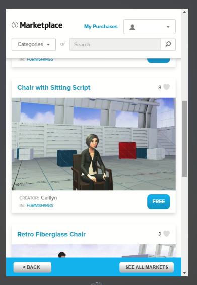
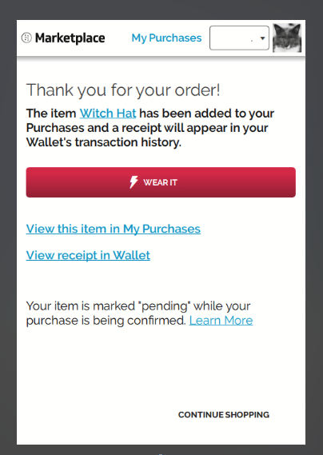
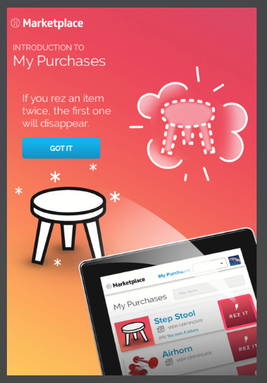
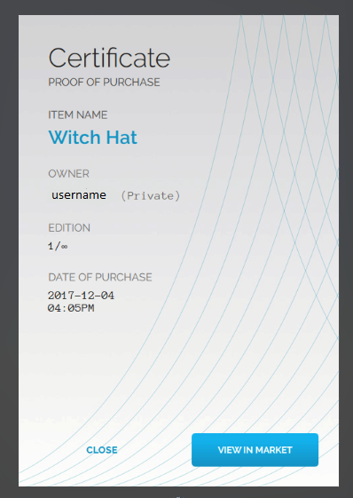
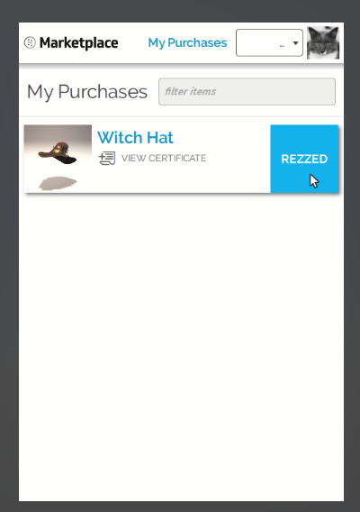

*Learn how you can buy items from the Marketplace.*

## Overview

Learn how you can buy items being sold for purchase or for free from the Marketplace. 

### Buy from the Marketplace

Items in the Marketplace will either be free, or will be priced at a certain amount of HFC. 

####Buy an item that is free

1. In Interface, pull up your tablet or HUD and go to Market.
2. Browse to find the item you wish to get. Click "Get" and confirm the purchase of 0 HFC.  
3. It will appear in the domain you are in (if you have access to add entities to it). 
4. Congratulations, you bought a free Marketplace item!

####Buy an item using HFC

1. In Interface, pull up your tablet or HUD and go to Market.
2. Browse through the items available until you find what you want. 
3. Let's say you have decided to buy this "Witch Hat" priced at 100 HFC. Click "Buy". 
4. Click "Confirm Purchase" to buy the "Witch Hat". You can also click "Cancel" if you do not wish to buy the hat.
5. You'll be redirected to the order confirmation page. You can start using your item immediately or view your purchases in your Inventory. You can access your purchase for use at any time from the Marketplace.
6. If you have purchased an item for the first time, when you click on *My Purchases* you will see a couple of introductory messages describing what **Rez** means in High Fidelity. Rezzing means that an item is being generated. If you click on *Rez It*, your item will appear in front of you. You cannot rez an item twice. If you do, the first one will disappear.   
7. You can also view the certificate of the item, which functions as a proof of purchase. This shows that you legally purchased and own this item. 
8. Click *Wear It* to wear your "Witch Hat". 
9. The Recent Activity section of the Inventory app will now be updated with the activity of your latest purchase and will reflect your new HFC balance.
10. You are now sporting your very first purchase from the High Fidelity Marketplace! If you are in VR mode, you can adjust your hat using your controllers. If you are in Desktop mode, you can use the Wear app. 
>>>>> The Wear app will be available in the Marketplace soon. If it is unavailable in the Marketplace, you can access it by visiting Avatar Island. 

