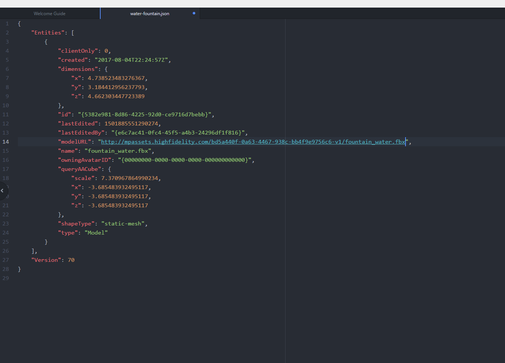

Once you've completed exporting the entity, you can add it to Marketplace. 

##Add Your Item to Marketplace

- If you wish to add a wearable to the Marketplace, check out this [page](../../../marketplace/sell/create). 
- On Marketplace's webpage where you have started filling in the details of your new item, scroll down until you see the assets tab. 
- Click 'Choose File' and the entity's file. Here, we added the .fbx file. Once you upload the file, you can select it see the file's URL. 
>>>>> You will refer to the file using this URL (or a relative URL) in any of the other assets you upload. You cannot have any external references (or external URLs or URLs related to your local machine) in any of the assets you upload. Please make sure your root entity file (the JSON) does not contain references to ATP hosted files. You can examine it in a text editor to double check. If you see anything like `atp://` in the file, it's referring to a local file hosted on a domain, rather than on the Marketplace. The JSON should only refer to files hosted on the Marketplace filesystem.

- To avoid having any external references, we will change the model URL in the .JSON file to the .fbx URL above. Where possible, use relative paths when referencing external assets, like other scripts, models, sounds, etc. This will keep your content portable and save you work in the future when you update your marketplace items.

Example, assuming the script URL is "[http://mpassets.highfidelity.com/0a5e847a-1e1f-4fb9-9081-a07b216393a5-v1/script1.js](http://mpassets.highfidelity.com/0a5e847a-1e1f-4fb9-9081-a07b216393a5-v1/script1.js)"

```
// BAD
Script.include("http://mpassets.highfidelity.com/0a5e847a-1e1f-4fb9-9081-a07b216393a5-v1/script2.js");

// GOOD
Script.include("script2.js");


// BAD
const MODEL_URL = "http://mpassets.highfidelity.com/0a5e847a-1e1f-4fb9-9081-a07b216393a5-v1/assets/model.fbx";

// GOOD
const MODEL_URL = Script.resolvePath("assets/model.fbx");
```



- Once you finish replacing all external references, you can upload your asset files. 
- Add a preview image. This image should have a minimum resolution of 1478 x 828 pixels. 
- Check the box to agree to the Terms of Marketplace and submit by clicking the 'Submit for Review' button. 
- Congratulations! Your item has now been submitted for review. You can check under 'My Items' to see if your items were approved to be published on Marketplace. If the item is still being reviewed, you'll see 'In Review' on the top right corner of the item window. We will contact you if any changes need to be made to your submission. Once reviewed, you can go to your profile, and check 'My Items' if your item has been published. 
- The Digital Asset Registry has to approve your item. Once your item is approved, you will receive a certificate with edition 0 of your item. If you wish to sell your item, all users purchasing your item will receive subsequent editions of your item. 


### Editing Your Uploaded Items

Each Marketplace item can be set to one of three status states: **Draft**, **In Review** and **Active**. The status of an item determines which elements can be edited freely and which elements require re-submission and review.

- **Draft** items can be edited freely by their creators.
- **In Review** items can be edited freely but because they are actively in review, the reviewer may at any time approve the version most recently submitted. Because of this, it's advisable to make all necessary changes before submitting an item for review.
- **Active** Active items can be edited to a limited extent without requiring re-submission, but changes to an item's assets or content file will require re-submission for review.

#### File Types

- For **models**: .FBX and .OBJ
- For **images/textures**: .JPG, .PNG, and .TGA
- For **audio**: .WAV (Mono or Stereo or Ambisonic, 16-bit at 24 or 48 Khz)

