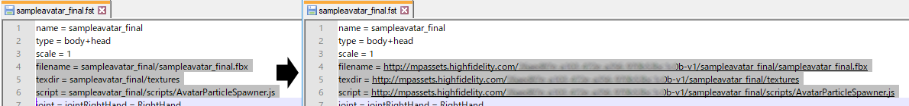

## Overview
Once you've created an avatar, wearable or entity, you have the option to sell it in the Marketplace. This guide walks you through the steps to upload it to the Marketplace so that you can start the process of having it reviewed and published. 

* [Add Your Avatar](#add-your-avatar)
* [Upload Your Environment](#upload-your-environment)

## Add Your Avatar
After you have [created an avatar](../create-and-explore/avatars/create-avatars), you should be left with:
* An FST file
* An FBX file
* Scripts folder (optional)
* Textures folder

Once you have these files, use these steps to upload your avatar to the Marketplace. 

1. Go to [https://highfidelity.com/marketplace/items/new](https://highfidelity.com/marketplace/items/new) to create a new item. If you're not logged in, you will be prompted to do so.
2. Enter a name for your avatar.
3. Under Categories, select 'Avatars'.
4. Click 'Save Draft'. You can edit the metadata later if you need to.
5. Scroll down to the Assets section. 
6. Click 'Choose Folder' and navigate to where your avatar is saved on your computer. Select the folder that contains your FBX file, click 'Upload' twice and wait for it to upload.
7. Click on the uploaded FBX file, and copy the Marketplace path including the unique hash for your avatar. Do not copy your folder name or the name of the file. 
8. Open your FST file in the text editor of your choice. (Note that the FST file is a local file on your computer)
9. Locate the relative path references to the FBX file, textures directory, and script file(s). Replace these with the absolute path references of the uploaded content. 
10. Return to your avatar submission on the Marketplace. 
11. In the Assets section, click 'Choose Files' and navigate to where your avatar is saved on your computer. Select your updated FST file, click 'Open' and wait for it to upload.
>>>>>Be sure you do not have any files or folders selected in the asset viewer so that the uploaded file goes to the right place. Any selected files and folders will be highlighted blue.
12. Click the FST file as your root file in the Asset Viewer.  
13. Save your submission. 

Now you are ready to use your avatar! To locate the URL for your avatar:
1. Go to [https://highfidelity.com/marketplace](https://highfidelity.com/marketplace). If you're not logged in, you will be prompted to do so.
2. Click on your user name, then on 'My Items'.
3. Locate your avatar in Draft mode and click on it. 
4. Click 'Edit'.
5. Scroll down to the Assets section.
6. Click on the FST file. Below it, click the 'Copy URL' button.

This is the URL you will use when you [change your avatar](../change-avatar) in High Fidelity.

If you wish to sell your avatar on the Marketplace, be sure to fill out your metadata and click "Submit for Review" to be verified and certified on the Marketplace.

## Upload Your Environment

Before uploading your environment to the Marketplace, make sure that you created the environment in a domain where you have access to the administration panel. Keep in mind that _all_ content in the domain will be included in your upload. Once your domain is set up, you are ready to upload your environment.

1. Open your Domain Administration Panel. If you are on a local sandbox, open it by clicking on the High Fidelity icon in the taskbar notifications and click Settings. 
2. Click on Content.
3. In the Content Archives section, click Generate New Archive.
4. Enter a name for your archive and click Generate Archive. It will appear just below the Generate New Archive button. 
5. Click the Actions button, then select Download. 
6. Go to [https://highfidelity.com/marketplace/items/new](https://highfidelity.com/marketplace/items/new) to create a new item. If you're not logged in, you will be prompted to do so.
7. Enter a name for your environment.
8. Under Categories, select 'Environments'.
9. Click 'Save Draft'. 
10. Scroll down to the Assets section. 
11. Click 'Choose Files' and navigate to where your environment download is saved on your computer. Select the ZIP file, click 'Open' and wait for it to upload.
12. Save your submission.

If you wish to sell your environment on the Marketplace, be sure to fill out your metadata and click "Submit for Review" to be verified and certified on the Marketplace.
