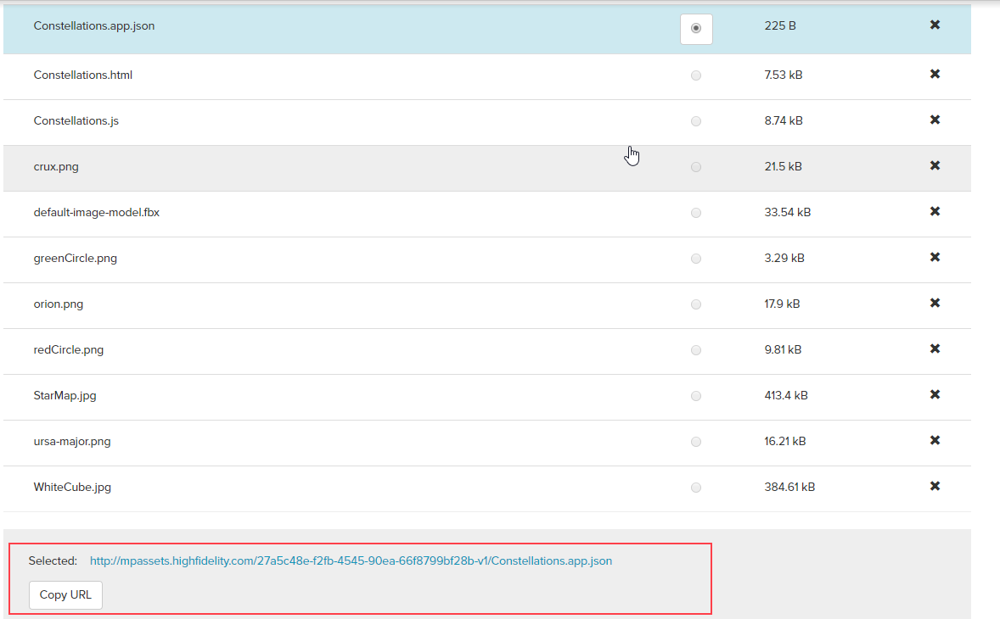

Before submitting an app, make sure it follows our certified app guidelines below:

* [A certified app requires 5 files: JSON file, JavaScript, HTML or QML, and two SVG files](https://docs.highfidelity.com/marketplace/certifiedapps#1-a-certified-app-consists-of-at-least-five-files)
* [A certified app must have a button that appears on the tablet or HUD](https://docs.highfidelity.com/marketplace/certifiedapps#2-a-certified-app-has-a-button-that-appears-on-the-tablet-in-vr)
* [When launched, a certified app must have a a full screen UI in VR and a standard-sized window display on the Desktop](https://docs.highfidelity.com/marketplace/certifiedapps#3-when-a-user-clicks-on-the-button-of-the-certified-app-the-app)
* [The UI for the certified app should explain how the app works](https://docs.highfidelity.com/marketplace/certifiedapps#4-it-is-recommended-that-the-ui-for-the-certified-app-explain-ho)
* [The certified app must handle quitting gracefully](https://docs.highfidelity.com/marketplace/certifiedapps#5-when-a-user-closes-the-app-using-the-%E2%80%9Cx%E2%80%9D-button-at-the-bottom)

## Guideline Details

##### 1. A certified app consists of at least five files: 
* &lt;script>.js 
* &lt;ui>.html or &lt;ui>.qml
* &lt;button>.svg
* &lt;activeButton>.svg
* &lt;rootFile>.app.json
    
     The .json has two required properties, “scriptURL” (whose value must be the URL of the uploaded &lt;script>.js), and “homeURL” (whose value must be the URL to the uploaded &lt;ui>.html) using explicit paths created upon upload of the files to the Marketplace. 

    >*Example where the zeros should be substituted for your Marketplace bucket:*
``` javascript
        {
        "scriptURL": "http://mpassets.highfidelity.com/00000000-0000-0000-0000-000000000000-v1/script.js",
        "homeURL": "http://mpassets.highfidelity.com/00000000-0000-0000-0000-000000000000-v1/ui.html"
        }
```

>>> How to find the URL to your Marketplace bucket:

1. First, upload a draft of your app to the Marketplace
2. Click on the app.json file on the Edit screen and the URL will be displayed at the bottom of the screen


##### 2. A certified app has a button that appears on the tablet in VR, or the app bar in desktop mode. The button of the certified app has an icon and the name of the certified app.

##### 3. When a user clicks on the button of the certified app, the app has to provide a full screen UI in VR (and a standard sized window display on the desktop) that is displayed. Below is an example of how to wire up handlers in the &lt;script>.js:

``` javascript 
    var tablet = Tablet.getTablet("com.highfidelity.interface.tablet.system");
    button = tablet.addButton({
        text: theAppName,
        icon: theButtonSVG,
        activeIcon: theActiveButtonSVG
	}),
    isOpen = false;
    function onClicked(){ //Nothing else here!
        if (isOpen) {
            tablet.gotoHomeScreen();
        } else {
            tablet.gotoWebScreen(ui.html, optInjected);
        // or tablet.loadQMLSource(ui.qml);
    }
    function onScreenChanged(type, url) {
        isOpen = (url === ui.html);
        // app-specific logic for opening and closing.
    }
    button.clicked.connect(onClicked);
    tablet.screenChanged.connect(onScreenChanged);
    Script.scriptEnding.connect(function () {
        button.clicked.disconnect(onClicked);
        // Disconnect any other handlers here.
        tablet.screenChanged.disconnect(onScreenChanged);
        tablet.removeButton(button);
    });
```
##### 4. It is recommended that the UI for the certified app explain how the app works, and have familiar UI elements that a user knows how to interact with.

##### 5. When a user closes the app using the “X” button at the bottom of the tablet, you have two options:
1.  The active functionality of the certified app can stop.
    * If the app had 3D interfaces on user’s hand, they can go away.
    * If the app was enhancing or modified the client using a script (e.g. floof sprint), that functionality can end.
2. All or some of the functions of the certified app can keep running.
    * If the app wants to persist the 3D interfaces on a user’s hand, it can keep them turned on.
    * If the app wants to keep enhancing or modifying the client using a script, it can keep doing that.

##### 6. If you choose option 5(1), the certified app needs to provide an affordance for the user to suspend the functionality of the certified app, i.e.: 
1. Turn off the 3D user interfaces. This can be achieved either by providing that functionality in the 3D user interface, or surfacing a button in the UI of the certified app that achieves the same function.
2. Stop the script from modifying or enhancing the client. This can be achieved by surfacing a button in the UI of the certified app.

Example of how the Shapes app works:


