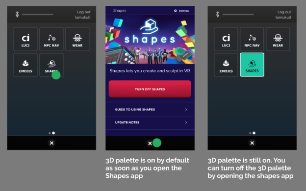
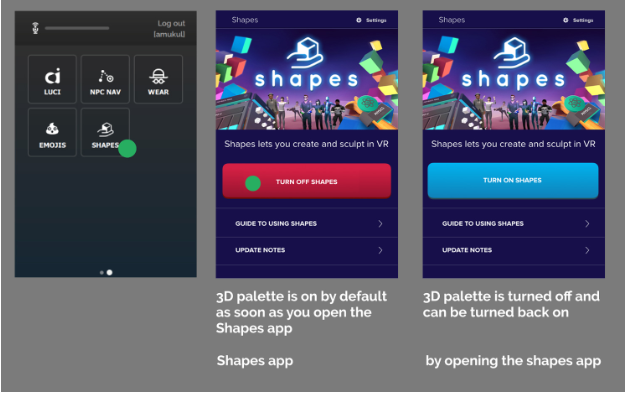
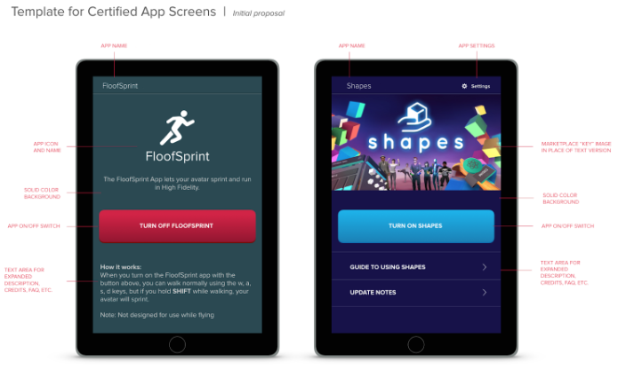

Before submitting an app, make sure it follows our certified app guidelines below:
## Guidelines
1. A certified app consists of at least five files: 
    * rootFile.app.json 
    * script.js 
    * ui.html or ui.qml
    * button.svg
    * activeButton.svg 

    The .json has two required properties, “scriptURL” (whose value must be the URL to the uploaded script.js), and “homeURL” (whose value must be the URL to the uploaded ui.html) using explicit paths created upon upload of the files to the Marketplace. 
>*Example where the zeros should be substituted for your marketplace bucket:*
``` javascript
        {
        "scriptURL": "http://mpassets.highfidelity.com/00000000-0000-0000-0000-000000000000-v1/script.js",
        "homeURL": "http://mpassets.highfidelity.com/00000000-0000-0000-0000-000000000000-v1/ui.html"
        }
```
2. A certified app has a button that appears on the tablet in VR, or the app bar in desktop.
3. The button of the certified app has an icon and the name of the certified app.
4. When a user clicks on the button of the certified app, the app has to provide a full screen UI in VR (and a standard sized window display on the desktop) that is displayed.
5. You have to wire up handlers in the script.js similar to:
``` javascript 
    var tablet = Tablet.getTablet("com.highfidelity.interface.tablet.system");
    var button = tablet.addButton({
        text: theAppName,
        icon: theButtonSVG,
        activeIcon: theActiveButtonSVG
	});
    isOpen = false;
    function onClicked(){ //Nothing else here!
        if (isOpen) {
            tablet.gotoHomeScreen();
        } else {
            tablet.gotoWebScreen(ui.html, optInjected);
            // or tablet.loadQMLSource(ui.qml);
        }
    }
    function onScreenChanged(type, url) {
	    isOpen = (url === ui.html);
        // app-specific logic for opening and closing.
    }
    button.clicked.connect(onClicked);
    tablet.screenChanged.connect(onScreenChanged);
    Script.scriptEnding.connect(function () {
        button.clicked.disconnect(onClicked);
        // Disconnect any other handlers here.
        tablet.screenChanged.disconnect(onScreenChanged);
        tablet.removeButton(button);
    });
```
6. When the user clicks on the certified app button, the certified app can perform other operations by listening to the event “onScreenChanged”. These operations can include:
    - Querying a server to get a response and determine what to show on the UI
    - Start displaying a 3D interface separate from the tablet (e.g. shapes app)
    - Determine the display mode (VR/Desktop) and change things to show on the UI
    - And other operations as well
7. It is recommended that the UI for the certified app explain how the app works, and have familiar UI elements that a user knows how to interact with.
8. When a user closes the app using the “X” button at the bottom of the tablet, you have two options:
    1. The active functionality of the certified app can stop
        * If the app had 3D interfaces on user’s hand, they can go away
        * If the app was enhancing or modified the client using a script (e.g. floof sprint), that functionality can be backed out
    2. All or some of the functions of the certified app can keep running
        * If the app wants to persist the 3D interfaces on a user’s hand, it can keep them turned on
        * If the app wants to keep enhancing or modifying the client using a script, it can keep doing that
9. If you choose option 8(1), the certified app needs to provide an affordance for the user to suspend the functionality of the certified app, i.e.: 
    1. Turn off the 3D user interfaces. This can be achieved either by providing an affordance on the 3D user interface, or surfacing a button in the UI of the certified app that achieves the same function
    2. Stop the script from modifying or enhancing the client. This can be achieved by surfacing a button in the UI of the certified app

Example of how the Shapes app works:






