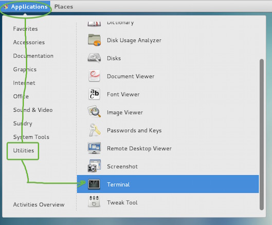

The goal with this document is for you have your very own build of the High Fidelity Interface that lets you be a part of our ever growing and exciting world!

This document will not cover specifics to installing and using CentOS 7 with GNOME but some info about the installation used for this writeup will be provided.

*Note: If you have any questions or suggestions about this guide then feel free to join us in our Gitter Chat Room.*

## Text Formatting in this Document

**Throughout this document I will use different conventions for the text you will see and what it means to you.**

*Italic text is a note - something that gives you some insight into what you are doing on each step*

1. `Single lines of code are formatted like this`

**Now Lets Get Started!**

## CentOS 7 Initial Install

**A basic install with a GNOME Desktop was picked**

GNOME Desktop Software Selection.

*Other configuration options may be used as you see fit. For those who are looking for a good starting place for CentOS documentation, be sure to check out their Wiki: http://wiki.centos.org/Documentation*

## The Terminal

**Accessing The Terminal**

Click Applications > Utilities > Terminal.

**We have a Terminal!**

The Terminal

- This is our first view of the terminal and the basic view of our prompt, in this case **[coal@localhost ~]**. It is the window we will be typing our commands into.
- If you see a name other than root in this location, you will need to get to **root**. During installation of the operating system it should have asked you to configure a password to your **root** user. You will need the password to your **root** user in the following command.
- Type this into your prompt if you need to switch to **root**: `su -`

*"su -" is telling the system to switch users to your root account*

**If you are successful then your Terminal will look like this**

It switched from "coal" to "root."

## Installing the Necessities

- There are no images for this section because you will be entering commands into the terminal one by one and since everything ends in a *"-y"*, it does everything on its own.
- Every command will be put on its own line using the single command line format separated by a bold block of text.
- You will know when the commands have finished executing when you are back at a prompt with a hash **#** on the end of it. At that point you may move to the next command.

**Step 1: Install the EPEL Repository**

1. `yum install epel-release -y`

**Step 2: Install the compile tool set**

1. `yum groupinstall "development tools" -y`

**Install some utilities and libraries required**

1. `yum install openssl-devel git wget freeglut* libXmu-* libXi-devel glew glew-devel tbb tbb-devel soxr soxr-devel qt5-qt* -y`

### Download Files to Extract and Install

- In this section multiple commands will be part of the same package/section.
- As before, each section will be split up with bold text so you know which parts go together.

**First we need to "cd" to our source directory**

1. `cd /usr/local/src`

**Download, compile and install "cmake"**

1. `wget http://www.cmake.org/files/v3.1/cmake-3.1.1.tar.gz`
2. `tar xvfz cmake-3.1.1.tar.gz`
3. `cd cmake-3.1.1`
4. `./configure --prefix=/usr`
5. `gmake && gmake install`
6. `cd /usr/local/src`

**Install QXMPP**

1. `git clone https://github.com/qxmpp-project/qxmpp.git`
2. `cd qxmpp/`
3. `[ "$(uname -m)" = "x86_64" ] && /usr/lib64/qt5/bin/qmake || /usr/lib/qt5/bin/qmake`
4. `make && make install`
5. `cd /usr/local/src`

**Download, compile and install "BulletSim"**

1. `wget https://bullet.googlecode.com/files/bullet-2.82-r2704.zip`
2. `unzip bullet-2.82-r2704.zip`
3. `cd bullet-2.82-r2704`
4. `cmake -G "Unix Makefiles"`
5. `make && make install`
6. `cd /usr/local/src`

*Screenshot: \**"cmake"** output from BulletSim provided as an example of expected output, including warnings.*

These warnings are expected and okay.

## Get and Compile High Fidelity Sources

In this step we pull the newest source code from the High Fidelity GitHub account and prepare a special directory structure to compile/build our Interface in.

**Hifi Source and Build Preparation**

1. `cd /usr/local/src`
2. `mkdir highfidelity &&; cd highfidelity`
3. `git clone https://github.com/highfidelity/hifi.git`
4. `mkdir /usr/local/src/highfidelity/hifi/build`

**Configure ("cmake") your High Fidelity Interface Build**

1. `cd /usr/local/src/highfidelity/hifi/build`
2. `cmake ..`

*This is the big step where High Fidelity basically puts all the bits together we just setup and checks to make sure it has what it needs. If you followed these directions you should have no errors!*

**This image is a reference to what a successful "cmake" will display**

"Not Found" messages are OK as long as you see "Build files have been written".

**Building Interface - Pretty easy one command!**

1. `make interface`

*You will see a lot of text stream by you by that just means its doing its job! When its finished you will be dropped back to the \**#** prompt.*

## Running Interface for the first time

- At this point you should be very proud of your self and know that you have compiled your own Interface/Client for High Fidelity!

**How to Run Your Interface**

1. `cd /usr/local/src/highfidelity/hifi/build/interface`
2. `./interface`

*After you type command #2, you may notice it takes a while for Interface to start up, but it will make its away around!*

