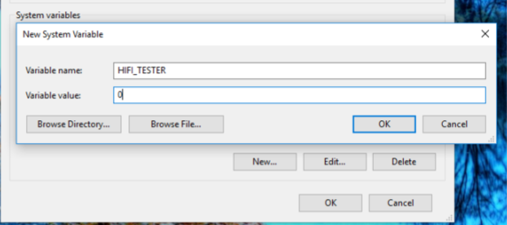

*Learn how to set environment variables if you're a developer or a QA tester.*

##Overview
If you're a developer or tester, this page contains details on how you can set environment variables.

##Introduction

In order to work with us, we require that you you set a specific Environment Variable on your computer. This method will persist even if you continue to reinstall High Fidelity, delete your app data or change your IP address. This won't affect your local machine in any way.

###Set Environment Variable

Here’s how you do it.
1. Search for “Advanced System Settings” and open the menu. 
2. Click on “Environment Variables”. 
3. Click on “New” under “System Variables”. 
4. Enter “HIFI_TESTER” as the Variable name and set the Variable value to “0” and click OK to close all the menus. 
5. Restart your computer for the changes to take effect.

