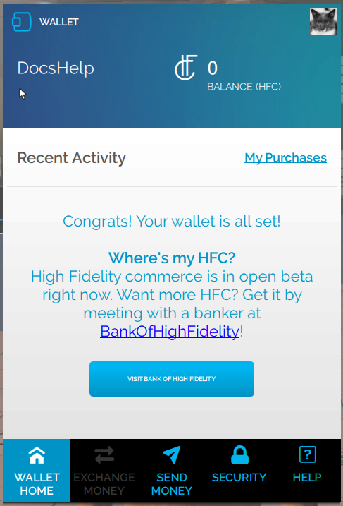

*Learn how you can get your initial grant of HFC to start shopping in High Fidelity.*

## Introduction

High Fidelity Commerce is in open Beta. This means when you first set up your [Wallet](https://docs.highfidelity.com/high-fidelity-commerce/marketplace/wallet-setup), you will not have any HFC available to start shopping. 

 Want more HFC? Get it by going to [Bank Of High Fidelity](https://hifi.place/BankOfHighFidelity) and meeting with the banker!

