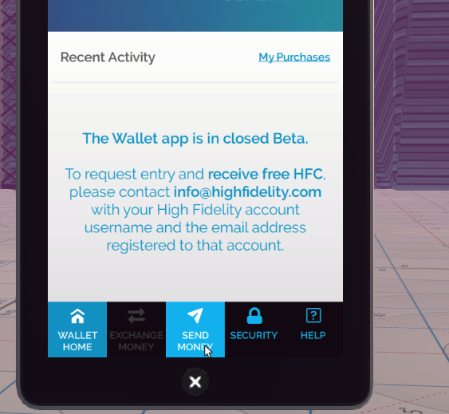
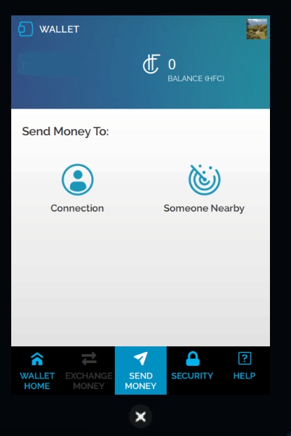
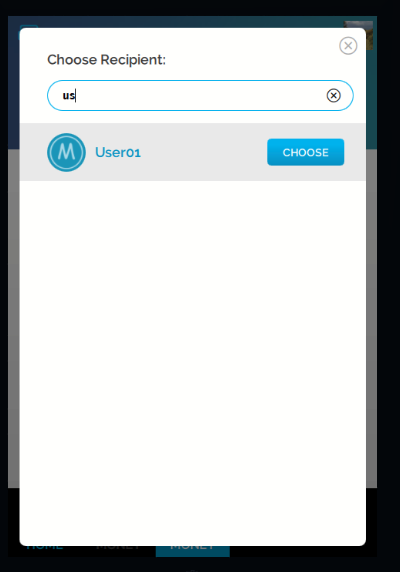
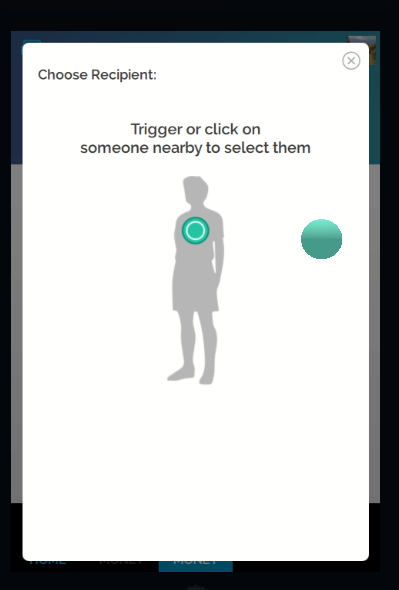

*Learn how you can send HFC to a connection or someone nearby.*

## Overview

This page details how you can transfer HFC from your wallet to another user. 

## Introduction

Once you are done with setting up your wallet and receiving your HFC, learn how to send HFC to another user. 

* Pull up your tablet and go to **Wallet**. 
* Enter your passphrase. 
* In your Wallet, click "Send Money". 
* You will have the option to send money to one of your connections or even someone nearby in the same domain! 
* If you want to send to one of your connections, just click "Connections" and choose the recepient from the list. 
* If you want to send to someone nearby, click "Someone Nearby" and choose your recepient by triggering or clicking on someone nearby to select them. 
