*Learn how you can set up your Wallet.*

## Overview

This page will detail how you can set up your Wallet to start participating in High Fidelity's commerce transactions. 

## Introduction

Before you start [buying](https://docs.highfidelity.com/high-fidelity-commerce/marketplace/buy) and [selling](https://docs.highfidelity.com/high-fidelity-commerce/marketplace/sell) items in the Marketplace or [shopping on Avatar Island](https://docs.highfidelity.com/high-fidelity-commerce/avatar-wearables/buy), you need [High Fidelity Coins](https://docs.highfidelity.com/high-fidelity-commerce/basics/hfc) (HFC). After setting up your wallet, follow the additional instructions to receive [10,000 HFC](https://docs.highfidelity.com/high-fidelity-commerce/basics/hfc/get-hfc). You can start using them for any transactions in-world. 

> > > You do not need a credit card to set up your wallet. 

### Set Up Your Wallet

- Pull up your tablet and go to **Wallet**. 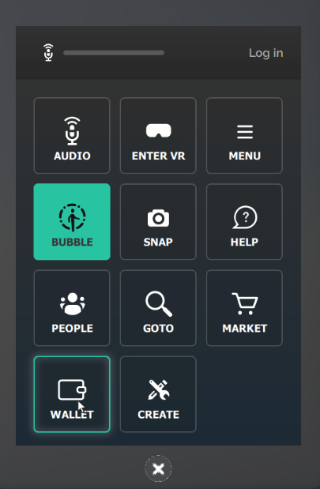
- Log in or sign up with your username and password. 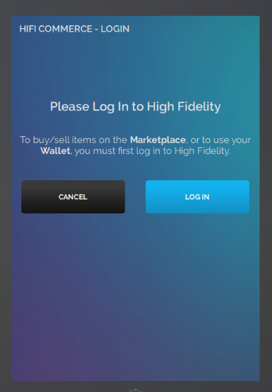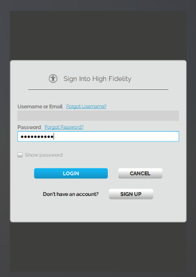
- You'll see the first step of setting up your wallet. Click "SET UP WALLET".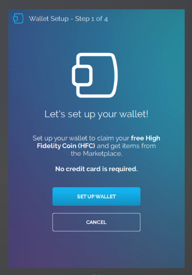
- In step 2, you will be prompted to choose a security picture. This picture will appear every time you make a transaction. This picture determines the legitimacy of the page you are making the transaction on. This means that whenever you see this picture, the transaction you are about to make is legitimate. Select a picture of your choice and click "Next".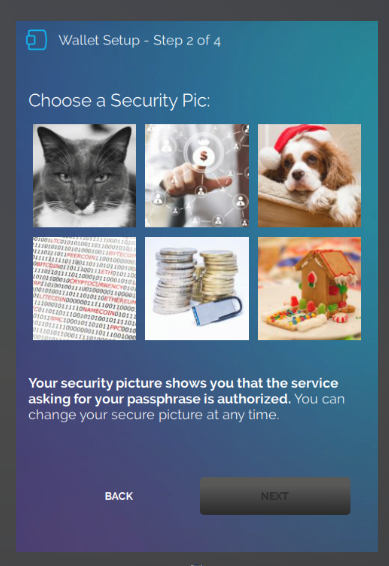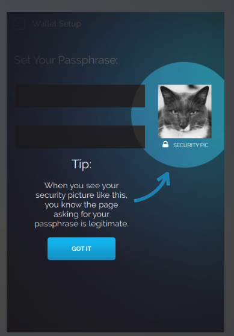
- Next, you will be asked to set your passphrase. During a transaction, your identity is confirmed when you enter the correct passphrase (which encrypts your private keys). Once you set an appropriate passphrase, click "Next".

> > > > Do not lose your passphrase. Please save it or write it down, we cannot recover this for you. If you lose your passphrase, you will also lose the HFC and purchases associated with your account. 

- You will be prompted to backup your private keys. This is an important step. If you lose your passphrase, we cannot recover your passphrase or your keys for you.  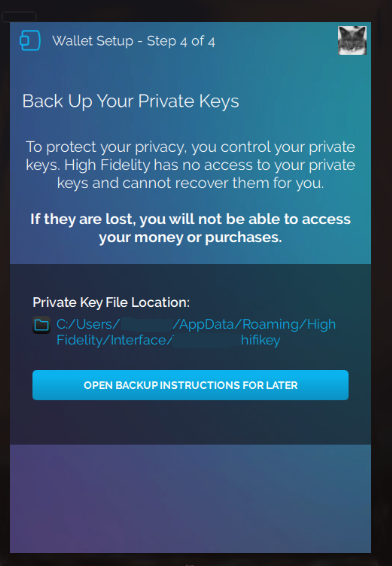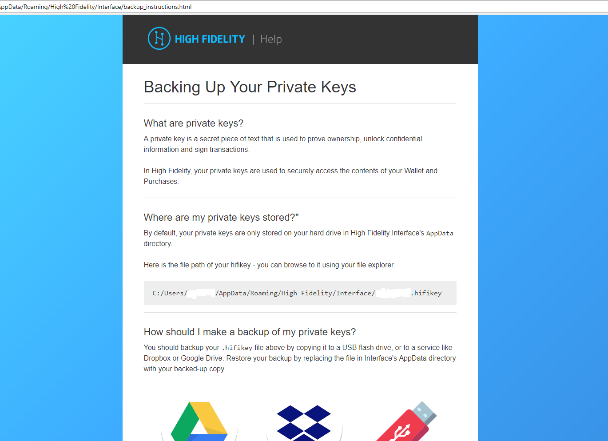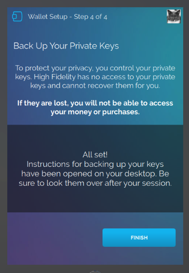 For more information, see our [FAQs](https://docs.highfidelity.com/high-fidelity-commerce/faq-section/commerce-faq)
- You will be directed to your *Wallet Home*. Here, you can view all your recent activity and the amount of HFC you have. Want more HFC? Get it by going to [Bank Of High Fidelity](https://hifi.place/BankOfHighFidelity) and meeting with the banker! 
- Once you receive your 10,000 HFC, you can start shopping and monitoring your recent activity. 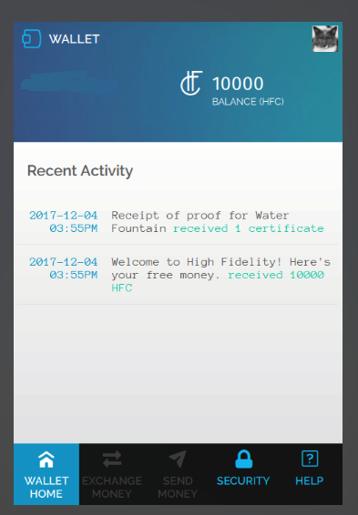
- The wallet also contains *Security* and *Help* pages. You can change your security picture, passphrase and backup your private keys on the *Security* page. The *Help* page contains some general questions that could be helpful. 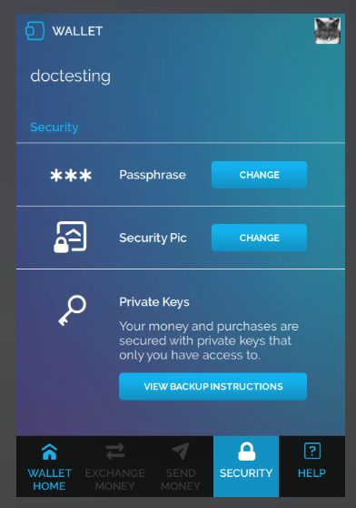 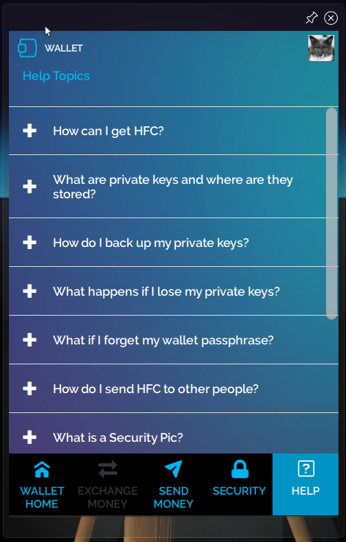 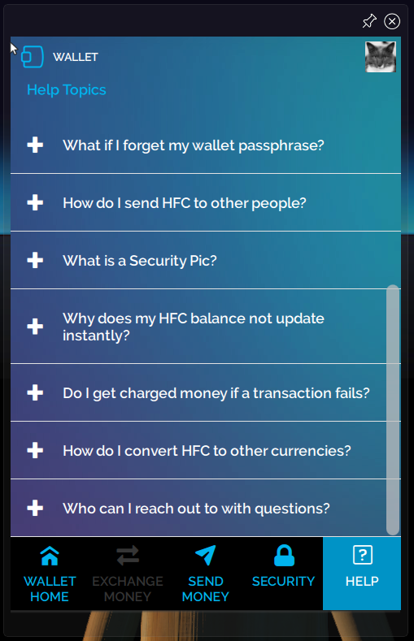

Congratulations, you're all set up! Start shopping!