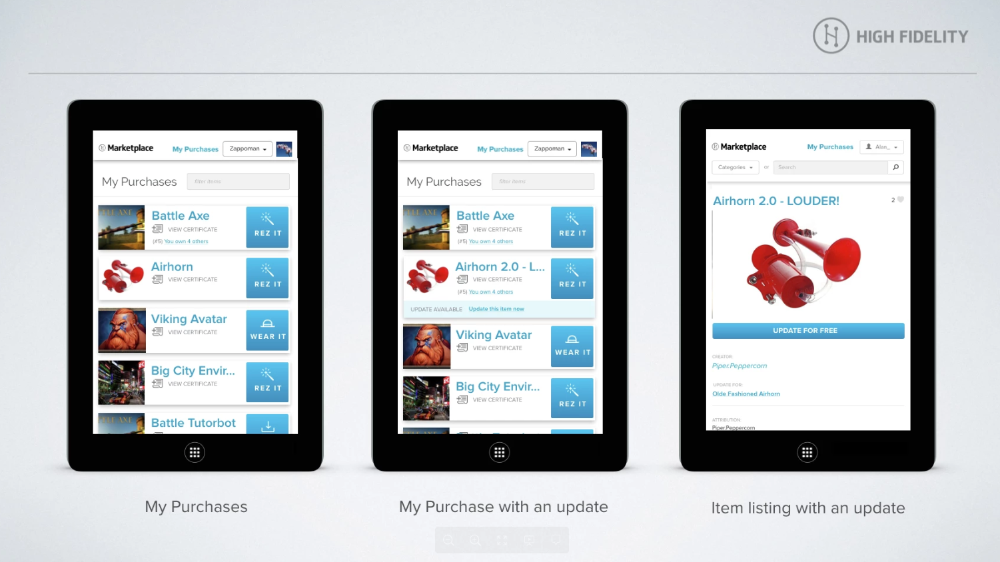

If you created an item on the Marketplace previously, and would like to offer your customers a new and improved version, these instructions show you how to update it.

## Update Your Item In Marketplace

Creating an update is similar to creating a new item:

1. Go to the Marketplace page and select New Item or bookmark this link: https://highfidelity.com/marketplace/items/new
2. Fill in the metadata and Save Draft.  We suggest using version numbers in the name.
3. Check the Update Item box. 
4. Select the previous version from the Updates drop-down menu.
5. Upload all files used in the product to the file system
6. Change any scripts, JSON files, etc to point to the files you uploaded in step 5.
7. Press Submit for Review.
8. Our Marketplace admin team will receive the update submission and process. 

Once the new update is approved, a new certificate will be generated.  The previous version of the item will be hidden from new customers on the marketplace, and replaced with the new version. 

## FAQ

**What is it?**
Marketplace updates leverage the HF commerce blockchain by creating a chain of related certificates between old and new versions of a product.  Previously, if you wanted to update a Marketplace item, you needed to re-submit it as a new item, and hide the old instance of the item.  This had numerous disadvantages including losing your likes, and your existing customers not being notified of the updates.

**Can I reference existing URLs on my previous item?**
No.  If you create an update, you must upload all the items the product uses in the update item.  If the old version of your product uses a .wav file that has not changed in the updated version, you must upload it again in the new item.  This is because the certificate system needs to recertify all files used in the product together.  

**How will my customers receive updates?**
Once the update hits the Blockchain, your customers will receive notification that an updated version of an item they previously purchased is available in their Marketplace My Purchases section.  A red dot on the Market button on your toolbar or tablet will appear to indicate there is an update available to download.
From My Purchases, they will see *UPDATE AVAILABLE. Update this Item now.*  If the customer views the Item Listing page, they will see an *UPDATE FOR FREE* button. Clicking either of these will record your customer as owning the updated version, and High Fidelity will use the updated version the next time the customer rezzes or uses the item. 

Customers who visit the Item Listing and have not purchased the old version will see the item listed like any other item, with a Buy button.  

**What happens if a customer chooses not to update?  Will the original continue to work?**
Yes.  If a customer decides against updating, their old product will still be valid and listed in My Purchases.

**What happens to an old product after a customer updates?**
The old version will be replaced by the new version in My Purchases. 

**Will the customer be able to retrieve the old version after they update?** 
No. The previous version of the product will no longer be available after they update.

**What happens if I update a product with the old version already in-world?**
It remains intact until the next time it is imported. The previous version of the product will remain in-world, and should be replaced manually with the updated version.  If you attempt to import an entities JSON which contains the old version, please note that the system will ignore the item, and not automatically replace it in-world.  It is up to the end-user to replace the old instances with the new.

**Is there a way I can allow my customers to select an older versions?**
No. We realize you may want to offer customers the opportunity to choose the version they want at the time of purchase, or the opportunity to revert.  However, this is not yet supported.

**Does this work with limited editions?**
Yes. The same policies apply as above.  

**What if I purchased multiple instances of an item?  Can I update just one of them?**
Yes.  You need to individually update each instance of an item you see in My Purchases as you see fit.  You can for example update 1 instance of a chair but leave the other ones un-updated.