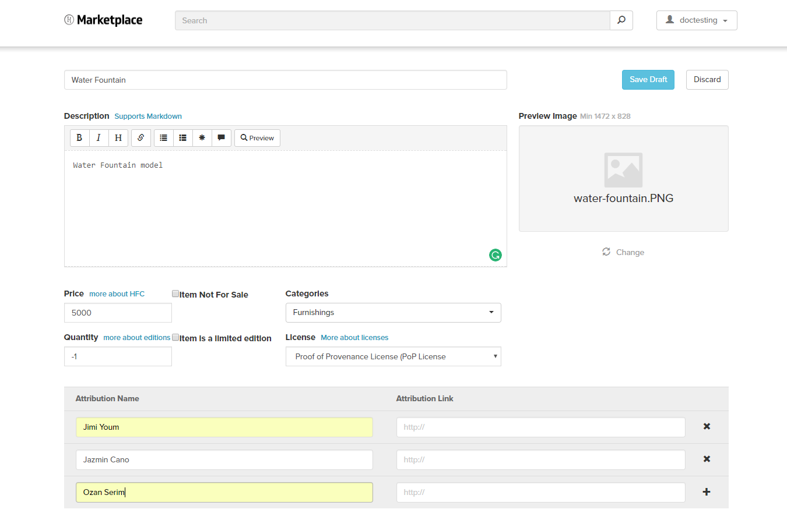

*Learn how to upload items to the Marketplace*

## Overview

Learn how you can upload your items to the Marketplace and be made available to all users in High Fidelity. 

## Introduction

If you've created a 3D Model or written a script for a model of a dog to follow your avatar, you can make it available for other users to download. 

> > > > > Currently, we do not have a monetary system. All your items in Marketplace will be free and will have a Creative Commons license. 

Let's go through the process of uploading an item to Marketplace!

We're going to upload a model of a water fountain. This process covers three major steps:

- Starting the process of adding the item in Marketplace. 
- Using Interface to get the .JSON file.
- Uploading to Marketplace. 

### Adding an Item to Marketplace

- Go to High Fidelity's [Marketplace](https://highfidelity.com/marketplace) on the web. 
- Log in with your credentials if you haven't. 
- The page displays different items available in Marketplace and the various categories they fall under. 
- Click on the "+ New Item" button below the categories. 
- The page that opens contains details of your item that you can start filling in. Don't upload your model's .fbx file yet.  
- Add the name of your model, description, and attribution and license details. 

 
