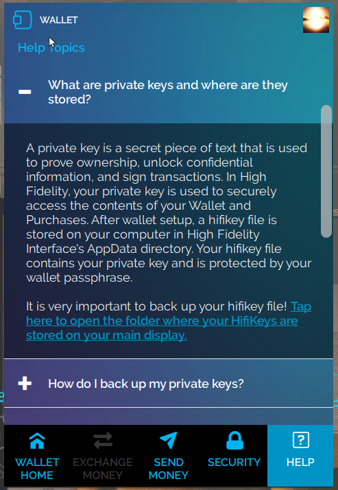
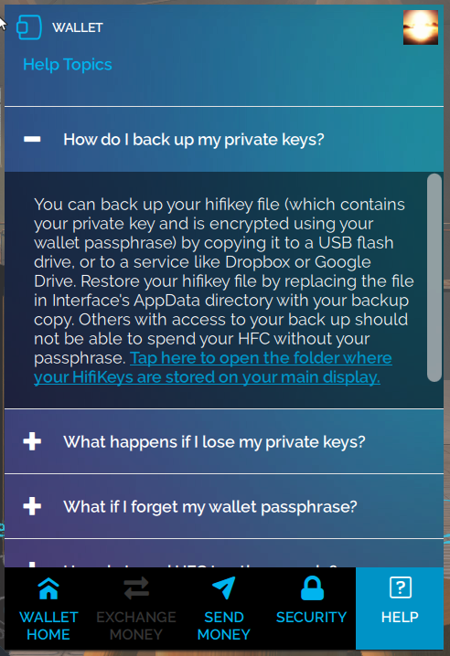

| **General Questions**                    |
| ---------------------------------------- |
| [Where’s my HFC?](#q0) |
| [What are private keys and where are they stored?](#q1)  |
| [How do I backup my private keys?](#q2)             |
| [What happens if I lose my private keys?](#q3) |
| [What happens if I forget my wallet passphrase?](#q4)             |
| [How do I send HFC to other people?](#q5) |
| [What is a Security Pic?](#q6) |
| [My HFC balance doesn’t update instantly. Why?](#q7) |
| [Do I get charged if a transaction fails?](#q8)   |
| [How do I convert HFC to other currencies?](#q9)            |
| [Who can I reach out to for additional questions?](#q10) |

 

### Commerce Questions
 

**Where’s my HFC?**  
High Fidelity commerce is in open beta right now. Want more HFC? Get it by going to [Bank Of High Fidelity](https://hifi.place/BankOfHighFidelity) and meeting with the banker!

<a href="#top">Back to Top</a>

 

**What are private keys and where are they stored?**  
A private key is a secret piece of text that is used to prove ownership, unlock confidential information, and sign transactions. In High Fidelity, your private key is used to securely access the contents of your Wallet and Purchases. After wallet setup, a hifikey file is stored on your computer in High Fidelity Interface's AppData directory. Your hifikey file contains your private key and is protected by your wallet passphrase.
It is very important to backup your hifikey file! To find the folder where your hifikey file is stored, navigate to the Help section in Interface. 

<a href="#top">Back to Top</a>

 

**How do I backup my private keys?**  
You can backup your hifikey file (which contains your private key and is encrypted using your wallet passphrase) by copying it to a USB flash drive, or to a service like Dropbox or Google Drive. Restore your hifikey file by replacing the file in Interface's AppData directory with your backup copy. Others who have access to your backup file can not spend your HFC without the passphrase. 
To find the folder where your hifikey file is stored, navigate to the Help section in Interface. 

<a href="#top">Back to Top</a>

 

**What happens if I lose my private keys?**  
We cannot stress enough that you should keep a backup! For security reasons, High Fidelity does not keep a copy, and cannot restore it for you. If you lose your private key, you will no longer have access to the contents of your Wallet or My Purchases. Here are some things to try:

- If you have backed up your hifikey file before, search for your backup 
- Search your AppData directory in the last machine you used to set up the Wallet 
- If you are a developer and have installed multiple builds of High Fidelity, your hifikey file might be in a previous build’s folder
 
Last resort: you can set up your Wallet again and generate a new hifikey file. Unfortunately, this means you will start with 0 HFC and your purchased items will not be transferred over.  

<a href="#top">Back to Top</a>

 

**What happens if I forget my wallet passphrase?** 
Your wallet passphrase is used to encrypt your private keys. Please write it down and store it securely! 

If you forget your passphrase, you will no longer be able to decrypt the hifikey file that the passphrase protects, hence lose  access to the contents of your Wallet or My Purchases. For security reasons, High Fidelity does not keep a copy of your passphrase, and can’t restore it for you. 

If you still cannot remember your wallet passphrase, you can set up your Wallet again and generate a new hifikey file. Unfortunately, this means you will start with 0 HFC and your purchased items will not be transferred over.  

<a href="#top">Back to Top</a>

 

**How do I send HFC to other people?**  
You can send HFC to a High Fidelity connection (someone you’ve shaken hands with in-world) or somebody Nearby (currently in the same domain as you). In your Wallet’s Send Money tab, choose from your list of connections, or choose Nearby and select the glowing sphere of the person’s avatar.

<a href="#top">Back to Top</a>

 

**What is a Security Pic?** 
Your Security Pic is an encrypted image that you select during Wallet Setup. It acts as an extra layer of Wallet security. When you see your Security Pic, you know that your actions and data are securely making use of your private keys. 

Don’t enter your passphrase anywhere that doesn’t display your Security Pic! If you don't see your Security Pic on a page that requests your Wallet passphrase, someone untrustworthy may be trying to access your Wallet. 

<a href="#top">Back to Top</a>

 

**My HFC balance doesn’t update instantly. Why?**  
HFC transactions sometimes take a few seconds to update as they are backed by a blockchain. [Learn more here](https://docs.highfidelity.com/high-fidelity-commerce).

<a href="#top">Back to Top</a>

 

**Do I get charged if a transaction fails?**  
No. Your HFC balance only changes after a transaction is confirmed.

<a href="#top">Back to Top</a>

 

 
**How do I convert HFC to other currencies?**  
We are hard at work building the tools needed to support a vibrant economy in High Fidelity. At the moment, there is currently no way to convert HFC to other currencies. Stay tuned...

<a href="#top">Back to Top</a>

 

 
**Who can I reach out to for additional questions?**  
Please email us if you have any issues or questions: support@highfidelity.com

<a href="#top">Back to Top</a>

